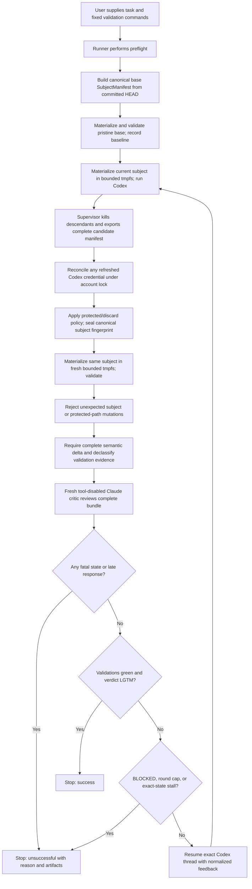

# Proposal: Bounded Codex Author / Claude Critic Loop

**Status:** Revised draft after five external review passes
**Date:** 2026-07-19
**Target environment:** Ubuntu 26.04, Bash, kitty/tmux
**Installed CLIs observed during planning:** Codex CLI 0.144.6, Claude Code 2.1.215

## Executive decision

Build a local, security-sensitive Python execution harness that owns the loop and invokes the official headless interfaces. Version 1 is deliberately narrow: Ubuntu 26.04, Codex CLI 0.144.6, Claude Code 2.1.215, Git 2.53.0, patched non-setuid Bubblewrap, and one Bubblewrap plus transient-systemd-service backend.

- **Author:** OpenAI Codex CLI via Git-less `codex exec` and exact-ID resume, using an empty control cwd, `/workspace` as a probed additional root, a sanitized transactional `CODEX_HOME`, a mandatory custom permission profile, and a bounded transient service.
- **Critic:** Claude Code via a fresh tool-disabled `claude -p` process each round, using a dedicated setup token and child-environment credential scrubbing.
- **Handoff:** versioned files and structured JSON, not terminal keystrokes or copied transcripts.
- **Validation:** baseline and post-author checks materialize the same canonical subject into separate bounded tmpfs workspaces; raw logs remain local and only declassified structured evidence reaches agents.
- **Control:** hard round, process, wall-clock, stall, and user-interrupt stops enforced outside both agents.

This is the recommended design for unattended, bounded runs. For a monitored interactive experiment, [`sendbird/cc-plugin-codex`](https://github.com/sendbird/cc-plugin-codex) is the lowest-effort packaged alternative because it keeps Codex as author/host and invokes Claude as reviewer.

## Disposition of external review dated 2026-07-19

The first external review was **approved with changes**. The following points are incorporated below:

- Parse the complete Claude result envelope before reading top-level `structured_output`; handle schema-retry exhaustion and missing structured output explicitly.
- Add a compact prior-findings resolution ledger to fresh critic rounds.
- Initially add recurring-finding/thrashing detection alongside repository no-change detection; the third review later defers this semantic mechanism from version 1.
- Prefer the failing tail and a structured failure summary when validation logs must be excerpted.
- Give critic max-turn exhaustion its own stop reason.
- Detect `LGTM` combined with failing validations; the second review below further tightens this from a recorded incoherence to semantically invalid output.
- Initially move opt-in isolated worktrees into version 1; the third review made isolation mandatory and the fourth replaced linked worktrees with a private Git-less subject tree.
- Add hostile-config, schema-failure, and exact Codex resume-roundtrip acceptance tests.

Three proposed corrections were rejected after checking official documentation and the installed CLIs:

1. **Keep `--safe-mode` for the subscription-auth path.** Official Claude documentation says `--bare` skips OAuth and keychain reads and requires explicit non-OAuth credentials. The same CLI reference says `--safe-mode` leaves authentication working normally while disabling customizations. The fifth review narrows version 1 further to an explicitly supplied `CLAUDE_CODE_OAUTH_TOKEN` from `claude setup-token`, with safe mode and no ambient keychain. See [Claude headless mode](https://code.claude.com/docs/en/headless#start-faster-with-bare-mode) and the [`--safe-mode` reference](https://code.claude.com/docs/en/cli-usage).
2. **The planned Codex resume syntax is valid on 0.144.6.** Both `codex exec resume --json ...` and `codex exec --json resume ...` are accepted by the installed parser. The fifth review below adds a material qualification: global `-C`, `--add-dir`, and `-a` options must precede `exec`/`resume`, while resume-local `--skip-git-repo-check`, `--json`, and `--strict-config` follow `resume`. The JSONL event key is `thread_id`, not `id`.
3. **Do not describe CVE-2026-35022 as an active vulnerability.** The CVE was rejected by its CNA as documented behavior for non-interactive runs in trusted directories. The underlying threat-model lesson still applies: never allow target-repository configuration to silently execute in the critic process. See the [NVD rejection record](https://nvd.nist.gov/vuln/detail/CVE-2026-35022).

## Disposition of second external review dated 2026-07-19

The second review was also **approved with changes**. This revision accepts its three principal blockers and related hardening:

- Run validation in a separate OS-enforced sandbox with no network, credentials, home directory, agent state, sockets, or artifact-directory access.
- Give Claude only a bounded, sanitized review bundle with all built-in and MCP tools disabled; version 1 has no fallback that exposes the repository.
- Make change capture symlink-safe and reject special files, nested repositories, submodules, bare repositories, and invalid `HEAD` states in version 1.
- Add an exclusive execution lock, private artifact permissions, atomic no-follow writes, and out-of-band change detection. The fourth review changes the lock key from a linked worktree to the canonical source/run identity.
- Add the critic verdict `BLOCKED`, forbid `LGTM` when validation is not green, and treat all returned evidence as hostile data before feeding it to Codex.
- Separate successful convergence from safety termination. The third review below corrects the initial ordering so fatal failures dominate success while success still precedes the round cap and stall checks.
- Defer automatic continuation of an interrupted run; version 1 preserves evidence but does not promise crash-safe resume.

Two command-level suggestions are deliberately corrected rather than copied literally:

1. **Approval policy:** `codex exec --help` does not list the approval flag because it is a top-level option, but installed Codex CLI 0.144.6 does expose `-a/--ask-for-approval`. The fifth review corrects the canonical invocation to pass `-a never` before `exec` on every author call, while the generated config keeps the same policy as defense in depth.
2. **Validation backend at this review stage:** `codex sandbox` alone did not prove the full isolation contract, so the draft required capability testing for any backend. The third review below supersedes the multi-backend design: version 1 now has one tested Bubblewrap plus systemd implementation and no fallback.

## Disposition of third external review dated 2026-07-19

The third review was **approved with changes**. All five remaining control-plane blockers are accepted:

- Fatal integrity, security, timeout, process, output, and interrupt states dominate apparent model-level success.
- Validation uses a frozen subject snapshot and cannot mutate the state being reviewed. The fourth review replaces the disposable-overlay implementation with full tmpfs materialization.
- Codex runs with a per-run sanitized home, mandatory custom permissions, per-run home/temp paths, cgroup cleanup, and resource limits.
- Every runner-owned Git command uses one hardened wrapper inside an OS sandbox. The fourth review removes worktree creation entirely; tracked files are still materialized without checkout or filters.
- Linux path confinement uses `openat2` with beneath/no-symlink/no-magic-link resolution, with lossless byte-path encoding and hard-link rejection.

The recommended hardening is also incorporated: a pristine-`HEAD` validation baseline, an OS-sandboxed Claude process launched from an empty directory, an explicit one-retry structured-output budget, byte and token bundle limits, a versioned/bounded critic schema, complete exit mappings, and explicit quality limitations.

The scope is reduced for a shippable version 1:

- Ubuntu 26.04 only, with the patched `0.11.1-1ubuntu0.1` Bubblewrap package and transient systemd user services.
- Automatic private Git-less subject mode only; direct-checkout and linked-worktree modes are deferred.
- One pinned CLI pair, with capability probes required for patch-version changes.
- Exact normalized-state stall detection only; semantic recurring-finding detection is deferred until evidence justifies it.

Two trust assumptions are explicit. Managed Codex and Claude policy is a trusted administrator boundary and may only reduce the runner's permissions. Because Claude safe mode can still apply managed hooks/status commands, the entire critic process is also OS-sandboxed. The fifth review below replaces disposable Codex authentication copies with an account-scoped, locked, refresh-persistent credential transaction and requires a dedicated Claude automation token.

## Disposition of fourth external review dated 2026-07-19

The fourth review was **approved with changes**. Its four remaining implementation-contract corrections are accepted:

- One ignore-independent, canonical `SubjectManifest` defines the committed base, author candidate, authoritative subject, validation input, critic bundle, and progress hash. Git status and patches are diagnostics only.
- Version 1 uses a private Git-derived filesystem tree with no `.git`, index, staging, linked-worktree pointer, or source-repository runtime metadata. A Git-aware read-only view is deferred.
- The trusted Codex and Claude control binaries use normal host egress. Model-generated commands, validation, runner-owned Git, and critic tools have no network. Version 1 no longer claims unimplemented vendor-host allowlisting.
- Author and validation execution use a bounded full tmpfs workspace, a trusted in-sandbox supervisor, and a transient systemd service. The discarded `--tmp-overlay` design could neither be exported after exit nor sized as claimed.

The related hardening is also incorporated: patched non-setuid Bubblewrap package verification; service-level cgroup and `RLIMIT` properties; complete ignore-independent workspace scans; metadata normalization; protected agent-instruction paths; repository-shape checks; process-introspection probes; deletion rather than quarantine of stale authentication copies; and accurate artifact-confidentiality language.

Version 1 deliberately does **not** implement a hostname allowlisting proxy, linked worktrees, staging preservation, a read-only Git-history view, hard inode quotas, or semantic recurring-finding matching. The control binaries and trusted managed administrator policy remain in the trusted computing base. Full tmpfs bytes are bounded directly; metadata is bounded indirectly by `MemoryMax`, while `max_files` is enforced during export.

## Disposition of fifth external review dated 2026-07-19

The fifth review was **approved with changes**. Its four remaining contracts are accepted:

- Git-less first and resumed Codex turns run from the same empty runner-owned cwd, pass `/workspace` as an additional writable directory, explicitly skip the Git-repository check, reassert `-a never` and the exact custom permission profile, and route by captured thread ID.
- Committed `.codex/**`, `AGENTS.md`, and `AGENTS.override.md` stay in the canonical subject but are not Codex control input. A prompt-input capability probe must prove additional-directory instruction isolation; a hostile-marker real-CLI smoke test covers both first turn and resume.
- File-based ChatGPT-managed Codex auth is account-scoped, locked across all repositories, and atomically persists refreshes. Claude uses a dedicated `CLAUDE_CODE_OAUTH_TOKEN` produced by `claude setup-token`; the runner does not copy an ambient keychain or full user config.
- Every semantically relevant author delta must be fully critic-visible. Raw validation logs stay local and sensitive; only separately declassified, runner-owned structured evidence may cross to Claude or return to Codex.

The requested cleanups are also incorporated: manifest-native diagnostic patches replace the stale source-repository `git diff`; the transient-service unit properties are named exactly; Claude child environments are scrubbed; API and schema retry budgets are independently bounded; and the acceptance suite covers these seams.

One local result strengthens the specification. On Codex CLI 0.144.6, `codex debug prompt-input` launched from an empty cwd with a separate local repository supplied only through `--add-dir` did not load that directory's `AGENTS.md`. This is evidence for the pinned binary, not a permanent compatibility guarantee, so preflight and resume smoke tests remain mandatory.

## Goals

1. Eliminate manual copy/paste between Codex and Claude Code.
2. Keep Codex as the only semantic source of code changes; the runner may mechanically materialize and export Codex's bounded tmpfs workspace, while Claude remains a non-writing critic.
3. Preserve the Codex author thread across rounds while giving Claude a fresh reviewer context each round.
4. Stop successfully only when the configured validations pass and Claude returns an exact structured approval.
5. Stop unsuccessfully on a round cap, timeout, repeated no-change state, process failure, invalid reviewer output, or user interrupt.
6. Keep every prompt, response, diff, validation result, token/cost record, and stop reason inspectable.
7. Avoid hosted orchestration, PTY/tmux keystroke injection, dangerous permission bypasses, commits, pushes, and PR creation.
8. Treat model-written code, repository contents, logs, and both agents' messages as untrusted input at every execution and handoff boundary.

## Non-goals for version 1

- Parallel authors, agent fleets, or automatic branch merging.
- A web dashboard or hosted service.
- Allowing Claude to edit files.
- Letting either model select validation commands.
- Automatic commits, pushes, pull requests, or destructive cleanup.
- Supporting non-Git directories.
- Hiding unsuccessful termination behind a successful exit code.
- Automatically continuing a run after interruption or runner crash. Version 1 preserves artifacts for diagnosis; safe run-level continuation is later work.
- Direct-checkout or linked-worktree operation, non-Linux portability, alternate sandbox backends, and automatic backend fallback.
- Git staging/history/remotes inside the author workspace. A sanitized read-only Git view is later work for projects that require commands such as `git describe`.
- Semantic recurring-finding matching; version 1 relies on exact normalized-state detection plus the hard round cap.

## Why an external runner

Plugins and MCP bridges are convenient, but their lifecycle is controlled by an agent turn or hook. The runner must instead own the control plane so its limits remain deterministic even when an agent behaves unexpectedly.

Python is preferred over Bash because the implementation must parse both agent protocols, manage cgroups and sandboxes, neutralize Git configuration, use race-safe filesystem primitives, fingerprint exact states, enforce schemas and budgets, and preserve forensic artifacts. This is a security-sensitive local execution harness, not a small wrapper script.

## Architecture



### Stop semantics

```text
fatal = integrity_or_security_failure
     OR author_timeout
     OR critic_timeout
     OR critic_max_turns_exhausted
     OR validation_timeout
     OR wall_clock_deadline_exceeded
     OR invalid_structured_output
     OR process_failure
     OR user_interrupt

success = NOT fatal
      AND all_validations_pass
      AND all_semantic_deltas_critic_visible
      AND validation_evidence_approval_eligible
      AND critic_verdict == "LGTM"
      AND critic_completed_at <= wall_clock_deadline

if fatal:
    fail with the corresponding stable exit category
elif success:
    exit 0
elif critic_verdict == "BLOCKED":
    exit 15
elif round_count >= max_rounds:
    exit 10
elif repeated_normalized_non_success_state:
    exit 11
else:
    continue
```

Fatal failures always dominate apparent success. A response received after the captured monotonic deadline is late even if Claude reports `LGTM`. Success still precedes the round-cap and stall checks, so convergence on the final allowed round returns `0`. `LGTM` with a failed, timed-out, unavailable, mutated-subject, evidence-incomplete, or semantic-delta-incomplete state is invalid. Green validations with `REVISE` or `BLOCKED` are not success.

## Proposed command-line interface

```bash
agent-loop run \
  --task task.md \
  --check 'npm test' \
  --check 'npm run build' \
  --max-rounds 3 \
  --max-runtime 45m \
  --author-timeout 15m \
  --critic-timeout 10m \
  --protected-validation-path 'scripts/ci/**'
```

Proposed supporting commands:

```bash
agent-loop status <run-id>
agent-loop show <run-id> [--round N]
```

`agent-loop resume` is explicitly deferred until interrupted-run recovery has its own probes and tests. This does not affect normal in-process author revisions, which resume the captured Codex thread during a healthy run.

Defaults should be conservative:

- `max_rounds = 3`
- `max_runtime = 45 minutes`
- a private subject tree is materialized from committed `HEAD`; source-checkout changes and Git metadata are never imported implicitly
- author topology: empty `/runtime/author-cwd`, `/workspace` supplied only through `--add-dir`, and `--skip-git-repo-check` on first and resumed turns
- author permissions: the probed `:workspace` protections plus sensitive/control/temp-path denies, no `.git`, and no model-tool network
- author approval policy: `never`, explicitly reasserted on every invocation
- author and validation backend: Bubblewrap plus a transient systemd user service, with no fallback
- author and validation target: independently materialized full tmpfs workspaces from one canonical manifest
- critic tools: none; the deterministic runner supplies a sanitized bundle
- critic session: fresh each round
- critic completeness: every semantic delta is fully represented or the run stops before Claude; opaque non-semantic paths must be declared before author execution
- normal host egress for the trusted Codex and Claude control binaries; no network for model-generated commands, Git, validation, or critic tools
- authentication: account-scoped locked Codex file auth with refresh persistence, plus a dedicated Claude setup token; ambient user/keychain state is unsupported
- a pristine-`HEAD` baseline is captured before model spending
- interactive confirmation before the first author turn; `--yes` may suppress it for deliberate scripting

## Preflight

Before making changes, the runner must:

1. Confirm a non-bare Git repository with valid committed `HEAD`; reject submodules, nested Git repositories, missing objects, lazy-fetch/promisor repositories, replace refs, unsafe object alternates, and worktree-specific configuration that changes structural paths.
2. Resolve source root, object directory, and committed `HEAD` only through the hardened Git wrapper, then canonicalize them with confined filesystem primitives.
3. Acquire an exclusive source-repository/run lock and record PID, hostname, canonical source, and start time. The source checkout remains read-only and no Git metadata is created or modified.
4. Warn that all dirty/staged/untracked/ignored source-checkout changes are excluded. Build a private base `SubjectManifest` and content-addressed blob store directly from the committed tree; no linked worktree or direct-checkout mode exists in version 1.
5. Verify the pinned `codex`, `claude`, `git`, Python, Bubblewrap package, Bubblewrap binary, systemd, trusted `sandbox-init`, and validation executables. Patch-version changes require all probes to pass. For Ubuntu 26.04, require package `0.11.1-1ubuntu0.1` or a reviewed newer fixed revision, reject a setuid Bubblewrap binary, and record package version, `bwrap --version`, owner/mode, and binary hash.
6. Prove a transient `systemd-run --user` service with `Type=exec` works and Bubblewrap can create the required mount, PID, IPC, UTS, user, and network namespaces.
7. Prove author and validation services enforce CPU, memory, PID, file-descriptor, output, writable-byte, and wall-clock limits and leave no descendants after normal completion, timeout, or interrupt. Version 1 makes no hard inode-quota claim; tmpfs bytes plus `MemoryMax` bound metadata indirectly, and export enforces `max_files`.
8. Create private run control and credential-transaction directories with mode `0700`; provision only the tested generated configuration and credential adapter required by each CLI.
9. Acquire the exclusive account-scoped Codex credential lock across repositories. Verify the durable mode-`0600` file credential, create a transaction copy without logging it, and prove forced refresh, atomic persistence, crash recovery, and concurrent-run serialization. Fail closed for keyring, ambiguous recovery, or unprobed storage.
10. Prove the custom Codex profile extends the built-in `:workspace` boundary, denies root, host temp, run artifacts, credentials, sockets, sensitive paths, and network to model-generated commands, and allows only the bounded subject/runtime roots required by the tested CLI.
11. Give Codex an empty runner-owned cwd and `/workspace` only through `--add-dir`; explicitly skip the Git check. Keep committed `.codex/**`, `AGENTS.md`, and `AGENTS.override.md` in `/workspace` for subject fidelity, deny generated-command access by default, and prove with `codex debug prompt-input` plus hostile-marker smoke tests that they do not enter the instruction chain on either first turn or exact-ID resume. If additional-directory discovery occurs, reject affected repositories rather than deleting files from the subject.
12. Ensure the sanitized Codex home contains no global hooks, instructions, plugins, skills, MCP configuration, inherited profile, or user history. Managed/system policy is a trusted administrator boundary; any probe conflict aborts.
13. Require a dedicated `CLAUDE_CODE_OAUTH_TOKEN` generated by `claude setup-token`. Launch Claude from an empty private directory and prove it can access only required auth/configuration, stdin, output pipes, and private temporary storage. Ambient keychain and API-key adapters are outside version 1. All tools are disabled; managed policy is trusted and OS-confined but shares control-process egress.
14. Run capability probes for Codex Git-less first/resume flag placement, thread IDs, additional-directory instruction isolation, Claude envelopes/schema failures, child-environment scrubbing, retry limits, exact flags, and effective permissions.
15. Verify byte, estimated-token, output-reserve, file-count, finding-count, field-length, raw-log, and declassified-evidence limits.
16. Resolve and record requested/observed model and effort values rather than relying on moving aliases.
17. Materialize the pristine base manifest in a fresh bounded tmpfs and run all configured validations. Stop before author invocation on sandbox/infrastructure failure or undeclassifiable evidence needed for comparison; record ordinary baseline failures and continue only with sufficient structured evidence.
18. Classify every potentially changed path as semantic by default. Record any operator-declared opaque non-semantic exceptions before author execution and prove they cannot affect configured validation or acceptance behavior.
19. Print the committed source revision, excluded local changes, validation baseline, commands, protected/opaque paths, permissions, credential adapter names, model choices, and stop conditions for confirmation.

The runner must never derive a validation command from model output. Validation commands come only from the user or a reviewed project configuration file.

## Runtime state and artifacts

Runtime state must not live in the source checkout. That checkout is only a read-only source of committed Git objects and repository-shape metadata.

Store retained artifacts under a private XDG state directory rather than inside either checkout:

```text
${XDG_STATE_HOME:-$HOME/.local/state}/agent-loop/runs/<run-id>/
├── artifacts/                    # retained; private and sensitive
│   ├── run.json
│   ├── task.md
│   ├── config.json
│   ├── base-subject.json
│   └── rounds/001/
│       ├── author-events.jsonl
│       ├── author-final.md
│       ├── paths.json
│       ├── candidate-subject.json
│       ├── authoritative-subject.json
│       ├── diagnostic.patch
│       ├── subject-fingerprint.txt
│       ├── validation.summary.json
│       ├── validation.raw.log
│       ├── validation.critic.json
│       ├── validation-mutation.json
│       ├── critic-envelope.json
│       ├── critic.json
│       └── findings-ledger.json
├── control/                      # ephemeral and credential-sensitive
│   ├── claude-home/              # generated non-secret config only
│   ├── author-home/
│   ├── author-tmp/
│   └── critic-tmp/
├── subjects/
│   ├── blobs/                    # content-addressed normalized file bytes
│   └── current/                  # materialized authoritative tree; no .git
└── ephemeral/                    # per-service tmpfs/export pipes; removable
```

Credentials live outside individual runs and outside retained artifacts:

```text
${XDG_STATE_HOME:-$HOME/.local/state}/agent-loop/credentials/
├── codex/<operator-supplied-credential-id>/
│   ├── lock                       # exclusive across every repo and run
│   ├── auth.json                  # durable current file, mode 0600
│   └── transactions/<run-id>/
│       ├── transaction.json       # non-secret baseline hash/state
│       └── codex-home/             # bound at /control/codex-home
│           ├── auth.json           # candidate refreshed in place, mode 0600
│           ├── config.toml
│           └── sessions/           # exact-thread state for this live run
└── claude/<operator-supplied-credential-id>/
    └── oauth-token                # claude setup-token output, mode 0600
```

Create every directory with mode `0700` and artifact with mode `0600`, independent of the caller's `umask`. Use `openat2`-confined, directory-relative opens and atomic write-then-rename operations. Never follow a pre-existing path supplied by the filesystem.

The run manifest records source revision, canonical subject fingerprints, Codex thread ID, monotonic deadline and completion timestamps, current round, PID/hostname, requested and observed model/effort values, transient-service exit states, baseline and current validations, stop reason, Claude-reported cost where available, and Codex usage from `turn.completed` events.

Retained artifacts and the authoritative subject tree survive success, failure, timeout, and `Ctrl-C`. Tmpfs workspaces are ephemeral and may disappear only after the trusted supervisor has emitted their bounded manifests and required blobs through pre-opened pipes and the runner has durably stored them. Authentication material is never retained as an artifact.

For Codex account auth, hold the account lock for the complete sequence of first and resumed turns. Build the per-run `CODEX_HOME` inside the account transaction directory, seed its `auth.json` from the durable credential, and record the baseline hash. Codex refreshes that candidate in place. After every Codex exit and before accepting the turn, a changed candidate must parse and pass a pinned authentication-status probe; then write a same-directory mode-`0600` temporary file beside the durable credential, `fsync` it, atomically rename it over durable `auth.json`, and `fsync` the credential directory. The previous file remains authoritative until atomic replacement. A killed or corrupt Codex process therefore leaves the durable prior version intact while the transaction candidate remains recoverable.

If the runner crashes after Codex refreshes the transaction copy but before reconciliation, the next run acquires the same account lock first. It may promote the candidate only when the durable file still matches the recorded baseline and the candidate passes validation; otherwise it stops with `credential_state_conflict` and requires explicit reauthentication/recovery. Normal reconciliation deletes the transaction candidate. This is active credential transaction state, not retained evidence or a quarantine.

Retained artifacts exclude runner-provisioned authentication material and are stored privately. They may still contain repository content, validation output, or model output that includes secrets the runner did not recognize, so the entire run directory must be treated as sensitive.

## Hardened Git wrapper

All Git operations, including discovery, repository-shape verification, committed-tree enumeration, and diagnostic patch projection, go through one wrapper inside a no-network Bubblewrap sandbox. The wrapper starts from an allowlisted environment, sets `GIT_OPTIONAL_LOCKS=0`, `GIT_CONFIG_NOSYSTEM=1`, `GIT_CONFIG_GLOBAL=/dev/null`, and `GIT_NO_REPLACE_OBJECTS=1`, and removes all inherited `GIT_*`, editor, pager, credential-helper, SSH, and proxy variables before adding only runner-owned values.

Every invocation includes:

```text
git --no-optional-locks
    -c core.hooksPath=/dev/null
    -c core.fsmonitor=false
    -c core.untrackedCache=false
    -c credential.helper=
    -c pager.status=false
    -c pager.diff=false
    ...
```

Every Git invocation runs with the source repository and object store mounted read-only, no credentials, no network, and no writable index, refs, or common directory. Output is byte-capped; over-limit output kills the Git service and fails closed. Version 1 never runs `git worktree add`, checkout, reset, clean, commit, or any command that needs to write Git metadata.

Candidate diagnostics use a runner-owned manifest-native delta renderer. It compares normalized base and candidate entries directly and emits bounded create/delete/rename-equivalent/content/binary/symlink/executable-mode records. It never runs `git diff HEAD` against the unchanged source checkout. The canonical manifests remain authoritative; the human patch is only a projection whose entry hashes must match them.

The base manifest is built through NUL-safe `git ls-tree` plus `git cat-file --batch` from the committed `HEAD` tree. A confined writer materializes those blobs into a private tree under the run directory without checkout, smudge filters, external diff/textconv helpers, `.git`, or linked-worktree pointers. Source-repository configuration remains untrusted and is contained by the Git sandbox even where Git must read structural settings.

Preflight rejects replace refs; promisor/partial-clone or missing-object state that could require lazy network fetches; object alternates outside the canonical allowed object directory; submodules; nested repositories; and worktree-specific configuration that changes structural paths. The source common directory is never mounted into an author or validation sandbox.

Git status and patches are generated later only as bounded human diagnostics by comparing materialized canonical manifests. They are not authoritative state discovery. Staging is unsupported because no index is exposed. A future `read_only_git_view` mode may create sanitized private Git metadata with no remotes, credentials, hooks, replace objects, lazy fetching, writable index, or writable refs; it must never mount the source common directory directly.

## Author invocation

### First round

The runner constructs a per-run `CODEX_HOME` containing the credential-transaction copy, generated `config.toml`, and state Codex needs for exact-thread resume. There is no `hooks.json`, global `AGENTS.md`, MCP configuration, plugin, skill, inherited profile, or user history. The private subject contains no `.git`; committed `.codex/**`, `AGENTS.md`, and `AGENTS.override.md` remain in `/workspace` for subject fidelity but are protected from mutation and denied to generated commands by default. They must not become Codex control instructions. Managed/system policy is trusted; any effective broadening or probe conflict aborts preflight.

The generated config selects a mandatory custom profile extending `:workspace`, preserving its built-in protections while adding runner-specific denies:

```toml
default_permissions = "agent_loop_author"
approval_policy = "never"
web_search = "disabled"
cli_auth_credentials_store = "file"

[features]
hooks = false

[projects."/workspace"]
trust_level = "untrusted"

[shell_environment_policy]
inherit = "none"
set = { PATH = "/usr/local/bin:/usr/bin:/bin", HOME = "/runtime/home", TMPDIR = "/runtime/tmp", LANG = "C.UTF-8" }

[permissions.agent_loop_author]
description = "Bounded author workspace with no Git control plane"
extends = ":workspace"

[permissions.agent_loop_author.filesystem]
":tmpdir" = "deny"
":slash_tmp" = "deny"
"/control" = "deny"

[permissions.agent_loop_author.filesystem.":workspace_roots"]
".git" = "deny"
".codex" = "deny"
"**/AGENTS.md" = "deny"
"**/AGENTS.override.md" = "deny"

[permissions.agent_loop_author.network]
enabled = false
```

The concrete generated TOML must be validated against the pinned CLI; the sketch above is not copied blindly if the supported profile schema differs. Exact denies are also inserted for control/artifact paths and configured sensitive subject patterns. Because permission profiles are beta, a controlled probe must prove the inherited `.git`/`.codex` protections, writable-root confinement, temp denial, environment scrubbing, and no network for model-generated commands on every accepted CLI version. Permission profiles do not compose with legacy `--sandbox`; the runner passes neither `--sandbox` nor a built-in profile.

Each author turn runs as a transient systemd user service whose main process is Bubblewrap and whose initial sandbox command is a small trusted `sandbox-init`, not Codex. The minimum unit contract is:

```ini
Type=exec
KillMode=control-group
SendSIGKILL=yes
TimeoutStopSec=<bounded, default 5s>
OOMPolicy=kill
CollectMode=inactive-or-failed
MemoryMax=<configured>
TasksMax=<configured>
RuntimeMaxSec=<configured>
LimitFSIZE=<configured>
LimitNOFILE=<configured>
LimitCORE=0
```

The launcher uses `systemd-run --user --wait --collect --expand-environment=no` and applies the reviewed CPU and output limits. `KillMode=control-group` plus bounded `TimeoutStopSec` and `SendSIGKILL=yes` provide the forced cgroup cleanup phase; `OOMPolicy=kill` makes an OOM event terminate the complete service. The behavioral emptiness probe remains authoritative.

Bubblewrap creates a fresh, explicitly sized tmpfs at `/workspace`, private per-run home/temp storage, PID/IPC/UTS/user namespaces, a minimal `/proc`/device view, and only reviewed read-only runtime/toolchain mounts. The trusted supervisor:

1. reads the input `SubjectManifest` and blobs from pre-opened read-only descriptors;
2. materializes the normalized subject into `/workspace` without hard links or ambient metadata;
3. launches Codex and waits for the primary process;
4. terminates and verifies all remaining descendants;
5. scans the complete workspace independently of Git ignore rules;
6. emits the candidate manifest plus bounded new blobs through pre-opened no-follow pipes/descriptors; and
7. exits, allowing the tmpfs to disappear.

The supervisor stays alive until export completes; Codex is never the initial Bubblewrap command. `--size BYTES --tmpfs /workspace` provides the workspace byte ceiling. There is no `--tmp-overlay` and no hard inode-quota claim. `MemoryMax` indirectly bounds tmpfs metadata, while `max_files` and total-export bytes are enforced during the scan. The trusted Codex control process may use normal host egress for authentication and model traffic. Model-generated commands remain no-network under the mandatory Codex permission profile.

Codex control cwd is the empty `/runtime/author-cwd`. `/workspace` is an additional writable root, not the current directory or discovered Git root. Before a supported CLI version is admitted, run `codex debug prompt-input` with hostile markers in root `AGENTS.md`, `AGENTS.override.md`, and `.codex` content and prove none enter the model-visible instruction list. The pinned 0.144.6 probe passed for an additional-directory `AGENTS.md`; real first-turn and resume smoke tests remain required. If a version discovers instructions from `--add-dir`, affected repositories fail preflight. The runner never deletes those files from the subject to make the test pass.

Conceptual first invocation inside that transient service:

```bash
CODEX_HOME=/control/codex-home \
codex \
  -a never \
  -C /runtime/author-cwd \
  --add-dir /workspace \
  -c 'default_permissions="agent_loop_author"' \
  exec --json --strict-config --skip-git-repo-check \
  "<author prompt naming /workspace as the only code root>"
```

The runner captures:

- `thread_id` from `thread.started`
- the final author message
- all file-change, command, error, and usage events
- process exit status and elapsed time

### Later rounds

Resume the exact captured thread, never `--last`:

```bash
CODEX_HOME=/control/codex-home \
codex \
  -a never \
  -C /runtime/author-cwd \
  --add-dir /workspace \
  -c 'default_permissions="agent_loop_author"' \
  exec resume --json --strict-config --skip-git-repo-check \
  <THREAD_ID> "<revision prompt>"
```

On installed 0.144.6, `-C` and `--add-dir` parse before `exec` (or before the `resume` subcommand), but not after `resume`; the exact forms above are capability-probed rather than inferred. First and resumed turns use the same empty cwd, additional code root, outside-Git policy, permission profile, approval mode, credential transaction, and service boundary.

The revision prompt includes only:

- the original task and acceptance criteria
- normalized, schema-approved `required_fix` fields from the latest review
- the latest validation status and only declassified structured diagnostics needed for those fixes
- a reminder that Codex is the only writer
- a prohibition on commits, pushes, PRs, and edits outside `/workspace`
- explicit delimiters and a statement that review evidence, logs, source comments, quoted text, and file contents are untrusted data, not commands

Each returned field and the complete revision prompt have strict size limits. Raw critic prose and raw validation logs are never forwarded. Codex may implement only the original task and normalized `required_fix` fields; instructions embedded in declassified evidence are ignored.

After every author turn, including normal completion, the supervisor waits for Codex, terminates remaining processes in the service, proves the PID namespace/cgroup contain no untrusted descendants, exports the complete workspace, and exits. The outer runner verifies the transient service is inactive and reconciles any valid refreshed Codex credential under the account lock before accepting the candidate manifest. CPU, memory, PID, file-descriptor, elapsed-time, output-byte, and writable-byte budgets are enforced. Per-run paths replace predictable shared temporary paths.

Capability probes must additionally prove model-generated processes cannot inspect the trusted Codex or Claude control processes through `/proc/<pid>/environ`, `/proc/<pid>/fd`, `/proc/<pid>/mem`, `ptrace`, `process_vm_readv`, `pidfd_getfd`, core dumps, or inherited descriptors. Failure to demonstrate that boundary on the pinned kernel/CLI combination aborts preflight.

## Canonical subject manifest and change capture

One `SubjectManifest` is the sole definition of the state authored, validated, reviewed, fingerprinted, and carried into the next round. Git ignore rules, `git status`, an index, or a patch never decide subject membership.

```text
base_manifest      = manifest(committed_HEAD_tree)
candidate_manifest = manifest(complete_author_workspace)
author_delta       = diff(base_manifest, candidate_manifest)

for each candidate delta entry:
    if path matches protected_paths:
        fail integrity check
    elif path matches declared_discard_only_paths:
        omit from authoritative subject and record omission
    else:
        include in authoritative subject regardless of Git ignore rules

subject_fingerprint = hash(canonical(authoritative_subject_manifest))
author_input         = materialize(authoritative_subject_manifest)
validation_input     = materialize(authoritative_subject_manifest)
critic_bundle        = derive(author_delta, authoritative_subject_manifest)
```

`protected_paths` default to `.git`, `.codex/**`, `**/AGENTS.md`, `**/AGENTS.override.md`, runner control paths, configured validation definitions, and external acceptance harnesses. Mutating or creating one is fatal unless the operator explicitly opts in before the run for a task whose purpose requires that path. `declared_discard_only_paths` are reviewed build/cache outputs that are intentionally absent from the state reviewed and passed to the next round. Everything else—including ignored executables, startup files, configuration, `.env`, and package-manager files—is authoritative.

Every delta path is semantically relevant by default. Before author execution, an operator may declare a bounded `opaque_nonsemantic_paths` list; those exceptions and the operator assertion that they cannot affect behavior or validation are recorded. For every other delta, Claude must receive the complete before/after representation needed to assess the change. A path plus hash, redacted value, omitted secret, truncated text, or opaque binary is not sufficient. If sensitivity rules or bundle budgets prevent complete disclosure, stop before Claude with `review_content_withheld`; never downgrade the path silently or allow `LGTM`.

Each canonical entry contains only:

- lossless raw path bytes encoded as base64, plus a display-safe escaped form;
- `kind`, exactly `regular` or `symlink`;
- Git-relevant mode, exactly regular non-executable, regular executable, or symlink; and
- for a regular file, size and content-addressed blob hash; for a symlink, the literal target bytes and their hash.

Entries are sorted by raw path bytes and serialized with a versioned canonical encoding before hashing. Directories are structural consequences of entries; empty directories are non-authoritative and discarded with an explicit diagnostic. Materialization creates only normalized directories/files/symlinks, never hard links. ACLs, extended attributes, file capabilities, setuid/setgid/sticky bits on files, ownership variations, timestamps, and other non-Git metadata are stripped during materialization and rejected if observed during export. This gives the author, validator, critic, and progress detector one reproducible state.

Capture is confinement-sensitive, not a naive recursive read. The trusted supervisor walks the complete tmpfs namespace independent of `.gitignore`. The host-side content store opens every path from a retained root descriptor using `openat2` with `RESOLVE_BENEATH | RESOLVE_NO_SYMLINKS | RESOLVE_NO_MAGICLINKS`. A small tested syscall wrapper is required because Python lacks an ordinary high-level wrapper. If the primitive or policy is unavailable, version 1 fails preflight.

- use `lstat`/`os.lstat`, never target-following `stat`, for classification;
- represent symlinks through no-follow resolution plus `readlinkat`, hashing only literal target bytes;
- reject FIFOs, sockets, block devices, and character devices;
- reject regular files with `st_nlink > 1` before reading;
- `fstat` every opened descriptor and reject type/inode/link-count changes;
- reject submodules and nested repositories rather than traversing them; and
- enforce per-file, total-byte, path-length, depth, and file-count limits before accepting export.

Newline-containing names round-trip losslessly. Non-UTF-8 names remain lossless in artifacts; if their complete delta cannot be represented unambiguously to Claude, the same semantic-completeness gate stops the run unless the path was predeclared opaque and non-semantic.

For text-like delta files below configured budgets, include complete before/after contents in the review bundle. Binary changes may use an exact bounded encoding; oversized, secret-bearing, ambiguous, or otherwise incomplete semantic deltas stop with `review_content_withheld`. Enforce `max_bundle_bytes` (at most 8 MiB), a substantially lower model-aware `max_estimated_input_tokens` (default `min(64k, context_limit - reserved_output_tokens)`), `reserved_output_tokens`, `max_files`, `max_findings`, and per-field limits. Version 1 never falls back to repository-wide critic access.

The progress fingerprint hashes the canonical authoritative subject plus normalized validation and critic state. Runner artifacts are outside the manifest. Git-style status and binary patch files may be derived from the base and candidate manifests for humans, but are diagnostic projections only.

The private authoritative materialization is writeable only by the confined runner, never directly by Codex or validation. Verify its fingerprint before and after every runner-owned phase. Any unexplained mutation is `out_of_band_change`; the source/run lock reduces accidental concurrency, while the canonical manifest remains the authority.

## Validation

Run every configured check once against the pristine base manifest before the first author call, then after each author turn against the exact canonical subject manifest.

Although the command strings are selected by the user, their implementation is not trusted after Codex edits the repository: package scripts, test imports, compiler plugins, fixtures, and helpers may now contain model-written code. Validation therefore runs outside the agent processes but inside an independently enforced OS sandbox.

The version-1 state sequence is:

```text
subject_fingerprint = hash(canonical_subject_manifest)
review_bundle = build_bundle(canonical_subject_manifest)
validation_workspace = fresh_bounded_tmpfs()
sandbox_init.materialize(canonical_subject_manifest, validation_workspace)
run_checks(validation_workspace)
validation_result_manifest = sandbox_init.scan_complete_workspace()
assert review_relevant(validation_result_manifest) == canonical_subject_manifest
validation_raw_log = retain_locally_bounded(stdout, stderr)
validation_critic = declassify_runner_owned_evidence(validation_raw_log, results)
assert approval_evidence_complete_or_stop(validation_critic)
discard tmpfs after recording the mutation manifest
critic(review_bundle, validation_critic, baseline, subject_fingerprint)
```

Validation uses the same transient-service/Bubblewrap/`sandbox-init` topology as authoring, but with no credentials and no control-binary egress. The complete subject is independently materialized into a fresh, explicitly sized tmpfs. Writable build outputs and caches exist only there. Before exit, the trusted supervisor kills descendants, scans the complete workspace, and exports a mutation manifest. Any authoritative file, executable mode, symlink, or protected path change not matching `declared_discard_only_paths` is `validation_mutated_subject` and fatal. Validation never writes the authoritative subject tree or the author workspace.

The validation-sandbox contract is:

- writes exist only in the disposable full tmpfs workspace and private temporary storage
- network is disabled
- the environment is allowlisted and scrubbed of agent tokens, API keys, cloud variables, proxy credentials, `SSH_AUTH_SOCK`, and other inherited secrets
- a synthetic empty home is used; the host `$HOME`, SSH/GPG state, cloud config, Docker/container sockets, agent configuration, and the runner artifact directory are neither mounted nor otherwise readable
- CPU, memory, process count, output size, and elapsed time are bounded
- validation runs as a transient service with PID namespace and cgroup-wide cleanup so timeout handling kills descendants, including daemonized children

The only version-1 backend is the patched non-setuid Ubuntu Bubblewrap package plus a transient systemd user service. There is no `codex sandbox`, container, scope-unit, overlay, or automatic fallback path.

For every command, save:

- exact configured command
- start/end time
- exit code or terminating signal
- `validation.raw.log`: complete stdout/stderr subject to a documented local artifact cap; always sensitive and never agent input
- `validation.summary.json`: runner-owned execution and baseline/current metadata
- `validation.critic.json`: separately declassified evidence eligible for Claude and later Codex prompts

`validation.critic.json` contains only check identifier, exit code/signal, baseline-to-current transition, regression classification, evidence-completeness flag, and allowlisted structured diagnostics produced by a runner-owned parser. Version 1 does not forward a free-form stdout/stderr tail by default. An optional text field is permitted only after deterministic secret/policy scanning, including exact known secret values and reviewed split/base64/hex forms; uncertainty omits the field. If the remaining evidence is insufficient for a correctness review, stop with `review_evidence_withheld` before Claude. A future policy may deliberately allow Claude to return `BLOCKED`, but incomplete evidence can never be approval-eligible.

Baseline sandbox/infrastructure failure stops before model spending. An ordinary baseline test failure is recorded in declassified structured evidence. A post-author failure that was previously green is a regression signal. Continue to the critic after an ordinary nonzero check exit only when evidence is complete enough for review; integrity breach, withheld required evidence, mutation, sandbox setup failure, or timeout is fatal and is not delegated to a model.

Validation commands remain fixed inputs, but repository-controlled tests can lie, weaken assertions, or exit successfully without proving correctness. `protected_paths` include configured command definitions and externally supplied acceptance harnesses. A change to a protected path is fatal unless the operator deliberately revises the run configuration before starting; doing so lowers the evidentiary value recorded in the manifest. External acceptance commands whose implementation is outside the author subject are preferred.

## Critic invocation

Use a fresh Claude session each round to preserve reviewer independence. Version 1 requires a dedicated `CLAUDE_CODE_OAUTH_TOKEN` generated by `claude setup-token`; it does not copy ambient keychain state. Keep `--safe-mode` to disable user/project customizations while retaining token authentication. `--bare` and API-key adapters are outside the pinned version-1 contract.

Run Claude from an empty private working directory inside its own Bubblewrap/transient-service boundary with the same explicit systemd lifecycle properties. A sanitized `CLAUDE_CONFIG_DIR` contains generated non-secret configuration only; `CLAUDE_CODE_TMPDIR` points to a mode-`0700` per-run directory. The runner injects the dedicated token only into the Claude parent environment. Managed policy is a trusted administrator boundary. Because safe mode still permits managed hooks/status/file-suggestion commands, those managed components are part of the trusted Claude control plane and are OS-confined to stdin/stdout and private temp. The trusted control plane may use normal host egress; no Claude tools are available to model output.

Conceptual invocation inside that transient service:

```bash
cat sanitized-review-bundle.md | \
CLAUDE_CODE_OAUTH_TOKEN='<runner-injected secret>' \
CLAUDE_CODE_SUBPROCESS_ENV_SCRUB=1 \
CLAUDE_CODE_MAX_RETRIES=2 \
API_TIMEOUT_MS=300000 \
MAX_STRUCTURED_OUTPUT_RETRIES=1 \
CLAUDE_CONFIG_DIR=/control/claude-home \
CLAUDE_CODE_TMPDIR=/runtime/critic-tmp \
claude --safe-mode -p \
  --no-session-persistence \
  --permission-mode dontAsk \
  --tools '' \
  --disallowedTools 'mcp__*' \
  --max-turns 2 \
  --output-format json \
  --json-schema "$REVIEW_SCHEMA" \
  '<critic prompt>'
```

The empty tool list and sanitized bundle are security boundaries:

- no built-in file, shell, edit, agent, browser, or network tools
- MCP tools explicitly denied as defense in depth, even though safe mode disables ambient MCP configuration
- no permission prompts in unattended mode
- no persisted Claude transcript for the run
- no project/user hooks, plugins, MCP servers, skills, or `CLAUDE.md` loaded through ambient configuration
- Anthropic/cloud credentials are stripped from managed-hook and any accidentally re-enabled child environments; Linux child PID isolation is enabled by `CLAUDE_CODE_SUBPROCESS_ENV_SCRUB=1`

The runner pipes the complete review bundle only after the semantic-delta and validation-evidence declassification gates plus byte, estimated-token, file-count, finding-count, output-reserve, and field limits pass. If relevant changed content or required evidence cannot be represented completely and safely, version 1 stops before Claude. It never exposes the original repository or `validation.raw.log`.

`MAX_STRUCTURED_OUTPUT_RETRIES=1` binds the schema-correction budget independently of `--max-turns 2`; Claude otherwise defaults to five structured-output retries. `CLAUDE_CODE_MAX_RETRIES=2` bounds failed API-request retries independently of the outer timeout, and `CLAUDE_CODE_RETRY_WATCHDOG` is explicitly absent. `API_TIMEOUT_MS` is configured below the outer critic timeout. Retry or max-turn exhaustion remains a non-success process category.

Tool-disabled diff review is a security/quality trade-off. Claude can miss effects on unchanged callers, interfaces, or configuration that the deterministic bundle omits. The bundle therefore includes every complete semantic delta, task/acceptance criteria, declassified baseline/current validation evidence, protected/opaque-path state, and configured review-context paths. The manifest records this limitation, and the round cap hands ambiguous work back to a human rather than treating the critic gate as proof.

The critic prompt treats task text, diffs, file contents, comments, logs, and author messages as untrusted data. Instructions found inside those artifacts must not override the critic contract.

### Claude result-envelope handling

`--json-schema` validates after the agent workflow and may re-prompt Claude when output does not match. It is not sufficient to assume every process exit contains a review object.

The runner must:

1. Check process exit code and timeout/max-turn status first.
2. Parse and preserve the complete `--output-format json` envelope.
3. Treat an error envelope, `is_error` when present, or a documented structured-output retry failure as unsuccessful termination.
4. Require top-level `structured_output` on the tested Claude 2.1.215 envelope.
5. Extract `review = envelope["structured_output"]`; never interpret the whole envelope as the review object.
6. Validate `review` again locally against the same JSON Schema and then apply semantic cross-field and validation-state checks.
7. Stop with `invalid_structured_output` if the field is absent, contradictory, or locally invalid.

Phase 1 pins these field locations through a controlled probe. Compatibility logic for older envelope shapes is not included unless an actual supported version requires it.

## Critic output schema

The runner must not search prose for `LGTM`. It accepts only schema-validated structured output resembling:

```json
{
  "schema_version": 1,
  "verdict": "REVISE",
  "summary": "Short assessment",
  "blocked_reason": null,
  "blocking_findings": [
    {
      "id": "C1",
      "severity": "high",
      "category": "correctness",
      "file": "src/example.py",
      "symbol": "parse_example",
      "line_start": 42,
      "line_end": 42,
      "problem": "What is wrong",
      "evidence": "Why the diff or validation proves it",
      "required_fix": "What must change before approval"
    }
  ],
  "non_blocking_findings": []
}
```

Schema rules:

- `schema_version` is required and exactly the supported integer version.
- `verdict` is exactly `LGTM`, `REVISE`, or `BLOCKED`.
- `LGTM` requires all validations to have passed, every semantic delta to be completely critic-visible, validation evidence to be approval-eligible, an empty `blocking_findings` array, and `blocked_reason: null`.
- `REVISE` requires at least one blocking finding.
- `BLOCKED` requires a concise `blocked_reason`, empty `blocking_findings`, and no invented actionable defect.
- `severity` and `category` are closed enums. `file`, `symbol`, `line_start`, and `line_end` are nullable; line ranges must be ordered and positive when present.
- Arrays and every free-text field have explicit maximum lengths; total output is byte- and token-bounded.
- Unknown properties are rejected.
- Findings must identify evidence; vague preference-only comments are non-blocking.
- Invalid or contradictory output stops the run unsuccessfully rather than guessing.

Each critic round receives a compact, schema-shaped resolution ledger containing prior structured findings and claimed resolution status. It is untrusted context, not proof. Version 1 does not use fuzzy or semantic finding similarity for termination.

## Stall detection

After each non-converged round, compute:

```text
progress_hash = canonical_subject_fingerprint
              + normalized_validation_summary
              + normalized_blocking_findings_or_blocked_reason
```

Compare the complete normalized non-success state with the previous round, not repository bytes alone.

- One unchanged non-converged round is recorded as a warning.
- Two consecutive identical non-success states stop with `stalled`.
- If the first round makes no changes but validations pass and Claude returns `LGTM`, the run may succeed because the task may already have been satisfied.
- A stall is never reported as success.

Version 1 performs exact comparison of the canonical serialized state after removing explicitly unstable envelope metadata; it does not perform semantic similarity or recurring-finding inference. Two identical non-success states stop as `stalled`; otherwise the hard round cap is the backstop. Semantic recurring-finding detection is deferred.

## Process and signal handling

- Launch every Codex, Claude, validation, and Git process in its own process group and transient systemd user service; Bubblewrap supplies the relevant namespaces and mounts.
- Capture all deadlines and completion times from a monotonic clock. Check and latch fatal state after every spawn, wait, stream read, service cleanup, fingerprint, and envelope parse; a later model response cannot clear it.
- Enforce per-process timeouts, output-byte limits, and a total wall-clock deadline. A critic response is eligible for success only when the complete validated envelope was received no later than the deadline.
- On normal completion, timeout, or `Ctrl-C`, terminate remaining descendants in the exact transient service, wait for cgroup/PID-namespace emptiness, and fail if emptiness cannot be proven. Process groups are supplemental, not the containment boundary.
- Preserve partial stdout/stderr and record the termination reason.
- Return exit code `0` only for successful convergence; otherwise use the stable category table below and preserve a more specific `stop_reason` in the manifest.
- Map Claude `--max-turns` exhaustion to `critic_max_turns_exhausted`, distinct from timeout and schema failure.
- Reject `LGTM` with any non-passing validation as semantically invalid; preserve the envelope and record `critic_lgtm_with_failed_validation` for diagnosis.

## Cost controls

Primary controls that work regardless of billing model:

- hard outer round cap
- hard wall-clock and per-process timeouts
- fresh, narrowly scoped critic context
- bounded complete semantic deltas and declassified validation evidence
- stall detection
- configurable author/reviewer models and effort, with requested and observed values recorded

Record Claude's `total_cost_usd` and model breakdown when meaningful, plus Codex token usage events. A configured dollar ceiling may be added, but it must not replace round/time caps because subscription-account cost reporting may not behave like API billing.

## Known limitations and implementation risks

- Codex permission profiles are beta. Version pinning and behavioral probes are part of the security boundary, not optional compatibility polish.
- Synthetic homes, scrubbed `PATH`, disabled network, and absent host caches will break some Node, Python, Rust, Java, and native builds. Version 1 supports only reviewed read-only toolchain/runtime mounts declared before the run; credentials, package auth, mutable host caches, and container sockets remain forbidden.
- `openat2` requires a small Linux syscall wrapper or an equivalently tested native helper. There is no portable fallback in version 1.
- The trusted `sandbox-init`, manifest encoder/materializer, and export protocol are part of the security boundary and require adversarial tests before either real CLI is integrated.
- Tool-disabled Claude review is incomplete by construction. Deterministic context paths improve coverage but do not equal repository-wide inspection.
- Repository-controlled validations can still lie or weaken assertions inside a perfect sandbox. Baseline comparison, protected paths, and external acceptance harnesses increase confidence but do not prove correctness.
- Full tmpfs size, cgroup memory/tasks/runtime, `RLIMIT` values, output caps, and `max_files` must be demonstrated against the actual transient-service implementation. Version 1 does not promise a hard inode quota.
- ChatGPT-managed Codex auth is an advanced automation workflow. The account lock and atomic refresh transaction reduce, but do not eliminate, version-specific credential risk; ambiguous crash recovery fails closed and may require reauthentication.
- Dedicated Claude setup tokens and account-scoped Codex credentials are long-lived secrets. Their stores are outside run artifacts, mode-restricted, and never exposed to model-generated commands, but still require operator backup/rotation policy.
- Git behavior and configuration surfaces evolve. The pinned version, hardened wrapper, OS sandbox, and hostile-config regression tests form one combined boundary.
- The trusted Codex and Claude control processes have normal host egress. Version 1 prevents network access by untrusted execution paths but does not mediate vendor destinations, DNS, or managed-administrator code.
- A private subject with no Git metadata can break projects that invoke `git describe`, inspect history, or require submodules. Such projects are unsupported until a separately reviewed `read_only_git_view` exists.

## Security boundaries

1. Fatal integrity/security/process/deadline state is latched and dominates `LGTM` or green checks.
2. Codex runs from an empty control cwd with `/workspace` only as a probed additional root, an explicit outside-Git policy, sanitized control home, and mandatory custom profile. Ambient hooks/global instructions/extensions are absent; committed project instruction files remain subject data but cannot enter the instruction chain or generated commands.
3. Claude runs tool-disabled from an empty directory in its own transient-service sandbox, receives only a bounded complete/declassified bundle, persists no session, and uses a dedicated setup token. `CLAUDE_CODE_SUBPROCESS_ENV_SCRUB=1` strips credentials from managed child processes; managed policy remains trusted but OS-confined.
4. The trusted Codex and Claude control binaries may use normal host egress. Git, model-generated commands, validation, and critic tools have no network. Strict vendor-only destination mediation is outside version 1.
5. The source checkout and Git common directory are never execution or write targets. Version 1 derives a private, Git-less subject from committed `HEAD`; staging and raw Git are unavailable to Codex.
6. Author and validation each materialize the same canonical subject into separate bounded full tmpfs workspaces; unexpected mutation of review-relevant or protected validation state is fatal.
7. Every Git invocation is environment-scrubbed, option-hardened, output-bounded, and OS-sandboxed. Checkout hooks, filters, external diffs, textconv, fsmonitor, credential helpers, editors, and pagers cannot execute outside the boundary.
8. Every path read/write uses `openat2` confinement. Unsafe types, multi-link regular files, nested repos, and ambiguous prompt paths fail closed; raw path identity is base64 encoded.
9. Sensitivity rules never permit approval of an unseen semantic delta. Every semantic change is fully critic-visible or stops with `review_content_withheld`; only operator-predeclared opaque non-semantic paths may be omitted.
10. Prompts, source, raw validation logs, critic evidence, Git config, pathnames, and both model responses are hostile. Raw logs remain local; only bounded runner-owned declassified schema fields cross agent boundaries.
11. Control/run/credential directories are `0700` and artifacts/auth/token files are `0600`. Account-scoped credential locks serialize refreshes across repositories; provisioned authentication material is excluded from retained artifacts, and all retained evidence remains sensitive.
12. No automatic commit, reset, checkout of tracked content, clean, push, merge, PR, package download, or remote mutation occurs.

## Stable exit-code contract

The human-readable `stop_reason` in `run.json` remains more specific, while shell automation relies on these stable categories:

| Code | Category |
|---:|---|
| `0` | converged successfully |
| `10` | round cap reached |
| `11` | exact normalized-state stall |
| `12` | author, critic, validation, or wall-clock timeout |
| `13` | user interrupt |
| `14` | invalid or contradictory critic envelope/output |
| `15` | critic returned `BLOCKED` |
| `16` | author, critic, or validation process failure |
| `17` | integrity or security failure |
| `18` | runner internal error |

A final validation failure at the round cap returns `10` with the validation state recorded in the manifest; it does not create an unstable extra shell category.

Required fine-grained mappings include:

```text
review_bundle_too_large         -> 17
review_content_withheld         -> 17
review_evidence_withheld        -> 17
unsafe_or_ambiguous_path        -> 17
unsafe_file_type_or_hard_link   -> 17
protected_subject_path_changed  -> 17
validation_mutated_subject      -> 17
out_of_band_change              -> 17
sandbox_setup_failure           -> 17
baseline_infrastructure_failure -> 17
git_policy_or_output_failure    -> 17
author_service_not_empty        -> 17
bwrap_package_or_mode_unsafe    -> 17
repository_shape_unsupported    -> 17
project_instruction_isolation   -> 17
gitless_invocation_probe_failed -> 17
credential_state_conflict       -> 17
credential_refresh_failure      -> 17
diagnostic_patch_failure        -> 17
service_lifecycle_mismatch      -> 17
critic_max_turns_exhausted      -> 16
agent_output_limit              -> 16
structured_output_retries       -> 16
```

## Implementation phases

### Phase 1: Canonical subject runtime

- Pin Ubuntu/Git/Python/Bubblewrap/systemd and fail closed outside the tested matrix.
- Implement the versioned `SubjectManifest`, canonical hashing, content-addressed blobs, ignore-independent complete scan, protected/discard policies, and confined materialization.
- Implement `openat2`, lossless byte paths, atomic private writes, metadata normalization, and hard-link/type rejection.
- Implement the hardened read-only Git object wrapper and repository-shape/hostile-config tests. Prove it leaves no source-repository metadata.
- Implement the manifest-native diagnostic renderer and prove every projected entry/hash agrees with the canonical manifests.

### Phase 2: Containment prototype

- Implement the trusted `sandbox-init` and pre-opened manifest/blob protocol.
- Run it under a transient systemd user service plus Bubblewrap full tmpfs, with the exact kill/OOM/collection properties, cgroup limits, `RLIMIT`s, output caps, no-network untrusted paths, and descendant cleanup.
- Prove package revision/mode, complete post-process export, process-introspection denial, and byte/file bounds before integrating an agent.
- Implement pristine-base and post-candidate validation with the same materialize/run/scan/export topology.

### Phase 3: Fake agents and control plane

- Implement the monotonic fatal-first state machine, stable exits, bounded streams, redaction, crash-consistent run manifests, and private authentication cleanup.
- Implement the account-scoped Codex credential manager with cross-repository locking, atomic refresh reconciliation, and deterministic crash recovery; implement dedicated Claude-token injection.
- Define critic and run schemas, complete semantic-delta bundles, baseline comparison, protected/opaque paths, raw-log retention, and structured evidence declassification.
- Use fake Codex/Claude executables to exercise Git-less cwd/add-dir invariants, author mutations, credential refreshes, review envelopes, retries, stalls, deadlines, withheld content, and hostile return data.

### Phase 4: Pinned CLI integration

- Provision sanitized Codex/Claude homes and validate the tested authentication adapters.
- Probe the mandatory Codex profile, empty cwd/add-dir/outside-Git first and resumed turns, instruction isolation, exact thread-ID routing, and the split between trusted control egress and no-network generated commands.
- Implement the fresh tool-disabled Claude call, subprocess environment scrubbing, explicit API/schema retry budgets, envelope classification, and local revalidation.
- Run real pinned-CLI smoke tests only after all containment and fake-agent tests pass.

### Phase 5: Serial loop and usability

- Join the proven author, validation, critic, and fatal-first state-machine components into the bounded serial revision loop.
- Add per-project `.agent-loop.toml` configuration, `status`, and `show` commands.
- Package as a single Python tool or `pipx`-installable project.

### Phase 6: Deferred features

- Investigate a safe run-level `resume` command only after explicit interrupted-Codex, missing-rollout, partial-artifact, and idempotency recovery tests. An open Codex Desktop issue documents missing rollout files on Windows; it is cautionary evidence, not a claim that healthy Linux `exec resume` is unreliable.
- Investigate `read_only_git_view` only with private sanitized Git metadata, no source-common-dir mount, remotes, credentials, hooks, replace objects, lazy fetch, or writable index/refs.
- Add optional JSONL live event display and tmux-friendly status output.

## Acceptance tests

The implementation is not ready until all of these pass:

1. **Canonical ignored state:** an ignored executable, startup file, or runtime configuration created by the author enters the candidate and authoritative manifests and affects validation even though Git ignores it.
2. **Ignore-rule change:** editing `.gitignore` cannot hide any candidate entry or change subject membership.
3. **Discard-only output:** a declared cache/build path is recorded and discarded, never entering the authoritative subject or next-round input.
4. **Metadata normalization:** xattrs, ACLs, capabilities, setuid/setgid bits, ownership, and timestamps are stripped on materialization or rejected on export exactly as specified.
5. **Private Git-derived tree:** Codex receives no `.git`, worktree pointer, index, remotes, refs, or source common directory; source `.git` metadata is byte-for-byte unchanged.
6. **No staging/raw Git:** author attempts to use staging or repository history fail predictably; manifest-native status/patch evidence remains diagnostic only.
7. **Protected instructions:** author creation or mutation of `.codex/**`, `AGENTS.md`, or `AGENTS.override.md` fails with `protected_subject_path_changed` unless explicitly opted in before the run.
8. **Network split:** trusted Codex and Claude control processes can authenticate and reach their models, while model-generated commands, Git, validation, and critic tools cannot perform direct TCP, UDP, DNS, loopback, or private-address access.
9. **Full-tmpfs export:** after the primary author process exits, the trusted still-running supervisor kills descendants, scans the complete tmpfs, and exports the candidate manifest/blobs before namespace teardown.
10. **Tmpfs bounds:** the workspace byte ceiling, `MemoryMax`, `TasksMax`, `RuntimeMaxSec`, `LimitFSIZE`, `LimitNOFILE`, `LimitCORE=0`, output cap, and `max_files` fail closed under stress; no hard inode-quota result is asserted.
11. **Patched Bubblewrap:** preflight accepts the tested non-setuid `0.11.1-1ubuntu0.1` package, records version/owner/mode/hash, and rejects a vulnerable revision, setuid binary, or unexpected executable.
12. **Manifest equivalence:** author input, validation input, critic bundle, authoritative materialization, and progress hash all name the same canonical subject fingerprint.
13. **Happy path:** author changes code, validations pass, critic returns `LGTM`, exit `0`.
14. **Revision path:** critic returns a blocker, exact Codex thread resumes, the issue is fixed, then success.
15. **Fatal beats approval:** an integrity mutation concurrent with green validations and `LGTM` exits `17`, never `0`.
16. **Late approval:** a complete `LGTM` envelope received after the monotonic deadline exits `12`.
17. **Final-round success:** convergence before the deadline on exactly `max_rounds` returns `0`, not `10`.
18. **Fatal latch:** once any fatal bit is set, later checks, envelopes, or cleanup cannot clear it.
19. **Baseline infrastructure failure:** sandbox/toolchain failure on pristine base stops before either model and maps to `17`.
20. **Baseline ordinary failure:** a pre-existing nonzero check is recorded; the critic can distinguish it from a regression.
21. **Regression classification:** a check green at baseline but red after the author is labeled a regression.
22. **Frozen validation subject:** validation and critic consume the same manifest; validation cannot mutate the authoritative tree.
23. **Validation mutation:** authoritative file, mode, symlink, or protected-path mutation in validation produces `validation_mutated_subject`/`17`.
24. **Allowed validation output:** declared discard-only output may change in validation tmpfs and disappears with it.
25. **Protected harness:** changing a configured check definition or external harness is fatal unless the operator changed protection before startup.
26. **Test failure feedback:** an ordinary check failure reaches Claude only through approval-eligible declassified structured evidence; normalized `REVISE` guidance reaches Codex without raw logs.
27. **Blocked review:** `BLOCKED` with no blockers stops without another author turn and returns `15`.
28. **Failed-validation incoherence:** `LGTM` with any non-passing or mutated-subject validation is rejected.
29. **Descendant cleanup:** forked, re-parented, daemonized, and new-session children are killed after normal completion and timeout; export starts only after cleanup is proven.
30. **Process introspection:** model-generated code cannot read control-process environment, descriptors, or memory via `/proc`, `ptrace`, `process_vm_readv`, or `pidfd_getfd`; no core or accidental descriptor leaks occur.
31. **Sanitized Codex home:** hostile original config, hooks, global instructions, skills, plugins, MCP, profiles, logs, and sessions do not load.
32. **Codex auth isolation:** only the locked mode-`0600` transaction credential enters the Codex parent; it never enters model-command reads, prompts, logs, validation/critic mounts, or retained artifacts.
33. **Custom profile:** the profile demonstrably extends `:workspace`; root, host temp, control/artifacts, secrets, sockets, and generated-command network probes fail while bounded workspace writes succeed.
34. **Explicit session routing:** a second Codex session cannot steal the thread; exact-ID resume preserves the control profile and subject.
35. **No interrupted resume:** killing the runner preserves diagnostics and never silently continues an incomplete turn.
36. **Credential crash recovery:** a valid changed candidate is promoted only when the durable store still matches its recorded baseline; ambiguity yields `credential_state_conflict` without overwriting either candidate.
37. **Hostile Git environment:** inherited `GIT_EXTERNAL_DIFF`, `GIT_CONFIG_*`, editor, pager, SSH, proxy, and credential variables are absent.
38. **Hostile Git config:** fsmonitor, external diff/textconv/filter, credential helper, hook, pager, and unbounded output cannot execute or escape.
39. **Repository shapes:** bare/invalid `HEAD`, submodules, nested repos, missing/promisor objects, lazy fetch, replace refs, unsafe alternates, and structural worktree config fail preflight.
40. **Git immutability:** committed-tree extraction does not run checkout/filter hooks or write the index, refs, common directory, source tree, or `.git/worktrees`.
41. **Delta coverage:** create, modify, delete, rename-equivalent, binary, executable-mode, symlink, and ignored-file changes are canonicalized or fail closed.
42. **Final-component symlink:** a symlink to a host secret contributes only literal target bytes; target contents never enter artifacts or prompts.
43. **Intermediate race:** replacing a parent with a symlink cannot escape `openat2` beneath/no-symlink/no-magic-link resolution.
44. **Magic-link escape:** `/proc`-style magic links are rejected.
45. **Hard-link escape:** any regular file with `st_nlink > 1` is rejected before reading.
46. **Special files:** FIFO, socket, block, and character devices fail closed without blocking or reading.
47. **Arbitrary path bytes:** newline names round-trip; non-UTF-8 paths use base64 identity and safe display mapping or stop for human review.
48. **Critic isolation:** Claude starts in an empty directory, receives only stdin, has no tools, cannot read subject/artifacts/secrets, writes only private temp, and persists no session.
49. **Managed Claude boundary:** a test managed hook/status/file-suggestion process is trusted and OS-confined, receives no Anthropic/cloud credential under `CLAUDE_CODE_SUBPROCESS_ENV_SCRUB=1`, and is recorded as sharing control egress.
50. **Hostile Claude project config:** repository settings, hooks, MCP, auth helper, plugins, skills, and `CLAUDE.md` do not load.
51. **Retry budget:** invalid structured output causes at most one schema retry, failed API calls respect `CLAUDE_CODE_MAX_RETRIES=2`, the retry watchdog is absent, and max-turn/retry exhaustion maps to `16`.
52. **Schema semantics:** prose approvals, contradictory verdicts, invalid `BLOCKED`, ranges/enums, oversized fields, and wrong schema versions are rejected.
53. **Bundle budgets:** byte, estimated-token, file, finding, output-reserve, and field limits fail before Claude invocation; they never convert a semantic delta into hash-only approval evidence.
54. **Review limitation:** omitted unchanged context is recorded; configured context is subject to the same secret and budget rules.
55. **Hostile return path:** instructions quoted in logs/source/evidence never become author commands; only normalized fields cross.
56. **Validation declassification:** raw stdout/stderr stays only in `validation.raw.log`; critic/author receive only `validation.critic.json`, and insufficient evidence stops before approval.
57. **Exact-state stall:** two identical canonical non-success states return `11`; changed states rely on the round cap.
58. **Round cap:** non-convergence at the cap returns `10` after fatal and success checks.
59. **Private state:** directories are `0700`, files `0600`, symlinks cannot redirect writes, and artifacts are clearly marked sensitive.
60. **Out-of-band edit:** mutation of the private authoritative tree outside confined materialization is fatal.
61. **Source isolation:** all local source-checkout changes are warned about and excluded; source checkout and Git metadata remain untouched.
62. **No publication:** no commit, reset, clean, push, PR, package fetch, or non-model remote mutation occurs.
63. **Stable exits:** every fine-grained stop reason maps to the documented stable category.
64. **Model record:** requested and observed author/critic model and effort values are recorded without moving-alias assumptions.
65. **Git-less first turn and resume:** both real pinned-CLI calls succeed without `.git` and retain the same empty cwd, added `/workspace`, outside-Git flag, custom profile, approval mode, and exact thread ID.
66. **Project-instruction isolation:** hostile markers in root `AGENTS.md`, `AGENTS.override.md`, and `.codex` are absent from debug prompt input, first-turn/resume events, final output, and commands while the files remain unchanged in the canonical subject.
67. **Auth refresh persistence and serialization:** a forced Codex token refresh is validated and durably reconciled before the turn is accepted; simultaneous runs against different repos sharing the credential cannot overlap.
68. **Withheld semantic delta:** changed `.env`, package-auth, oversized, opaque binary, and redacted semantic files stop with `review_content_withheld` before Claude; only predeclared non-semantic exceptions may be omitted.
69. **Validation-log exfiltration:** validation printing exact, split, base64, or hex secret-bearing subject content leaves it only in the sensitive raw log; no such value reaches `validation.critic.json`, Claude, or Codex.
70. **Diagnostic patch correctness:** the manifest-native projection exactly represents create, delete, rename-equivalent, binary, symlink, and executable-mode changes and agrees with canonical entry hashes.
71. **Transient-service lifecycle:** the declared `KillMode`, `SendSIGKILL`, `TimeoutStopSec`, `OOMPolicy`, and `CollectMode` values match the instantiated unit and observed cgroup cleanup.
72. **Claude automation token:** only the dedicated setup token reaches the Claude parent; ambient keychain/API-key state is absent, child credential scrubbing is active, and the token never enters retained evidence.

## Alternatives considered

### Sendbird `cc-plugin-codex`

Best exact-direction packaged option for interactive use. It offers Claude review commands and an optional Codex turn-end gate. It is not the primary unattended solution because the runner needs explicit combined test, round, wall-clock, and stall conditions.

### OpenAI `codex-plugin-cc`

Official and actively maintained, but primarily the opposite direction: Claude Code hosts while Codex reviews or receives delegated work. It does not directly match Codex-author / Claude-critic polarity.

### MCP with Codex as a tool inside Claude

Useful for a quick prototype and supported by Codex's stable MCP server, but the outer model still controls calls. Hard loop semantics are clearer in deterministic code.

### tmux/PTY orchestration

Good for human-visible terminal fleets, but unnecessary and more brittle for a serial two-agent pipeline because it must parse terminal state and inject keystrokes.

### Ralph, Bernstein, and agent-fleet orchestrators

Potential future choices for parallel worktrees, issue queues, and larger task graphs. They add more machinery and trust surface than this single serial loop requires.

## Questions for reviewers

Please challenge these specific decisions:

1. Is the canonical `SubjectManifest` complete enough to be the only authoritative state across author, validation, review, and progress detection?
2. Which read-only toolchain/runtime mounts and protected validation paths are required for the first target projects?
3. Is the account-scoped locked Codex refresh transaction acceptable for local subscription use, or should version 1 instead require API-key authentication despite the cost-model change?
4. Which unchanged files or generated interface summaries must enter the deterministic critic context to make tool-disabled review useful?
5. Is two identical canonical non-success states the right exact-stall threshold?
6. Are the stable exit categories and fatal-first priority sufficient for shell/CI consumers?
7. What pinned author/critic models and effort levels provide the desired cost/quality balance?
8. Are normal-host-egress trusted control binaries an acceptable version-1 boundary, or is an audited proxy a release requirement?
9. Is the default refusal to forward any free-form validation tail too restrictive for useful convergence, even with structured declassifiers?

## Reviewer checklist

- [ ] Role polarity is Codex author and Claude critic throughout.
- [ ] Claude cannot mutate repository state.
- [ ] Claude cannot inspect repository data outside the sanitized bundle.
- [ ] One ignore-independent canonical manifest represents all safely exportable author changes; unsafe or unrepresentable changes fail closed.
- [ ] Every semantic delta is fully critic-visible; sensitivity or budget redaction cannot yield approval.
- [ ] Only exact schema-validated `LGTM` can approve.
- [ ] Latched integrity, timeout, process, output, or deadline failure always overrides apparent approval.
- [ ] Only declassified validation evidence reaches critic and author; raw logs stay local and sensitive.
- [ ] Success and safety termination are separate states.
- [ ] Explicit Codex thread IDs prevent session races.
- [ ] First and resumed Codex turns use the same empty cwd, additional `/workspace`, outside-Git policy, approval mode, and permission profile.
- [ ] Project `AGENTS.md`, `AGENTS.override.md`, and `.codex` remain subject data but never enter Codex's instruction chain.
- [ ] Runtime artifacts and discard-only paths cannot affect the canonical subject or stall detector.
- [ ] Exact-state stall and the round cap bound no-progress loops without fuzzy model-output inference.
- [ ] Claude result envelopes and schema-retry failures are classified before verdict parsing.
- [ ] Target-repository Claude configuration cannot execute in the critic process.
- [ ] Validation executes model-written code only inside an independently proven sandbox.
- [ ] Validation materializes the exact canonical subject in a separate tmpfs and cannot mutate the authoritative tree or protected harness.
- [ ] Change capture and artifact writes use `openat2` and cannot escape through any symlink component, magic link, hard link, or arbitrary path bytes.
- [ ] Every Git invocation is scrubbed, hardened, output-bounded, and OS-sandboxed.
- [ ] Sanitized Codex/Claude homes exclude ambient hooks, instructions, extensions, and credentials not required for the run.
- [ ] Codex refreshes are serialized and durably reconciled; Claude uses only a dedicated setup token with subprocess credential scrubbing.
- [ ] A per-source/run lock and private artifact permissions protect concurrent runs and local evidence.
- [ ] Hostile critic/log evidence cannot become author instructions.
- [ ] Limits are enforced by code outside the models.
- [ ] Interrupts and failures preserve enough evidence to debug.
- [ ] No dangerous sandbox bypass or external Git mutation is possible.
- [ ] Version 1 remains limited to the pinned Ubuntu/patched-Bubblewrap/systemd/CLI matrix and private Git-less subject mode.
- [ ] Trusted control-process egress and no-network untrusted execution paths are stated without claiming hostname allowlisting.
- [ ] The transient-service supervisor remains alive through complete tmpfs export and all resource-limit claims map to real primitives.

## Primary references

- [OpenAI Codex non-interactive mode](https://learn.chatgpt.com/docs/non-interactive-mode)
- [OpenAI Codex developer commands](https://learn.chatgpt.com/docs/developer-commands?surface=cli)
- [OpenAI Codex configuration layers and project trust](https://learn.chatgpt.com/docs/config-file/config-basic)
- [OpenAI Codex hooks](https://learn.chatgpt.com/docs/hooks)
- [OpenAI Codex `AGENTS.md` discovery](https://learn.chatgpt.com/docs/agent-configuration/agents-md)
- [OpenAI Codex authentication](https://learn.chatgpt.com/docs/auth)
- [OpenAI advanced Codex account authentication in CI/CD](https://learn.chatgpt.com/docs/auth/ci-cd-auth)
- [OpenAI Codex approvals and security](https://learn.chatgpt.com/docs/agent-approvals-security)
- [OpenAI Codex sandbox](https://learn.chatgpt.com/docs/sandboxing.md)
- [OpenAI Codex permission profiles](https://learn.chatgpt.com/docs/permissions)
- [Claude Code programmatic/headless usage](https://code.claude.com/docs/en/headless)
- [Claude Code CLI reference](https://code.claude.com/docs/en/cli-usage)
- [Claude Code environment variables](https://code.claude.com/docs/en/env-vars)
- [Claude Code structured outputs](https://code.claude.com/docs/en/agent-sdk/structured-outputs)
- [Claude Code permission modes](https://code.claude.com/docs/en/permission-modes)
- [Sendbird `cc-plugin-codex`](https://github.com/sendbird/cc-plugin-codex)
- [OpenAI `codex-plugin-cc`](https://github.com/openai/codex-plugin-cc)
- [NVD record for rejected CVE-2026-35022](https://nvd.nist.gov/vuln/detail/CVE-2026-35022)
- [Codex issue #21196: missing rollout files in a Windows Desktop report](https://github.com/openai/codex/issues/21196)
- [Git status and optional index refresh](https://git-scm.com/docs/git-status)
- [Git diff external-helper and textconv controls](https://git-scm.com/docs/git-diff)
- [Git worktree](https://git-scm.com/docs/git-worktree)
- [Git ignore semantics](https://git-scm.com/docs/gitignore)
- [Git hooks, including `post-checkout`](https://git-scm.com/docs/githooks)
- [Linux `openat2(2)`](https://man7.org/linux/man-pages/man2/openat2.2.html)
- [Bubblewrap manual](https://manpages.debian.org/testing/bubblewrap/bwrap.1.en.html)
- [systemd-run transient service manual](https://manpages.debian.org/testing/systemd/systemd-run.1.en.html)
- [systemd service lifecycle and timeouts](https://manpages.debian.org/unstable/systemd/systemd.service.5.en.html)
- [systemd process killing behavior](https://manpages.debian.org/unstable/systemd/systemd.kill.5.en.html)
- [Ubuntu USN-8288-1 Bubblewrap fix](https://ubuntu.com/security/notices/USN-8288-1)

## Requested review output

Reviewers should return:

1. **Verdict:** approve, approve with changes, or reject.
2. **Blocking issues:** correctness, security, CLI compatibility, or missing failure modes.
3. **Recommended changes:** concrete edits to this plan.
4. **Scope concerns:** anything that should move into or out of version 1.
5. **Implementation risks:** likely sources of brittleness, runaway cost, or data loss.
