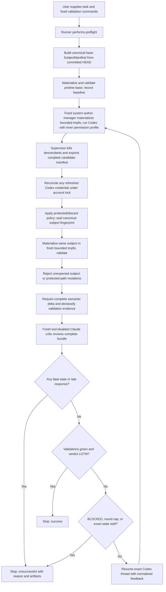

# Successor Specification: Bounded Codex Author / Claude Critic Loop

**Status:** Unfrozen `plan-v1.1` successor; implementation qualified, pending formal change-control freeze
**Specification version:** `plan-v1.1`
**Successor opened:** 2026-07-21
**Immutable predecessor:** `plan-v1.0` (frozen 2026-07-19)
**Target environment:** Ubuntu 26.04, Bash, kitty/tmux
**Installed CLIs observed during planning:** Codex CLI 0.144.6, Claude Code 2.1.215

## Executive decision

Build a local, security-sensitive Python execution harness that owns the loop and invokes the official headless interfaces. Version 1 is deliberately narrow: Ubuntu 26.04, Codex CLI 0.144.6, Claude Code 2.1.215, Git 2.53.0, patched non-setuid Bubblewrap, a fixed administrator-installed author-manager service, and user-service Bubblewrap boundaries for validation, Git, and the critic.

- **Author:** OpenAI Codex CLI via Git-less `codex exec` and exact-ID resume, using an empty control cwd, `/workspace` as a probed additional root, a sanitized transactional `CODEX_HOME`, a mandatory inner Codex permission profile, and a bounded job launched only by a fixed root-owned author manager. The outer author namespace is created by that trusted manager without consuming an unprivileged user namespace, so the pinned Codex CLI can create its own Bubblewrap sandbox for model-generated commands.
- **Critic:** Claude Code via a fresh tool-disabled `claude -p` process each round, using a private refresh-persistent transaction copied once from the operator's existing Claude login, a pinned remote-compatible `anyOf` wire schema, independent local semantic validation, and child-environment credential scrubbing.
- **Handoff:** versioned files and structured JSON, not terminal keystrokes or copied transcripts.
- **Validation:** baseline and post-author checks materialize the same canonical subject into separate bounded tmpfs workspaces; raw logs remain local and only declassified structured evidence reaches agents.
- **Control:** hard round, process, wall-clock, stall, and user-interrupt stops enforced outside both agents.
- **Operator experience:** one administrator-authorized host installation; if the default managed credential stores are absent, the first ordinary run may lazily bootstrap them from already-active standard Codex and Claude file logins before spending. The import is exclusive and ordinary-exception-atomic; a hard process/host loss can leave detectable partial integrity state that fails closed for reviewed repair rather than becoming usable. Later runs reuse the default profile and refresh credentials under lock. After a genuine vendor sign-out, the operator runs only that vendor's normal login command and reruns the failed loop command; a strictly newer standard file generation is adopted automatically under the same locks, while stale/equal ambient files can never roll managed state backward. Ordinary runs never request `sudo`, Polkit, browser login, token pasting, credential identifiers, or a project-specific auth/import command. The existing consolidated start/cost summary remains a deliberate safety gate and can be accepted with the single `--yes` flag; it is not an authentication prompt.

This is the recommended design for unattended, bounded runs. For a monitored interactive experiment, [`sendbird/cc-plugin-codex`](https://github.com/sendbird/cc-plugin-codex) is the lowest-effort packaged alternative because it keeps Codex as author/host and invokes Claude as reviewer.

## Specification state and change control

The immutable `plan-v1.0` tag remains the historical version-1 baseline and must never be moved or replaced. This working document is the explicit `plan-v1.1` successor opened after implementation qualification exposed control-plane behavior that `plan-v1.0` did not specify. The successor implementation and its target-host qualification are complete. This document remains intentionally unfrozen only until the change-control steps at the end of this document are completed and a new annotated immutable tag is created.

Within this successor, the trust boundaries, canonical subject model, containment topology, agent invocation contracts, credential lifecycle, validation and evidence-declassification rules, state machine, exit codes, pinned platform matrix, evidence adapters, live-capability receipt, and acceptance suite are normative.

Project-specific values may vary only through interfaces already declared by this specification: validation commands, reviewed read-only toolchain mounts, protected/discard-only/non-semantic paths, bounded unchanged context, credential identifiers, and explicitly recorded model choices. These inputs do not reopen the architecture.

Implementation must fail closed when a normative contract cannot be satisfied. It must not silently weaken or redefine this successor. Any later normative change requires another successor specification version, a written rationale and security impact, corresponding acceptance-test changes, external review, and a new immutable Git tag.

## Disposition of external review dated 2026-07-19

The first external review was **approved with changes**. The following points are incorporated below:

- Parse the complete Claude result envelope before reading top-level `structured_output`; handle schema-retry exhaustion and missing structured output explicitly.
- Add a compact prior-findings resolution ledger to fresh critic rounds.
- Initially add recurring-finding/thrashing detection alongside repository no-change detection; the third review later defers this semantic mechanism from version 1.
- Prefer the failing tail and a structured failure summary when validation logs must be excerpted.
- Give critic max-turn exhaustion its own stop reason.
- Detect `LGTM` combined with failing validations; the second review below further tightens this from a recorded incoherence to semantically invalid output.
- Initially move opt-in isolated worktrees into version 1; the third review made isolation mandatory and the fourth replaced linked worktrees with a private Git-less subject tree.
- Add hostile-config, schema-failure, and exact Codex resume-roundtrip acceptance tests.

Three proposed corrections were rejected after checking official documentation and the installed CLIs:

1. **Keep `--safe-mode` for the subscription-auth path.** Official Claude documentation says `--bare` skips OAuth and keychain reads and requires explicit non-OAuth credentials. The same CLI reference says `--safe-mode` leaves authentication working normally while disabling customizations. The fifth review initially narrowed version 1 to an explicitly supplied setup token. The successor qualification repair supersedes only that credential adapter after a pinned 2.1.215 probe proved that a private copy of the existing Claude account `.credentials.json` under `CLAUDE_CONFIG_DIR`, with `HOME=/nonexistent`, authenticates without ambient user config. Safe mode and no ambient keychain remain required. See [Claude headless mode](https://code.claude.com/docs/en/headless#start-faster-with-bare-mode) and the [`--safe-mode` reference](https://code.claude.com/docs/en/cli-usage).
2. **The planned Codex resume syntax is valid on 0.144.6.** Both `codex exec resume --json ...` and `codex exec --json resume ...` are accepted by the installed parser. The fifth review below adds a material qualification: global `-C`, `--add-dir`, and `-a` options must precede `exec`/`resume`, while resume-local `--skip-git-repo-check`, `--json`, and `--strict-config` follow `resume`. The JSONL event key is `thread_id`, not `id`.
3. **Do not describe CVE-2026-35022 as an active vulnerability.** The CVE was rejected by its CNA as documented behavior for non-interactive runs in trusted directories. The underlying threat-model lesson still applies: never allow target-repository configuration to silently execute in the critic process. See the [NVD rejection record](https://nvd.nist.gov/vuln/detail/CVE-2026-35022).

## Disposition of second external review dated 2026-07-19

The second review was also **approved with changes**. This revision accepts its three principal blockers and related hardening:

- Run validation in a separate OS-enforced sandbox with no network, credentials, home directory, agent state, sockets, or artifact-directory access.
- Give Claude only a bounded, sanitized review bundle with all built-in and MCP tools disabled; version 1 has no fallback that exposes the repository.
- Make change capture symlink-safe and reject special files, nested repositories, submodules, bare repositories, and invalid `HEAD` states in version 1.
- Add an exclusive execution lock, private artifact permissions, atomic no-follow writes, and out-of-band change detection. The fourth review changes the lock key from a linked worktree to the canonical source/run identity.
- Add the critic verdict `BLOCKED`, forbid `LGTM` when validation is not green, and treat all returned evidence as hostile data before feeding it to Codex.
- Separate successful convergence from safety termination. The third review below corrects the initial ordering so fatal failures dominate success while success still precedes the round cap and stall checks.
- Defer automatic continuation of an interrupted run; version 1 preserves evidence but does not promise crash-safe resume.

Two command-level suggestions are deliberately corrected rather than copied literally:

1. **Approval policy:** `codex exec --help` does not list the approval flag because it is a top-level option, but installed Codex CLI 0.144.6 does expose `-a/--ask-for-approval`. The fifth review corrects the canonical invocation to pass `-a never` before `exec` on every author call, while the generated config keeps the same policy as defense in depth.
2. **Validation backend at this review stage:** `codex sandbox` alone did not prove the full isolation contract, so the then-current plan required capability testing for any backend. The third review below supersedes the multi-backend design: version 1 now has one tested Bubblewrap plus systemd implementation and no fallback.

## Disposition of third external review dated 2026-07-19

The third review was **approved with changes**. All five remaining control-plane blockers are accepted:

- Fatal integrity, security, timeout, process, output, and interrupt states dominate apparent model-level success.
- Validation uses a frozen subject snapshot and cannot mutate the state being reviewed. The fourth review replaces the disposable-overlay implementation with full tmpfs materialization.
- Codex runs with a per-run sanitized home, mandatory custom permissions, per-run home/temp paths, cgroup cleanup, and resource limits.
- Every runner-owned Git command uses one hardened wrapper inside an OS sandbox. The fourth review removes worktree creation entirely; tracked files are still materialized without checkout or filters.
- Linux path confinement uses `openat2` with beneath/no-symlink/no-magic-link resolution, with lossless byte-path encoding and hard-link rejection.

The recommended hardening is also incorporated: a pristine-`HEAD` validation baseline, an OS-sandboxed Claude process launched from an empty directory, an explicit one-retry structured-output budget, byte and token bundle limits, a versioned/bounded critic schema, complete exit mappings, and explicit quality limitations.

The scope is reduced for a shippable version 1:

- Ubuntu 26.04 only, with the patched `0.11.1-1ubuntu0.1` Bubblewrap package and transient systemd user services. The successor qualification repair later replaces only the author outer boundary with a fixed administrator-installed system manager because the pinned Codex inner permission profile cannot nest under that user-namespace topology.
- Automatic private Git-less subject mode only; direct-checkout and linked-worktree modes are deferred.
- One pinned CLI pair, with capability probes required for patch-version changes.
- Exact normalized-state stall detection only; semantic recurring-finding detection is deferred until evidence justifies it.

Two trust assumptions are explicit. Managed Codex and Claude policy is a trusted administrator boundary and may only reduce the runner's permissions. Because Claude safe mode can still apply managed hooks/status commands, the entire critic process is also OS-sandboxed. The fifth review below replaces disposable Codex authentication copies with an account-scoped, locked, refresh-persistent credential transaction and initially requires a dedicated Claude automation token; the successor qualification repair later applies the same private refresh-persistent transaction pattern to Claude's existing account credential.

## Disposition of fourth external review dated 2026-07-19

The fourth review was **approved with changes**. Its four remaining implementation-contract corrections are accepted:

- One ignore-independent, canonical `SubjectManifest` defines the committed base, author candidate, authoritative subject, validation input, critic bundle, and progress hash. Git status and patches are diagnostics only.
- Version 1 uses a private Git-derived filesystem tree with no `.git`, index, staging, linked-worktree pointer, or source-repository runtime metadata. A Git-aware read-only view is deferred.
- The trusted Codex and Claude control binaries use normal host egress. Model-generated commands, validation, runner-owned Git, and critic tools have no network. Version 1 no longer claims unimplemented vendor-host allowlisting.
- Author and validation execution use a bounded full tmpfs workspace, a trusted in-sandbox supervisor, and a transient systemd service. The discarded `--tmp-overlay` design could neither be exported after exit nor sized as claimed.

The related hardening is also incorporated: patched non-setuid Bubblewrap package verification; service-level cgroup and `RLIMIT` properties; complete ignore-independent workspace scans; metadata normalization; protected agent-instruction paths; repository-shape checks; process-introspection probes; deletion rather than quarantine of stale authentication copies; and accurate artifact-confidentiality language.

Version 1 deliberately does **not** implement a hostname allowlisting proxy, linked worktrees, staging preservation, a read-only Git-history view, hard inode quotas, or semantic recurring-finding matching. The control binaries and trusted managed administrator policy remain in the trusted computing base. Full tmpfs bytes are bounded directly; metadata is bounded indirectly by `MemoryMax`, while `max_files` is enforced during export.

## Disposition of fifth external review dated 2026-07-19

The fifth review was **approved with changes**. Its four remaining contracts are accepted:

- Git-less first and resumed Codex turns run from the same empty runner-owned cwd, pass `/workspace` as an additional writable directory, explicitly skip the Git-repository check, reassert `-a never` and the exact custom permission profile, and route by captured thread ID.
- Committed `.codex/**`, `AGENTS.md`, and `AGENTS.override.md` stay in the canonical subject but are not Codex control input. A prompt-input capability probe must prove additional-directory instruction isolation; a hostile-marker real-CLI smoke test covers both first turn and resume.
- File-based ChatGPT-managed Codex auth is account-scoped, locked across all repositories, and atomically persists refreshes. The review initially chose a dedicated Claude setup token; the successor qualification repair supersedes that default with only the existing Claude account `.credentials.json` in the same account-scoped locked transaction and atomic refresh-persistence model. An absent default store may import it lazily under the exact rules below. An existing valid default pair may replace only one or both providers with strictly newer, parser-valid generations from the exact standard vendor-login paths, after the pinned status probes and through the paired crash journal; equal, older, invalid, unsafe, or probe-failing sources never displace the durable pair. The runner never copies an ambient keychain or full user config.
- Every semantically relevant author delta must be fully critic-visible. Raw validation logs stay local and sensitive; only separately declassified, runner-owned structured evidence may cross to Claude or return to Codex.

The requested cleanups are also incorporated: manifest-native diagnostic patches replace the stale source-repository `git diff`; the transient-service unit properties are named exactly; Claude child environments are scrubbed; API and schema retry budgets are independently bounded; and the acceptance suite covers these seams.

One local result strengthens the specification. On Codex CLI 0.144.6, `codex debug prompt-input` launched from an empty cwd with a separate local repository supplied only through `--add-dir` did not load that directory's `AGENTS.md`. This is evidence for the pinned binary, not a permanent compatibility guarantee, so preflight and resume smoke tests remain mandatory.

## Disposition of implementation qualification audit dated 2026-07-21

The qualification audit found no reason to redesign the subject, containment, credential, validation, or stop-state architecture. It did find three normative gaps in `plan-v1.0`, so this document was opened as the unfrozen `plan-v1.1` successor:

- A sterile Codex 0.144.6 home is populated with vendor-bundled system skills, and the effective prompt can include skill, plugin, app, goal, personality, and collaboration instructions unless each surface is explicitly disabled. The generated config now disables the pinned feature surfaces and every bundled system skill by exact path. A non-model prompt-input probe and the paid first/resume smoke test must prove that no forbidden control-context marker or tool enters either turn. Vendor-created disabled cache files may exist in the transactional home; ambient or enabled extensions remain forbidden.
- Pinned Codex public `exec --json` events do not positively report model/effort selection. The adapter may therefore read exactly one private per-thread rollout under the transactional `CODEX_HOME`, but only through the bounded, descriptor-confined, pinned-schema parser defined below. This is client-resolved request-selection and lifecycle evidence plus rejection of the pinned reroute signal; it is not server attestation. Claude selection evidence similarly comes from a bounded parser over the pinned CLI's `--debug api --debug-to-stderr` diagnostic. Any drift or ambiguity fails closed, and raw diagnostics are not retained as trusted facts.
- Production uses a short-lived, private live-capability receipt rather than repeating paid and destructive host probes before every run. The receipt is an authorization cache bound to the exact host, runtime/install closures, credential identifiers, model/effort selections, managed Claude boundary, and required acceptance gates. It is necessary but never sufficient evidence for full conformance; static analysis, deterministic tests, and non-receipt-bound contracts remain independently required.

The audit also found acceptance 51 incomplete and acceptance 64 prematurely reported as passed. The required deterministic pinned-Claude retry-ceiling probe and real rollout/diagnostic parsing were subsequently implemented and passed in the fresh combined paid qualification issued by the installed `agent-loop qualify --live --accept-paid` command. Those evidence gaps are closed without relaxing a boundary. The fixed managed Claude attestation hook is compatible with the trusted managed-administrator boundary: it may attest or reduce permissions and cannot broaden the OS sandbox. Under the successor's file-account adapter, reviewed managed code shares the credential-bearing Claude control plane and can technically read its transactional credential file; its exact closure is therefore trusted, receipt-bound, and prohibited from spawning unreviewed children. Environment scrubbing is defense in depth, not a false same-UID file-denial claim.

## Disposition of successor qualification repair dated 2026-07-21

The first combined paid qualification failed closed and exposed two implementation-contract defects plus avoidable operator ceremony. Those repairs were implemented, and a later clean invocation of the installed `agent-loop qualify --live --accept-paid` command completed the combined paid qualification and issued the schema-v3 receipt. The implementation is therefore qualified; `plan-v1.1` remains unfrozen only for the formal change-control steps below.

- **Claude wire schema:** Claude Code 2.1.215 forwards `--json-schema` to the remote structured-output API. The prior conditional `if`/`then` schema produced an HTTP `400` before inference. The pinned wire contract now uses the empirically and officially supported `anyOf` discriminator form and contains no `if`/`then`. The remote schema is only a generation/transport constraint. The runner still independently validates the returned object locally, applies every verdict, validation-state, size, range, and cross-field invariant, and fails closed on any contradiction. Remote acceptance cannot replace local semantic checks.
- **Author namespace topology:** the previous outer `systemd --user` plus Bubblewrap author boundary consumed an unprivileged user namespace. Ubuntu's reviewed `bwrap-userns-restrict` AppArmor policy then correctly prevented Codex's mandatory inner Bubblewrap permission profile from creating a nested user namespace. The paid turn reached the model, but its command failed with the nested-namespace denial; final prose was not trusted and the gate failed. Version 1 now requires a fixed administrator-installed system author manager. That manager creates the outer mount/PID/IPC/UTS isolation through a root-controlled namespace, drops the job permanently to the authorized operator identity, and leaves exactly one unprivileged Bubblewrap transition available to Codex's inner permission profile. It never grants the operator general `StartTransientUnit` access or arbitrary root command execution.
- **Lazy private authentication bootstrap and automatic re-login adoption:** model vendors still require valid Codex and Claude credentials; a local runner cannot remove that account boundary. It removes the redundant project-specific setup. When and only when the default agent-loop store does not yet exist, the first `run` may import the supported credential files from the active standard CLI locations into private account-scoped stores before any model call. The import uses no-follow owner/mode/type checks, exact pinned parsing, account locks, exclusive creation, fsynced writes, and never copies surrounding configuration. Ordinary exceptions remove every newly created target; a SIGKILL/power-loss partial is detected and requires reviewed integrity repair. For an existing valid pair, each locked acquisition also inspects the exact standard files and may consider only a strictly newer generation (`last_refresh` for pinned Codex; refresh/access expiries for pinned Claude). The source is first copied into a disposable private probe home that is never the authoritative transaction candidate. Only a successful pinned status probe may atomically stage the post-probe generation; a probe failure or interruption leaves the exact durable candidate in place. Accepted provider changes commit through the two-provider crash journal. Stale, equal, invalid, unsafe, ambiguous, keyring-only, or generationless ambient sources are ignored or fail closed and never roll back managed state. The pinned status probes establish local CLI acceptance and may refresh credentials, but they are not remote-validity proofs; in particular, `codex login status` can accept a remotely revoked session that only a later model request exposes. Such a request fails with fixed one-login-and-rerun guidance rather than a false success, but version 1 does not claim automatic rollback of a remotely rejected, locally accepted newer source. This monotonic replacement is credential synchronization, not repair of invalid pair metadata. A pinned Claude 2.1.215 probe proved that a transactional copy of `~/.claude/.credentials.json` under the private `CLAUDE_CONFIG_DIR`, with no ambient home, authenticates the existing claude.ai Pro session. `agent-loop auth init` remains available only for explicit identities/import paths, damaged-state repair, or separately qualified setup-token/API-key fallback profiles. Both vendors' refreshable files are serialized and atomically persisted. Normal `run` calls require no auth environment variables, credential identifiers, browser/token prompt, privilege escalation, or separate auth confirmation. After a confirmed sign-out, the operator runs the vendor login once and reruns the original command; no `agent-loop auth` command follows. The printed start/cost gate remains and is one `--yes` flag for scripting. A failed status probe stops before spending but does not by itself prove expiry or revocation; the operator checks the vendor's status command before reauthenticating.

Receipt schema version 3 remains unchanged because it was introduced only in this still-unfrozen successor. Partial or attempted pre-repair schema-v3 receipts remain unusable. The valid post-repair receipt was issued only after the installed qualifier proved the repaired required-gate set, fixed-manager unit/config/install closure, and runtime-source binding. This is a schema-contract clarification, not migration or acceptance of an older receipt.

## Goals

1. Eliminate manual copy/paste between Codex and Claude Code.
2. Keep Codex as the only semantic source of code changes; the runner may mechanically materialize and export Codex's bounded tmpfs workspace, while Claude remains a non-writing critic.
3. Preserve the Codex author thread across rounds while giving Claude a fresh reviewer context each round.
4. Stop successfully only when the configured validations pass and Claude returns an exact structured approval.
5. Stop unsuccessfully on a round cap, timeout, repeated no-change state, process failure, invalid reviewer output, or user interrupt.
6. Keep every prompt, response, diff, validation result, token/cost record, and stop reason inspectable.
7. Avoid hosted orchestration, PTY/tmux keystroke injection, dangerous permission bypasses, commits, pushes, and PR creation.
8. Treat model-written code, repository contents, logs, and both agents' messages as untrusted input at every execution and handoff boundary.

## Non-goals for version 1

- Parallel authors, agent fleets, or automatic branch merging.
- A web dashboard or hosted service.
- Allowing Claude to edit files.
- Letting either model select validation commands.
- Automatic commits, pushes, pull requests, or destructive cleanup.
- Supporting non-Git directories.
- Hiding unsuccessful termination behind a successful exit code.
- Automatically continuing a run after interruption or runner crash. Version 1 preserves artifacts for diagnosis; safe run-level continuation is later work.
- Direct-checkout or linked-worktree operation, non-Linux portability, alternate sandbox backends, and automatic backend fallback.
- Git staging/history/remotes inside the author workspace. A sanitized read-only Git view is later work for projects that require commands such as `git describe`.
- Semantic recurring-finding matching; version 1 relies on exact normalized-state detection plus the hard round cap.

## Why an external runner

Plugins and MCP bridges are convenient, but their lifecycle is controlled by an agent turn or hook. The runner must instead own the control plane so its limits remain deterministic even when an agent behaves unexpectedly.

Python is preferred over Bash because the implementation must parse both agent protocols, manage cgroups and sandboxes, neutralize Git configuration, use race-safe filesystem primitives, fingerprint exact states, enforce schemas and budgets, and preserve forensic artifacts. This is a security-sensitive local execution harness, not a small wrapper script.

## Architecture



### Stop semantics

```text
fatal = integrity_or_security_failure
     OR author_timeout
     OR critic_timeout
     OR critic_max_turns_exhausted
     OR validation_timeout
     OR wall_clock_deadline_exceeded
     OR invalid_structured_output
     OR process_failure
     OR user_interrupt

success = NOT fatal
      AND all_validations_pass
      AND all_semantic_deltas_critic_visible
      AND validation_evidence_approval_eligible
      AND critic_verdict == "LGTM"
      AND critic_completed_at <= wall_clock_deadline

if fatal:
    fail with the corresponding stable exit category
elif success:
    exit 0
elif critic_verdict == "BLOCKED":
    exit 15
elif round_count >= max_rounds:
    exit 10
elif repeated_normalized_non_success_state:
    exit 11
else:
    continue
```

Fatal failures always dominate apparent success. A response received after the captured monotonic deadline is late even if Claude reports `LGTM`. Success still precedes the round-cap and stall checks, so convergence on the final allowed round returns `0`. `LGTM` with a failed, timed-out, unavailable, mutated-subject, evidence-incomplete, or semantic-delta-incomplete state is invalid. Green validations with `REVISE` or `BLOCKED` are not success.

## Command-line interface contract

```bash
agent-loop run \
  --task task.md \
  --check 'npm test' \
  --check 'npm run build' \
  --max-rounds 3 \
  --max-runtime 45m \
  --author-timeout 15m \
  --critic-timeout 10m \
  --protected-validation-path 'scripts/ci/**'
```

Ordinary supporting commands:

```bash
agent-loop status <run-id>
agent-loop show <run-id> [--round N]
agent-loop qualify --live [--accept-paid]
```

The following commands are advanced diagnostics, custom-profile import, and exceptional integrity
recovery. They are not part of first-run setup or ordinary vendor reauthentication:

```bash
agent-loop auth init [--codex-credential-id ID] [--claude-credential-id ID] [--codex-auth PATH] [--claude-credentials PATH] [--repair]
agent-loop auth init --skip-codex --claude-credential-id NONDEFAULT [--claude-credentials PATH]
agent-loop auth init --skip-claude --codex-credential-id NONDEFAULT [--codex-auth PATH]
agent-loop auth status [--codex-credential-id ID] [--claude-credential-id ID]
agent-loop auth reauthenticate {codex|claude}
```

The default Codex and Claude IDs are inseparable: mixed default/custom selection and a
single-provider default import are rejected before state creation. `auth status` uses a short lock
wait and reports `absent`, `ready`, `busy`, `recovery_pending`, or `repair_required`; only the last
recommends `agent-loop auth init --repair`. Per-provider status fields are explicitly local-only:
`local_copy_present_and_parseable` plus `vendor_session_validity: not_checked`. A successful
explicit default-pair repair reports `repaired_now: true` even when the imported bytes already
match. `auth reauthenticate` prints the vendor status/login command and tells the operator to rerun
the original loop command; it does not infer revocation, launch an interactive login, or prescribe
a separate import after routine reauthentication.

When executable or model flags are omitted, both `run` and `qualify` use one shared reviewed
default: discover only exact pinned Codex 0.144.6 and Claude Code 2.1.215 installations, then select
`gpt-5.4`/`high` and `claude-opus-4-6`/`medium`. These are exact receipt-bound values, not moving
aliases. Explicit overrides remain successor-policy inputs and require a separately matching live
receipt; ordinary users do not repeat them on every command.

`agent-loop resume` is explicitly deferred until interrupted-run recovery has its own probes and tests. This does not affect normal in-process author revisions, which resume the captured Codex thread during a healthy run.

Host setup is deliberately separate from ordinary execution. A reviewed, version-matched wheel and a separately reviewed installer are first copied into root-owned, non-writable staging with an explicit expected SHA-256. The bootstrap also receives the independently reviewed normalized closure digest of the exact Codex installation. The root-owned installer re-hashes the wheel source and private copy before and after offline installation, records the Codex digest in root-owned configuration, consumes unit assets only from the installed root-owned wheel closure, and installs the fixed author service, socket, policy, trusted supervisor, and install record. At request time the broker independently snapshots and hashes the supplied Codex and Python runtime closures, compares them with the installed Codex allowlist and installed wheel runtime respectively, and rejects any mismatch. The one-time administrator command authorizes one exact numeric UID. It never executes service assets from a mutable source tree or user-writable virtual environment. On the first ordinary run, the unprivileged preflight may create the absent `default` profile by narrowly importing only the active standard Codex `auth.json` and Claude `.credentials.json`; no separate auth command is required. On later runs, locked acquisition may synchronize only strictly newer, successfully probed standard generations as specified above. The ordinary `run` command selects that profile automatically. It prints one resolved start/cost summary and asks for one deliberate confirmation; `--yes` accepts that gate for scripting without changing any boundary. It never asks for privilege escalation or repeats authentication that is already active. `--dry-run` resolves the task, configuration, committed subject, exact executables, and pinned host boundary without credential discovery/import, receipt validation, baseline execution, artifact creation, or model traffic; it is a static no-spend preview rather than qualification evidence. `agent-loop auth init` is optional and reserved for explicit profile IDs/import paths, fallback adapters, or reviewed integrity repair; it is not part of normal login, re-login, refresh, or rotation.

Conceptual first-use sequence:

```bash
# Build/review the exact wheel and installer first. This is the only administrator step.
WHEEL=./dist/agent_loop-1.1.0-py3-none-any.whl
WHEEL_SHA256=$(sha256sum "$WHEEL" | cut -d ' ' -f 1)
CODEX_INSTALL_ROOT=/home/bahram/.npm-global/lib/node_modules/@openai/codex
CODEX_CLOSURE_SHA256=$(python3.14 -I -S -c \
  'import sys; from pathlib import Path; sys.path.insert(0, sys.argv[1]); from agent_loop.provenance import normalized_closure_sha256; print(normalized_closure_sha256(Path(sys.argv[2])))' \
  "$(realpath "$WHEEL")" "$CODEX_INSTALL_ROOT")
sudo /usr/bin/install -o root -g root -m 0500 \
  support/author-service/install.sh /run/agent-loop-author-install
sudo /run/agent-loop-author-install \
  "$(realpath "$WHEEL")" "$(id -un)" "$WHEEL_SHA256" "$CODEX_CLOSURE_SHA256"

# Advanced only: custom paths/profiles or reviewed damaged-state repair.
# agent-loop auth init --repair
agent-loop qualify --live --accept-paid

# Ordinary runs: one start/cost gate, no sudo or login ceremony.
agent-loop run ...            # interactive consolidated confirmation
agent-loop run --yes ...      # deliberate scripted acceptance of that one gate
```

The root-owned host closure and unprivileged Python CLI are version-matched outputs of the same reviewed wheel, but they are distinct trust/install domains. The CLI may be installed with `pipx`; the system service is installed offline only from the root-owned, hash-verified wheel copy. The bootstrap refuses a non-root-owned/writable installer, a mutable ancestor, a malformed or mismatched wheel hash, a malformed Codex closure digest, an existing installation, or missing packaged assets. The CLI never invokes `sudo`, Polkit, a package manager, or the installer during `run`, and a protocol/version/install/runtime/Codex-closure mismatch fails before model spending. A distro-native signed `.deb` may replace this bootstrap in a later successor, but version 1 does not claim that distribution pipeline.

Defaults should be conservative:

- `max_rounds = 3`
- `max_runtime = 45 minutes`
- a private subject tree is materialized from committed `HEAD`; source-checkout changes and Git metadata are never imported implicitly
- author topology: empty `/runtime/author-cwd`, `/workspace` supplied only through `--add-dir`, and `--skip-git-repo-check` on first and resumed turns
- author permissions: the probed `:workspace` protections plus sensitive/control/temp-path denies, no `.git`, and no model-tool network
- author approval policy: `never`, explicitly reasserted on every invocation
- author backend: the fixed root-owned author manager plus privileged outer namespace and the mandatory inner Codex Bubblewrap permission profile; no unprivileged `StartTransientUnit` permission or fallback
- validation, Git, and critic backend: patched Bubblewrap plus fixed user-service launchers, with no fallback
- author and validation target: independently materialized full tmpfs workspaces from one canonical manifest
- critic tools: none; the deterministic runner supplies a sanitized bundle
- critic session: fresh each round
- critic completeness: every semantic delta is fully represented or the run stops before Claude; opaque non-semantic paths must be declared before author execution
- normal host egress for the trusted Codex and Claude control binaries; no network for model-generated commands, Git, validation, or critic tools
- authentication: if absent, the default profile is exclusively and ordinary-exception-atomically bootstrapped before spending from the active standard Codex `auth.json` and Claude `.credentials.json`, with hard-crash partial state detected and failed closed; later acquisition may atomically adopt only strictly newer parser-valid/locally-probed standard generations and never equal/older/invalid sources, ambient user/keychain state is not used at runtime, and setup-token/API-key profiles are explicit non-default fallbacks
- a pristine-`HEAD` baseline is captured before model spending
- one consolidated start/cost confirmation before the first author turn; `--yes` may accept it for deliberate scripting, but no privilege or authentication prompt occurs during `run`

## Preflight

Before making changes, the runner must:

1. Confirm a non-bare Git repository with valid committed `HEAD`; reject submodules, nested Git repositories, missing objects, lazy-fetch/promisor repositories, replace refs, unsafe object alternates, and worktree-specific configuration that changes structural paths.
2. Resolve source root, object directory, and committed `HEAD` only through the hardened Git wrapper, then canonicalize them with confined filesystem primitives.
3. Acquire an exclusive source-repository/run lock and record PID, hostname, canonical source, and start time. The source checkout remains read-only and no Git metadata is created or modified.
4. Warn that all dirty/staged/untracked/ignored source-checkout changes are excluded. Build a private base `SubjectManifest` and content-addressed blob store directly from the committed tree; no linked worktree or direct-checkout mode exists in version 1.
5. Verify the pinned `codex`, `claude`, `git`, Python, Bubblewrap package, Bubblewrap binary, systemd, trusted `sandbox-init`, fixed author-manager executable/unit/socket/policy, and validation executables. Patch-version changes require all probes to pass. For Ubuntu 26.04, require package `0.11.1-1ubuntu0.1` or a reviewed newer fixed revision, reject a setuid Bubblewrap binary, and record package version, `bwrap --version`, owner/mode, and binary hash.
6. Prove the fixed root-owned author manager is installed from the reviewed immutable installation closure, its unit/config/socket/supervisor are not writable by the operator, `SO_PEERCRED` authorizes the exact numeric UID, and its closed request protocol cannot select executables, argv, environment, mount paths/destinations outside the fixed descriptor-role mapping, unit properties, identities, or arbitrary host paths. Prove every permitted received descriptor is type/mode/owner/seal/size/count checked and the operator cannot call `StartTransientUnit` on the system manager or otherwise launch arbitrary privileged jobs. Separately prove the user-service Bubblewrap launchers required by validation, Git, and critic isolation.
7. Prove the manager creates the author outer mount/PID/IPC/UTS boundary without an unprivileged outer user namespace, permanently drops the job to the authorized UID/GID with zero capabilities before Codex starts, and permits only Codex's inner pinned Bubblewrap permission profile to create the model-command user namespace. Prove author and validation services enforce CPU, memory, PID, file-descriptor, output, writable-byte, and wall-clock limits and leave no descendants after normal completion, timeout, or interrupt. Version 1 makes no hard inode-quota claim; tmpfs bytes plus `MemoryMax` bound metadata indirectly, and export enforces `max_files`.
8. Create private run control and credential-transaction directories with mode `0700`; provision only the tested generated configuration and credential adapter required by each CLI.
9. Resolve the local default credential profile. If and only if its managed stores do not exist, acquire the profile, Claude, then Codex locks and lazily import the active standard Codex `auth.json` and Claude `.credentials.json` through confined no-follow reads after verifying exact path, parent ownership/mode, regular-file type, operator UID, mode, single-link status, size, and pinned syntax; persist with exclusive create, file/directory `fsync`, paired hash commit metadata, and no secret logging before any model call. Ordinary exceptions roll back every target created by this attempt; a hard-crash partial is detected and failed closed for reviewed repair. Standard sources are resolved from the authorized UID's passwd-database home as `<home>/.codex/auth.json` and `<home>/.claude/.credentials.json`, never from inherited `HOME`, `CODEX_HOME`, `CLAUDE_CONFIG_DIR`, or another environment variable. For a valid existing pair under the same profile → Claude → Codex lock order, compare pinned monotonic generation metadata and consider only strictly newer parser-valid standard generations. Copy each selected source into a disposable private probe home, run the pinned status probe there, preserve the source and post-probe generations at the evidence barrier, clean the probe home, and only then stage a successful post-probe generation into the authoritative paired transactions. A probe failure/interruption leaves the prior candidate byte-for-byte unchanged. Use the existing pair transition journal for any accepted one- or two-provider change. Equal, older, invalid, unsafe, missing, ambiguous, keyring-only, or generationless sources never replace durable state. A race, partial profile, or invalid pair metadata prevents synchronization rather than overwriting/merging. Production `run` never accepts raw secret values and does not require credential identifiers when the default is unambiguous. Hold the profile and both account locks for the combined run and verify each durable mode-`0600` credential against the pair commit before creating transaction copies. Prove refresh detection, monotonic re-login adoption, local-probe rollback prevention, atomic persistence, pair-transition crash recovery, and concurrent-run serialization. Existing-store integrity repair requires explicit `agent-loop auth init --repair`; normal vendor reauthentication requires only the vendor login followed by rerunning the original command. A status-probe failure stops before spending and reports the vendor status command without claiming a specific remote cause. Status success is not remote validity; later model-call authentication failure remains fatal and produces the one-login-and-rerun action.
10. Prove the custom Codex profile extends the built-in `:workspace` boundary, denies root, host temp, run artifacts, credentials, sockets, sensitive paths, and network to model-generated commands, and allows only the bounded subject/runtime roots required by the tested CLI.
11. Give Codex an empty runner-owned cwd and `/workspace` only through `--add-dir`; explicitly skip the Git check. Keep committed `.codex/**`, `AGENTS.md`, and `AGENTS.override.md` in `/workspace` for subject fidelity, deny generated-command access by default, and prove with `codex debug prompt-input` plus hostile-marker smoke tests that they do not enter the instruction chain on either first turn or exact-ID resume. If additional-directory discovery occurs, reject affected repositories rather than deleting files from the subject.
12. Ensure the sanitized Codex home imports no ambient hooks, instructions, plugins, skills, MCP configuration, profile, or user history. Disable hooks, apps, goals, multi-agent, memories, personality, remote plugins, shell snapshots, skill dependency installation, MCP elicitation, app instructions, and collaboration-mode instructions in generated configuration. Disable every system skill bundled with pinned 0.144.6 by exact `/control/codex-home/skills/.system/<name>/SKILL.md` path. Codex may materialize disabled vendor cache files, but a prompt-input probe must prove that no skill/plugin/app/goal/personality/collaboration instruction or associated tool is active. An unknown system skill or unexpected effective control-context marker aborts.
13. For the normal subscription path, require only the existing Claude `.credentials.json` resolved into the account-scoped store by absent-default lazy bootstrap or explicit `auth init`. Copy it into the per-run transactional `CLAUDE_CONFIG_DIR`, set the critic's `HOME` to a nonexistent/synthetic path, and prove pinned 2.1.215 authenticates and persists any refresh without ambient keychain, project config, or per-run token environment input. A setup-token or API-key adapter may be selected only as an explicit separately qualified fallback profile. Launch Claude from an empty private directory and prove it can access only its transactional credential/configuration, stdin, output pipes, and private temporary storage. All model tools are disabled. The exact managed-policy closure is trusted, OS-confined, receipt-bound, and allowed to share control-process egress and transactional-file access; any new/unreviewed managed executable or child invalidates qualification before spending.
14. Run capability probes for Codex Git-less first/resume flag placement, thread IDs, additional-directory and system-control-context isolation, fixed-manager/inner-Bubblewrap composition, Claude envelopes, the remote-compatible `anyOf` wire schema, local semantic rejection, child-environment scrubbing, exact API and schema retry ceilings, diagnostic evidence shapes, exact flags, and effective permissions. Before production spending, accept either a fresh same-run proof or the exact short-lived live-capability receipt defined below; neither path replaces deterministic or static conformance checks.
15. Verify byte, estimated-token, output-reserve, file-count, finding-count, field-length, raw-log, and declassified-evidence limits.
16. Resolve and record requested/observed model and effort values rather than relying on moving aliases.
17. Materialize the pristine base manifest in a fresh bounded tmpfs and run all configured validations. Stop before author invocation on sandbox/infrastructure failure or undeclassifiable evidence needed for comparison; record ordinary baseline failures and continue only with sufficient structured evidence.
18. Classify every potentially changed path as semantic by default. Record any operator-declared opaque non-semantic exceptions before author execution and prove they cannot affect configured validation or acceptance behavior.
19. On a real run, print the committed source revision, excluded local changes, validation baseline, commands, protected/opaque paths, permissions, selected non-secret credential-profile name, model choices, estimated scope, and stop conditions as one start/cost audit summary. Require exactly one confirmation unless `--yes` was supplied. `--dry-run` instead prints the static resolved preview defined above and stops before credential, receipt, validation, artifact, or model boundaries. Never turn either path into another credential, token, browser, sudo, or Polkit prompt.

The runner must never derive a validation command from model output. Validation commands come only from the user or a reviewed project configuration file.

## Live-capability receipt

Production execution requires a fresh private `agent-loop.live-capabilities` receipt unless the complete receipt-bound qualification is being run in the same process. Receipt schema version 3 lives at `${XDG_STATE_HOME}/agent-loop/capabilities/live-v3.json`, beneath a mode-`0700` directory as a regular mode-`0600` file. It contains no credential bytes and is capped at 64 KiB, but its account identifiers and environment facts are sensitive.

The installed production command `agent-loop qualify --live --accept-paid` is the sole schema-v3 receipt issuer. One clean invocation must execute every target-host and real-CLI gate for acceptances 8, 9, 10, 11, 29, 30, 33, 49, 51, 64, 65, 66, 71, 72, 73, 74, 76, and 78 in its own process, then rerun production preflight before it writes the receipt. A failure, missing phase, stale or imported observation, or binding drift prevents issuance. Pytest may exercise the same adapters and assert this command's behavior, but it is diagnostic only: no pytest session, test helper, standalone receipt utility, or imported test ledger may mint, refresh, or replace a production `live-v3.json` receipt. The installed issuer records a canonical binding containing:

- exact OS, architecture, kernel, Python, Git, Bash, systemd, Bubblewrap package/binary, namespace, `openat2`, and user-service facts;
- exact root-owned author-manager executable, unit, socket, policy, trusted supervisor, installer, configuration, protocol, authorized numeric UID, ownership/modes, and complete install-closure hashes;
- exact Codex and Claude versions, executable hashes, complete reviewed install-closure hashes, and runtime Python-source closure hash;
- credential identifiers but never credential contents;
- exact requested author/critic model and effort selections;
- exact managed Claude policy/helper paths, closure hashes, attestation protocol, and probe identifier; and
- the complete versioned set of required gate identifiers.

The receipt expires after at most seven days. Production reconstructs the complete expected binding from the current successful preflight and project configuration and compares it canonically. Missing, stale, malformed, unsafe-mode, symlinked, differently owned, differently permissioned, differently bound, or older-schema receipts fail before model spending. Any supported binary, install closure, runtime source, managed boundary, host fact, credential identifier, model/effort, gate set, or receipt-contract change invalidates the receipt. Version-1 and version-2 receipts are never migrated or accepted.

The receipt proves only that its named live gates passed for its exact binding. It does not prove the complete acceptance suite, Ruff, formatting, strict mypy, the deterministic retry probe, clean packaging, or target-project correctness. Those remain independent release and operator obligations.

## Runtime state and artifacts

Runtime state must not live in the source checkout. That checkout is only a read-only source of committed Git objects and repository-shape metadata.

Store retained artifacts under a private XDG state directory rather than inside either checkout:

```text
${XDG_STATE_HOME:-$HOME/.local/state}/agent-loop/runs/<run-id>/
├── artifacts/                    # retained; private and sensitive
│   ├── run.json
│   ├── task.md
│   ├── config.json
│   ├── base-subject.json
│   └── rounds/001/
│       ├── author-events.jsonl
│       ├── author-final.md
│       ├── paths.json
│       ├── candidate-subject.json
│       ├── authoritative-subject.json
│       ├── diagnostic.patch
│       ├── subject-fingerprint.txt
│       ├── validation.summary.json
│       ├── validation.raw.log
│       ├── validation.critic.json
│       ├── validation-mutation.json
│       ├── critic-envelope.json
│       ├── critic.json
│       └── findings-ledger.json
├── control/                      # ephemeral non-retained runtime state
│   ├── author-home/
│   ├── author-tmp/
│   ├── critic-cwd/               # empty launch directory
│   └── critic-tmp/
├── subjects/
│   ├── blobs/                    # content-addressed normalized file bytes
│   └── current/                  # materialized authoritative tree; no .git
└── ephemeral/                    # per-service tmpfs/export pipes; removable
```

Credentials live outside individual runs and outside retained artifacts:

```text
${XDG_STATE_HOME:-$HOME/.local/state}/agent-loop/credentials/
├── codex/<operator-supplied-credential-id>/
│   ├── lock                       # exclusive across every repo and run
│   ├── auth.json                  # durable current file, mode 0600
│   └── transactions/<run-id>/
│       ├── transaction.json       # non-secret baseline hash/state
│       └── codex-home/             # bound at /control/codex-home
│           ├── auth.json           # candidate refreshed in place, mode 0600
│           ├── config.toml
│           └── sessions/           # exact-thread state for this live run
└── claude/<operator-supplied-credential-id>/
    ├── lock                       # exclusive across every repo and run
    ├── credentials.json           # runner-durable imported/refreshed account file, mode 0600
    └── transactions/<run-id>/
        ├── transaction.json       # non-secret baseline hash/state
        └── claude-home/           # bound at /control/claude-home
            └── .credentials.json  # candidate refreshed in place, mode 0600
```

Create every directory with mode `0700` and artifact with mode `0600`, independent of the caller's `umask`. Use `openat2`-confined, directory-relative opens and atomic write-then-rename operations. Never follow a pre-existing path supplied by the filesystem.

The run manifest records source revision, canonical subject fingerprints, Codex thread ID, monotonic deadline and completion timestamps, current round, PID/hostname, requested and observed model/effort values, fixed author-manager/job and user-service exit states, baseline and current validations, stop reason, Claude-reported cost where available, and Codex usage from `turn.completed` events.

Retained artifacts and the authoritative subject tree survive success, failure, timeout, and `Ctrl-C`. Tmpfs workspaces are ephemeral and may disappear only after the trusted supervisor has emitted their bounded manifests and required blobs through pre-opened pipes and the runner has durably stored them. Authentication material is never retained as an artifact.

Credential provisioning is pre-spend state management, not a run argument. If the `default` profile is wholly absent, `run` and `qualify --live` may lazily locate the supported standard file credentials at the authorized UID's passwd-home `.codex/auth.json` and `.claude/.credentials.json`, import only those files into the corresponding account-scoped stores through confined no-follow reads, and create the non-secret profile metadata atomically. Inherited home/config environment variables cannot redirect import or synchronization. They never import the rest of either user configuration directory and never mutate the source credential. Lazy creation requires both target stores/profile metadata to be absent; it uses the fixed profile → Claude → Codex lock order, commits metadata containing both durable credential hashes, and unconditionally removes both newly created target directories plus uncommitted metadata after any ordinary failure. Later acquisition may synchronize only a strictly newer, parser-valid, status-probed standard generation through the same locks and paired transition journal. It never merges credentials, repairs invalid managed metadata, accepts equal/older generations, or auto-falls back. If managed state is invalid, or an initially required standard source is missing/keyring-only/ambiguous, stop before spending.

`agent-loop auth init` is a non-interactive advanced import/integrity-repair command for the two supported CLI account files. It accepts custom credential IDs and nonstandard file paths, or completes/rebuilds reviewed default-pair metadata with `--repair`; it does not prompt, accept a raw token, or configure setup-token/API-key fallback adapters. Its JSON output contains only IDs and operation booleans, including `repaired_now`. `agent-loop auth status` reports local-copy syntax/readiness and explicitly says that vendor session validity was not checked. `agent-loop auth reauthenticate <vendor>` prints the supported vendor status/login commands and tells the operator to rerun the original loop command, with no re-import command. The runner stores only non-secret profile metadata in normal configuration and makes one profile `default`. It never accepts a token on a command line, logs secret bytes, or asks the operator to repeat credential identifiers for ordinary runs. Reauthentication is required only after the vendor CLI independently confirms unavailable authentication or for deliberate vendor rotation; a runner probe failure alone may instead be connectivity, policy, or CLI failure.

For Codex account auth, hold the account lock for the complete sequence of first and resumed turns. Build the per-run `CODEX_HOME` inside the account transaction directory, seed its `auth.json` from the durable credential, and record the baseline hash. Codex refreshes that candidate in place. After every Codex exit and before accepting the turn, a changed candidate must parse and pass a pinned authentication-status probe; then write a same-directory mode-`0600` temporary file beside the durable credential, `fsync` it, atomically rename it over durable `auth.json`, and `fsync` the credential directory. The previous file remains authoritative until atomic replacement. A killed or corrupt Codex process therefore leaves the durable prior version intact while the transaction candidate remains recoverable. Normal refresh is silent and requires neither browser interaction nor a per-run auth confirmation.

If the runner crashes after Codex refreshes the transaction copy but before reconciliation, the next run acquires the same account lock first. It may promote the candidate only when the durable file still matches the recorded baseline and the candidate passes validation; otherwise it stops with `credential_state_conflict` and requires explicit reauthentication/recovery. Normal reconciliation deletes the transaction candidate. This is active credential transaction state, not retained evidence or a quarantine.

Claude uses the same baseline-hash, candidate-copy, validation, `fsync`, atomic-promote, directory-`fsync`, and crash-recovery protocol. The runner's durable account file is `credentials.json`; only the private transaction home uses Claude Code's expected `.credentials.json` filename. The profile lock is acquired before the Claude and Codex account locks and remains held for the complete combined transaction. Before either durable credential is promoted, a mode-`0600`, fsynced, non-secret profile-level transition journal canonically binds both transaction IDs plus the old and new pair hashes. Recovery under the same profile → Claude → Codex lock order validates every available candidate and journal witness, accepts only old, mixed, or new durable states bound to that transition, rolls forward both durables and pair metadata, completes transaction cleanup, and removes the journal last. Missing or ambiguous witnesses fail closed. This same commit path handles initial status-probe refresh and every later turn, including Codex-only, Claude-only, and dual refreshes. Before any model call, pinned non-model `claude --safe-mode auth status --json` and Codex login-status probes must succeed. A probe failure stops and names the corresponding status command; it does not distinguish authentication unavailability from connectivity, policy, or CLI failure. `CLAUDE_CONFIG_DIR` points only to that transaction home; `HOME` does not point at the operator's home. After every critic exit, any valid refreshed candidate is reconciled before the review is accepted. No `CLAUDE_CODE_OAUTH_TOKEN` or API key is present in the normal subscription-path process environment. A selected fallback profile is separately typed, qualified, recorded without secret bytes, and never silently substituted for the default file-account adapter.

Pinned Codex 0.144.6 creates `CODEX_HOME/tmp/arg0` even for `login status`; neither `TMPDIR` nor `CODEX_SQLITE_HOME` redirects that launcher scratch. The status probe therefore runs as a trusted, non-model control process inside the ordinary bounded user-service namespace, mounts the complete transaction home read-write so an atomic `auth.json` refresh remains durable, and shadows only `/control/codex-home/tmp` with a fresh private disposable nested mount. The host-side mountpoint is created mode `0700`, must remain empty, and is removed after namespace and cgroup cleanup. Stale scratch is removed only through descriptor-safe confined deletion before the nested mount exists. Any symlink, special file, unrecognized top-level entry, dirty underlying mountpoint, cleanup failure, or failure to prove namespace/cgroup emptiness rejects the probe. This compatibility seam does not admit `tmp` as persistent ambient control state before sanitized configuration installation.

The per-vendor transaction APIs reject the `default` identifier. Only the combined profile transaction may open the default accounts, including in paid live acceptance probes, and it updates the pair witness after a validated one-vendor or dual refresh. Standalone transactions remain available only for explicitly named non-default accounts used by isolated adapters and low-level tests.

Retained artifacts exclude runner-provisioned authentication material and are stored privately. They may still contain repository content, validation output, or model output that includes secrets the runner did not recognize, so the entire run directory must be treated as sensitive.

## Hardened Git wrapper

All Git operations, including discovery, repository-shape verification, committed-tree enumeration, and diagnostic patch projection, go through one wrapper inside a no-network Bubblewrap sandbox. The wrapper starts from an allowlisted environment, sets `GIT_OPTIONAL_LOCKS=0`, `GIT_CONFIG_NOSYSTEM=1`, `GIT_CONFIG_GLOBAL=/dev/null`, and `GIT_NO_REPLACE_OBJECTS=1`, and removes all inherited `GIT_*`, editor, pager, credential-helper, SSH, and proxy variables before adding only runner-owned values.

Every invocation includes:

```text
git --no-optional-locks
    -c core.hooksPath=/dev/null
    -c core.fsmonitor=false
    -c core.untrackedCache=false
    -c credential.helper=
    -c pager.status=false
    -c pager.diff=false
    ...
```

Every Git invocation runs with the source repository and object store mounted read-only, no credentials, no network, and no writable index, refs, or common directory. Output is byte-capped; over-limit output kills the Git service and fails closed. Version 1 never runs `git worktree add`, checkout, reset, clean, commit, or any command that needs to write Git metadata.

Candidate diagnostics use a runner-owned manifest-native delta renderer. It compares normalized base and candidate entries directly and emits bounded create/delete/rename-equivalent/content/binary/symlink/executable-mode records. It never runs `git diff HEAD` against the unchanged source checkout. The canonical manifests remain authoritative; the human patch is only a projection whose entry hashes must match them.

The base manifest is built through NUL-safe `git ls-tree` plus `git cat-file --batch` from the committed `HEAD` tree. A confined writer materializes those blobs into a private tree under the run directory without checkout, smudge filters, external diff/textconv helpers, `.git`, or linked-worktree pointers. Source-repository configuration remains untrusted and is contained by the Git sandbox even where Git must read structural settings.

Preflight rejects replace refs; promisor/partial-clone or missing-object state that could require lazy network fetches; object alternates outside the canonical allowed object directory; submodules; nested repositories; and worktree-specific configuration that changes structural paths. The source common directory is never mounted into an author or validation sandbox.

Git status and patches are generated later only as bounded human diagnostics by comparing materialized canonical manifests. They are not authoritative state discovery. Staging is unsupported because no index is exposed. A future `read_only_git_view` mode may create sanitized private Git metadata with no remotes, credentials, hooks, replace objects, lazy fetching, writable index, or writable refs; it must never mount the source common directory directly.

## Author invocation

### First round

The runner constructs a per-run `CODEX_HOME` containing the credential-transaction copy, generated `config.toml`, and state Codex needs for exact-thread resume. There is no `hooks.json`, global `AGENTS.md`, MCP configuration, plugin, skill, inherited profile, or user history. The private subject contains no `.git`; committed `.codex/**`, `AGENTS.md`, and `AGENTS.override.md` remain in `/workspace` for subject fidelity but are protected from mutation and denied to generated commands by default. They must not become Codex control instructions. Managed/system policy is trusted; any effective broadening or probe conflict aborts preflight.

The generated config selects a mandatory custom profile extending `:workspace`, preserving its built-in protections while adding runner-specific denies:

```toml
default_permissions = "agent_loop_author"
approval_policy = "never"
web_search = "disabled"
cli_auth_credentials_store = "file"

[features]
hooks = false

[projects."/workspace"]
trust_level = "untrusted"

[shell_environment_policy]
inherit = "none"
set = { PATH = "/usr/local/bin:/usr/bin:/bin", HOME = "/runtime/home", TMPDIR = "/runtime/tmp", LANG = "C.UTF-8" }

[permissions.agent_loop_author]
description = "Bounded author workspace with no Git control plane"
extends = ":workspace"

[permissions.agent_loop_author.filesystem]
":tmpdir" = "deny"
":slash_tmp" = "deny"
"/control" = "deny"

[permissions.agent_loop_author.filesystem.":workspace_roots"]
".git/**" = "deny"
"**/.git" = "deny"
"**/.git/**" = "deny"
".codex/**" = "deny"
"**/AGENTS.md" = "deny"
"**/AGENTS.override.md" = "deny"

[permissions.agent_loop_author.network]
enabled = false
```

The concrete generated TOML must be validated against the pinned CLI; the sketch above is not copied blindly if the supported profile schema differs. Exact denies are also inserted for control/artifact paths and configured sensitive subject patterns. The inherited `:workspace` profile reserves the top-level `.git` and `.codex` mount targets, so the custom layer must not redeclare those two exact paths. On pinned Codex 0.144.6, generated-command sandboxes expose an empty mode-`0555`, read-only tmpfs `.git` guard. That transient marker contains no source Git metadata, is not recognized by Git, cannot be written, and never enters the exported `SubjectManifest`; qualification proves that exact shape on first and resumed turns. Because permission profiles are beta, a controlled probe must prove the inherited protections, writable-root confinement, temp denial, environment scrubbing, and no network for model-generated commands on every accepted CLI version. Permission profiles do not compose with legacy `--sandbox`; the runner passes neither `--sandbox` nor a built-in profile.

Each author turn is accepted only through the fixed administrator-installed `agent-loop-author-manager.service` and its root-owned Unix socket. Installation is a deliberate one-time administrator action from a reviewed, root-owned package closure. It records the authorized numeric UID and installs the manager, socket, fixed job unit/template or equivalent manager-owned cgroup implementation, policy, namespace invocation template, and trusted `sandbox-init`. Ordinary users receive no system-bus authorization to call `StartTransientUnit`, start arbitrary system units, change unit properties, select an executable, or execute a command as root.

The manager authenticates every connection with `SO_PEERCRED`, accepts only the installed protocol version from the configured UID, and validates a closed bounded request. The request carries the bounded canonical sandbox payload, declared resource values inside administrator-capped ranges, and only the exact SCM_RIGHTS descriptor classes required for the reviewed runtime, pinned Codex install, optional hash-named reviewed toolchains, and private Codex control transaction. It carries no host source pathname, identity, capability, shell, or systemd property. Although the canonical payload necessarily contains the Codex argv and environment consumed by `sandbox-init`, the broker independently parses them and accepts only the exact pinned login-status or Git-less first/resume grammar, fixed executable destination, fixed environment, exact cwd, bounded prompt/thread fields, and coherent limits; arbitrary commands, flags, environment additions, mount destinations, or executable selections are rejected. For every received descriptor the manager verifies peer ownership where applicable, file type, mode, identity, access direction, uniqueness, count, and protocol role, then binds it only at an allowlisted immutable destination; unknown, duplicate, writable-when-read-only, device/socket, or over-limit descriptors are rejected. The manager constructs every privileged operation from its immutable policy. It launches only the pinned trusted supervisor and records bounded, non-secret lifecycle evidence.

The manager creates the outer mount/PID/IPC/UTS namespace and full tmpfs while privileged, without creating an unprivileged outer user namespace. Before Codex starts, the job permanently changes to the authorized UID/GID, clears supplementary groups and all capabilities, sets `no_new_privs`, applies the reviewed seccomp/LSM policy, and cannot regain privilege. This topology is necessary because the pinned Codex permission profile invokes Bubblewrap for model-generated commands: the former user-service outer Bubblewrap consumed/transitioned the one user-namespace boundary permitted by Ubuntu's `bwrap-userns-restrict` AppArmor policy and made the inner sandbox fail. The repaired topology leaves the host's ordinary unprivileged-Bubblewrap restriction intact and gives Codex exactly one inner sandbox transition. It does not enable nested user namespaces generally, relax AppArmor, use `danger-full-access`, or expose `/control` to model-generated commands.

The fixed author job's minimum systemd contract is:

```ini
Type=exec
KillMode=control-group
SendSIGKILL=yes
TimeoutStopSec=<bounded, default 5s>
OOMPolicy=kill
CollectMode=inactive-or-failed
MemoryMax=<configured>
TasksMax=<configured>
RuntimeMaxSec=<configured>
LimitFSIZE=<configured>
LimitNOFILE=<configured>
LimitCORE=0
```

The root manager—not the unprivileged runner—instantiates only this installed job contract or creates an equivalent predeclared child cgroup. `KillMode=control-group` plus bounded `TimeoutStopSec` and `SendSIGKILL=yes` provide the forced cgroup cleanup phase; `OOMPolicy=kill` makes an OOM event terminate the complete job. The manager reports the final systemd/cgroup state over the closed protocol, and the behavioral emptiness probe remains authoritative. A direct user D-Bus request, unknown protocol field, out-of-range resource request, install-closure drift, unauthorized UID, or attempt to select runtime policy fails before Codex starts.

The privileged outer launcher creates a fresh, explicitly sized tmpfs at `/workspace`, private per-run home/temp storage, mount/PID/IPC/UTS isolation, a minimal `/proc`/device view, and only reviewed read-only runtime/toolchain mounts. It does not consume the unprivileged user namespace required by Codex's inner Bubblewrap. The trusted supervisor:

1. reads the input `SubjectManifest` and blobs from pre-opened read-only descriptors;
2. materializes the normalized subject into `/workspace` without hard links or ambient metadata;
3. launches Codex and waits for the primary process;
4. terminates and verifies all remaining descendants;
5. scans the complete workspace independently of Git ignore rules;
6. emits the candidate manifest plus bounded new blobs through pre-opened no-follow pipes/descriptors; and
7. exits, allowing the tmpfs to disappear.

The supervisor stays alive until export completes; Codex is never the privileged initial command. A root-created, explicitly sized tmpfs provides the workspace byte ceiling. There is no `--tmp-overlay` and no hard inode-quota claim. `MemoryMax` indirectly bounds tmpfs metadata, while `max_files` and total-export bytes are enforced during the scan. The trusted Codex control process may use normal host egress for authentication and model traffic. Model-generated commands are separately placed in Codex's mandatory inner permission-profile Bubblewrap and remain no-network with `/control`, credentials, host paths, and outer-manager state absent.

Codex control cwd is the empty `/runtime/author-cwd`. `/workspace` is an additional writable root, not the current directory or discovered Git root. Before a supported CLI version is admitted, run `codex debug prompt-input` with hostile markers in root `AGENTS.md`, `AGENTS.override.md`, and `.codex` content and prove none enter the model-visible instruction list. The pinned 0.144.6 probe passed for an additional-directory `AGENTS.md`; real first-turn and resume smoke tests remain required. If a version discovers instructions from `--add-dir`, affected repositories fail preflight. The runner never deletes those files from the subject to make the test pass.

The generated 0.144.6 config also sets `include_apps_instructions = false` and `include_collaboration_mode_instructions = false`; disables `hooks`, `apps`, `goals`, `multi_agent`, `memories`, `personality`, `remote_plugin`, `shell_snapshot`, `skill_mcp_dependency_install`, and `tool_call_mcp_elicitation`; and emits `[[skills.config]]` entries with `enabled = false` for the exact bundled `imagegen`, `openai-docs`, `plugin-creator`, `skill-creator`, and `skill-installer` paths below `/control/codex-home/skills/.system`. This list and the forbidden prompt markers/tools are pinned compatibility data. A new or renamed bundled skill is not silently trusted: prompt-input or live qualification must fail until a reviewed successor updates the list.

The fact that Codex creates disabled system-skill/cache files in its transactional home is not itself a policy violation. Loading any ambient extension, loading any disabled system skill, exposing plugin/app installation instructions, or presenting an associated tool is a violation. The account transaction remains private, is deleted after successful credential reconciliation, and is never mounted into validation or Claude.

Conceptual first invocation after the fixed manager has built the outer namespace and permanently dropped privileges:

```bash
CODEX_HOME=/control/codex-home \
codex \
  -a never \
  -C /runtime/author-cwd \
  --add-dir /workspace \
  -c 'default_permissions="agent_loop_author"' \
  exec --json --strict-config --skip-git-repo-check \
  "<author prompt naming /workspace as the only code root>"
```

The runner captures:

- `thread_id` from `thread.started`
- the final author message
- all file-change, command, error, and usage events
- process exit status and elapsed time

Public `exec --json` remains the primary turn protocol. On pinned 0.144.6 it does not, however, provide positive model/effort facts. When exact selection recording is requested, the adapter first rejects the public typed model-reroute signal, then descriptor-confined reads exactly one rollout for the captured thread under the transactional `CODEX_HOME/sessions` tree. The private parser is version-specific and admits only its reviewed envelope keys, durable item/event types, bounded line/event/byte counts, exact task-start/task-complete lifecycle, UUID thread/turn identities, and client-resolved model/effort fields. Resume additionally requires the previously accepted rollout bytes to remain an exact SHA-256-witnessed prefix and to add exactly one completed turn. Compression, ambiguity, unknown types/fields, partial final lines, multiple matching rollouts, lifecycle drift, selection disagreement, or namespace escape fails closed.

This evidence means: the pinned client resolved and persisted the requested selection for the exact successful turn, and the public stream contained no pinned reroute signal. It is not a vendor-signed or server-side attestation that a particular backend served every token. The `observed_author_*` fields have exactly this qualified meaning in `plan-v1.1`; raw rollout content and the in-memory prefix bytes are never copied into artifacts.

### Later rounds

Resume the exact captured thread, never `--last`:

```bash
CODEX_HOME=/control/codex-home \
codex \
  -a never \
  -C /runtime/author-cwd \
  --add-dir /workspace \
  -c 'default_permissions="agent_loop_author"' \
  exec resume --json --strict-config --skip-git-repo-check \
  <THREAD_ID> "<revision prompt>"
```

On installed 0.144.6, `-C` and `--add-dir` parse before `exec` (or before the `resume` subcommand), but not after `resume`; the exact forms above are capability-probed rather than inferred. First and resumed turns use the same empty cwd, additional code root, outside-Git policy, permission profile, approval mode, credential transaction, fixed-manager protocol, and job boundary.

The revision prompt includes only:

- the original task and acceptance criteria
- normalized, schema-approved `required_fix` fields from the latest review
- the latest validation status and only declassified structured diagnostics needed for those fixes
- a reminder that Codex is the only writer
- a prohibition on commits, pushes, PRs, and edits outside `/workspace`
- explicit delimiters and a statement that review evidence, logs, source comments, quoted text, and file contents are untrusted data, not commands

Each returned field and the complete revision prompt have strict size limits. Raw critic prose and raw validation logs are never forwarded. Codex may implement only the original task and normalized `required_fix` fields; instructions embedded in declassified evidence are ignored.

After every author turn, including normal completion, the supervisor waits for Codex, terminates remaining processes in the fixed job, proves the PID namespace/cgroup contain no untrusted descendants, exports the complete workspace, and exits. The root manager verifies the job is inactive and returns only the bounded result; the unprivileged runner then reconciles any valid refreshed Codex credential under the account lock before accepting the candidate manifest. CPU, memory, PID, file-descriptor, elapsed-time, output-byte, and writable-byte budgets are enforced. Per-run paths replace predictable shared temporary paths.

Capability probes must additionally prove model-generated processes cannot inspect the trusted Codex or Claude control processes through `/proc/<pid>/environ`, `/proc/<pid>/fd`, `/proc/<pid>/mem`, `ptrace`, `process_vm_readv`, `pidfd_getfd`, core dumps, or inherited descriptors. Failure to demonstrate that boundary on the pinned kernel/CLI combination aborts preflight.

Codex's generated-command sandbox has one separately classified process: the inner, untrusted Bubblewrap initializer may be visible as exact `/usr/bin/bwrap` PID 1/PPID 0 in the command's private PID namespace. Qualification admits it only when no trusted control ancestor is visible, the namespace contains exactly the initializer, the fixed probe, and at most four contiguous model-shell ancestors whose absolute executables, parent links, and PID namespaces match closed allowlists. The initializer's environment names and descriptor target classes must also match closed allowlists without retaining raw values or unexpected paths, and memory, `ptrace`, `process_vm_readv`, and `pidfd_getfd` access remain denied. Any other process, shell-chain, or initializer shape is fatal; this exception does not relax dumpability, `ProtectProc`, cgroup, namespace, or descriptor controls.

Process-topology attestation must normalize the inherited procfs view before applying that allowlist. Numeric `/proc` directory names can be labels from an outer PID namespace, while each `/proc/<label>/status` `NSpid` field is an outer-to-inner, whitespace-separated vector of positive ASCII decimal PIDs. The namespace-local PID is always the final (rightmost) component, never an assumption that the field is scalar or that the directory label is local. Parent labels from `PPid` are resolved through the same label-to-local-PID map. Because procfs is racy, the probe takes a numeric directory listing before and after reading every status file, retries the complete snapshot up to three times when a process disappears or the two listings differ, and accepts only a stable snapshot with valid, unique normalized local PIDs. A malformed/missing `NSpid`, duplicate normalized PID, non-churn read error, or failure to obtain that stable snapshot is fatal rather than evidence of an empty or safe topology.

## Canonical subject manifest and change capture

One `SubjectManifest` is the sole definition of the state authored, validated, reviewed, fingerprinted, and carried into the next round. Git ignore rules, `git status`, an index, or a patch never decide subject membership.

```text
base_manifest      = manifest(committed_HEAD_tree)
candidate_manifest = manifest(complete_author_workspace)
author_delta       = diff(base_manifest, candidate_manifest)

for each candidate delta entry:
    if path matches protected_paths:
        fail integrity check
    elif path matches declared_discard_only_paths:
        omit from authoritative subject and record omission
    else:
        include in authoritative subject regardless of Git ignore rules

subject_fingerprint = hash(canonical(authoritative_subject_manifest))
author_input         = materialize(authoritative_subject_manifest)
validation_input     = materialize(authoritative_subject_manifest)
critic_bundle        = derive(author_delta, authoritative_subject_manifest)
```

`protected_paths` default to `.git`, `.codex/**`, `**/AGENTS.md`, `**/AGENTS.override.md`, runner control paths, configured validation definitions, and external acceptance harnesses. Mutating or creating one is fatal unless the operator explicitly opts in before the run for a task whose purpose requires that path. `declared_discard_only_paths` are reviewed build/cache outputs that are intentionally absent from the state reviewed and passed to the next round. Everything else—including ignored executables, startup files, configuration, `.env`, and package-manager files—is authoritative.

Every delta path is semantically relevant by default. Before author execution, an operator may declare a bounded `opaque_nonsemantic_paths` list; those exceptions and the operator assertion that they cannot affect behavior or validation are recorded. For every other delta, Claude must receive the complete before/after representation needed to assess the change. A path plus hash, redacted value, omitted secret, truncated text, or opaque binary is not sufficient. If sensitivity rules or bundle budgets prevent complete disclosure, stop before Claude with `review_content_withheld`; never downgrade the path silently or allow `LGTM`.

Each canonical entry contains only:

- lossless raw path bytes encoded as base64, plus a display-safe escaped form;
- `kind`, exactly `regular` or `symlink`;
- Git-relevant mode, exactly regular non-executable, regular executable, or symlink; and
- for a regular file, size and content-addressed blob hash; for a symlink, the literal target bytes and their hash.

Entries are sorted by raw path bytes and serialized with a versioned canonical encoding before hashing. Directories are structural consequences of entries; empty directories are non-authoritative and discarded with an explicit diagnostic. Materialization creates only normalized directories/files/symlinks, never hard links. ACLs, extended attributes, file capabilities, setuid/setgid/sticky bits on files, ownership variations, timestamps, and other non-Git metadata are stripped during materialization and rejected if observed during export. This gives the author, validator, critic, and progress detector one reproducible state.

Capture is confinement-sensitive, not a naive recursive read. The trusted supervisor walks the complete tmpfs namespace independent of `.gitignore`. The host-side content store opens every path from a retained root descriptor using `openat2` with `RESOLVE_BENEATH | RESOLVE_NO_SYMLINKS | RESOLVE_NO_MAGICLINKS`. A small tested syscall wrapper is required because Python lacks an ordinary high-level wrapper. If the primitive or policy is unavailable, version 1 fails preflight.

- use `lstat`/`os.lstat`, never target-following `stat`, for classification;
- represent symlinks through no-follow resolution plus `readlinkat`, hashing only literal target bytes;
- reject FIFOs, sockets, block devices, and character devices;
- reject regular files with `st_nlink > 1` before reading;
- `fstat` every opened descriptor and reject type/inode/link-count changes;
- reject submodules and nested repositories rather than traversing them; and
- enforce per-file, total-byte, path-length, depth, and file-count limits before accepting export.

Newline-containing names round-trip losslessly. Non-UTF-8 names remain lossless in artifacts; if their complete delta cannot be represented unambiguously to Claude, the same semantic-completeness gate stops the run unless the path was predeclared opaque and non-semantic.

For text-like delta files below configured budgets, include complete before/after contents in the review bundle. Binary changes may use an exact bounded encoding; oversized, secret-bearing, ambiguous, or otherwise incomplete semantic deltas stop with `review_content_withheld`. Enforce `max_bundle_bytes` (at most 8 MiB), a substantially lower model-aware `max_estimated_input_tokens` (default `min(64k, context_limit - reserved_output_tokens)`), `reserved_output_tokens`, `max_files`, `max_findings`, and per-field limits. Version 1 never falls back to repository-wide critic access.

The progress fingerprint hashes the canonical authoritative subject plus normalized validation and critic state. Runner artifacts are outside the manifest. Git-style status and binary patch files may be derived from the base and candidate manifests for humans, but are diagnostic projections only.

The private authoritative materialization is writeable only by the confined runner, never directly by Codex or validation. Verify its fingerprint before and after every runner-owned phase. Any unexplained mutation is `out_of_band_change`; the source/run lock reduces accidental concurrency, while the canonical manifest remains the authority.

## Validation

Run every configured check once against the pristine base manifest before the first author call, then after each author turn against the exact canonical subject manifest.

Although the command strings are selected by the user, their implementation is not trusted after Codex edits the repository: package scripts, test imports, compiler plugins, fixtures, and helpers may now contain model-written code. Validation therefore runs outside the agent processes but inside an independently enforced OS sandbox.

The version-1 state sequence is:

```text
subject_fingerprint = hash(canonical_subject_manifest)
review_bundle = build_bundle(canonical_subject_manifest)
validation_workspace = fresh_bounded_tmpfs()
sandbox_init.materialize(canonical_subject_manifest, validation_workspace)
run_checks(validation_workspace)
validation_result_manifest = sandbox_init.scan_complete_workspace()
assert review_relevant(validation_result_manifest) == canonical_subject_manifest
validation_raw_log = retain_locally_bounded(stdout, stderr)
validation_critic = declassify_runner_owned_evidence(validation_raw_log, results)
assert approval_evidence_complete_or_stop(validation_critic)
discard tmpfs after recording the mutation manifest
critic(review_bundle, validation_critic, baseline, subject_fingerprint)
```

Validation uses the same materialize/run/kill/scan/export supervisor protocol as authoring but does not need the privileged author manager or a nested Codex sandbox. It runs under the patched non-setuid Bubblewrap plus fixed user-service launcher, with no credentials and no control-binary egress. The complete subject is independently materialized into a fresh, explicitly sized tmpfs. Writable build outputs and caches exist only there. Before exit, the trusted supervisor kills descendants, scans the complete workspace, and exports a mutation manifest. Any authoritative file, executable mode, symlink, or protected path change not matching `declared_discard_only_paths` is `validation_mutated_subject` and fatal. Validation never writes the authoritative subject tree or the author workspace.

The validation-sandbox contract is:

- writes exist only in the disposable full tmpfs workspace and private temporary storage
- network is disabled
- the environment is allowlisted and scrubbed of agent tokens, API keys, cloud variables, proxy credentials, `SSH_AUTH_SOCK`, and other inherited secrets
- a synthetic empty home is used; the host `$HOME`, SSH/GPG state, cloud config, Docker/container sockets, agent configuration, and the runner artifact directory are neither mounted nor otherwise readable
- CPU, memory, process count, output size, and elapsed time are bounded
- validation runs as a transient service with PID namespace and cgroup-wide cleanup so timeout handling kills descendants, including daemonized children

The only version-1 validation/Git/critic execution backend is the patched non-setuid Ubuntu Bubblewrap package plus fixed user-service launchers. The only author backend is the fixed root-owned manager plus Codex's mandatory inner permission profile. There is no `codex sandbox`, container, scope-unit, overlay, arbitrary transient-unit grant, or automatic fallback path.

For every command, save:

- exact configured command
- start/end time
- exit code or terminating signal
- `validation.raw.log`: complete stdout/stderr subject to a documented local artifact cap; always sensitive and never agent input
- `validation.summary.json`: runner-owned execution and baseline/current metadata
- `validation.critic.json`: separately declassified evidence eligible for Claude and later Codex prompts

`validation.critic.json` contains only check identifier, exit code/signal, baseline-to-current transition, regression classification, evidence-completeness flag, and allowlisted structured diagnostics produced by a runner-owned parser. Version 1 does not forward a free-form stdout/stderr tail by default. An optional text field is permitted only after deterministic secret/policy scanning, including exact known secret values and reviewed split/base64/hex forms; uncertainty omits the field. If the remaining evidence is insufficient for a correctness review, stop with `review_evidence_withheld` before Claude. A future policy may deliberately allow Claude to return `BLOCKED`, but incomplete evidence can never be approval-eligible.

Baseline sandbox/infrastructure failure stops before model spending. An ordinary baseline test failure is recorded in declassified structured evidence. A post-author failure that was previously green is a regression signal. Continue to the critic after an ordinary nonzero check exit only when evidence is complete enough for review; integrity breach, withheld required evidence, mutation, sandbox setup failure, or timeout is fatal and is not delegated to a model.

Validation commands remain fixed inputs, but repository-controlled tests can lie, weaken assertions, or exit successfully without proving correctness. `protected_paths` include configured command definitions and externally supplied acceptance harnesses. A change to a protected path is fatal unless the operator deliberately revises the run configuration before starting; doing so lowers the evidentiary value recorded in the manifest. External acceptance commands whose implementation is outside the author subject are preferred.

## Critic invocation

Use a fresh Claude session each round to preserve reviewer independence. The normal version-1 subscription path uses only the transactional private `.credentials.json` imported once from an existing Claude login; it does not copy ambient keychain/config state or require token input per run. Keep `--safe-mode` to disable user/project customizations while retaining account authentication. Setup-token and API-key adapters are optional, explicit, separately qualified fallback profiles; they are never silently chosen. `--bare` remains outside the pinned normal-path contract.

Run Claude from an empty private working directory inside its own Bubblewrap/user-service boundary with the same explicit systemd lifecycle properties. A transactional `CLAUDE_CONFIG_DIR` contains generated non-secret configuration plus only the private candidate `.credentials.json`; `CLAUDE_CODE_TMPDIR` points to a mode-`0700` per-run directory and `HOME` is synthetic/nonexistent. No token or API-key environment variable exists on the normal path. Managed policy is a trusted administrator boundary. Because safe mode still permits managed hooks/status/file-suggestion commands, the exact reviewed managed closure is part of the credential-bearing Claude control plane: it is OS-confined to the control boundary, may technically read the transaction file, shares control egress, and is bound by hash in the live receipt. It may not load or spawn an unreviewed executable. No Claude tool or model-generated child is available to model output.

For Claude Code 2.1.215, the managed-boundary probe accepts only one of two exact contiguous attestation renderings within bounded stderr: the full helper marker `AGENT_LOOP_MANAGED_CLAUDE_BOUNDARY_OK:reviewed-managed-boundary-v1:credential_absent:scrub=1`, or the one pinned vendor-redacted alternative `AGENT_LOOP_MANAGED_CLAUDE_BOUNDARY_OK:reviewed-managed-boundary-v1:credential_absent:[REDACTED]`. The latter means exactly that the `scrub=1` suffix was replaced by the uppercase literal `[REDACTED]`; surrounding diagnostic text may exist, but partial markers, case variants, different substitutions, a freely placed redaction token, or any other rendering do not attest the boundary.

Conceptual invocation inside that transient service:

```bash
cat sanitized-review-bundle.md | \
CLAUDE_CODE_SUBPROCESS_ENV_SCRUB=1 \
CLAUDE_CODE_MAX_RETRIES=2 \
API_TIMEOUT_MS=300000 \
MAX_STRUCTURED_OUTPUT_RETRIES=1 \
CLAUDE_CODE_DEBUG_LOG_LEVEL=verbose \
CLAUDE_CODE_DISABLE_NONESSENTIAL_TRAFFIC=1 \
CLAUDE_CONFIG_DIR=/control/claude-home \
CLAUDE_CODE_TMPDIR=/runtime/critic-tmp \
HOME=/nonexistent \
claude --safe-mode -p \
  --no-session-persistence \
  --permission-mode dontAsk \
  --tools '' \
  --disallowedTools 'mcp__*' \
  --max-turns 2 \
  --debug api \
  --debug-to-stderr \
  --output-format json \
  --json-schema "$CRITIC_WIRE_SCHEMA" \
  '<critic prompt>'
```

The empty tool list and sanitized bundle are security boundaries:

- no built-in file, shell, edit, agent, browser, or network tools
- MCP tools explicitly denied as defense in depth, even though safe mode disables ambient MCP configuration
- no permission prompts in unattended mode
- no persisted Claude transcript for the run
- no project/user hooks, plugins, MCP servers, skills, or `CLAUDE.md` loaded through ambient configuration
- Anthropic/cloud credential environment variables are stripped from managed-hook and any accidentally re-enabled child environments; Linux child PID isolation is enabled by `CLAUDE_CODE_SUBPROCESS_ENV_SCRUB=1`. This does not hide the same-namespace transaction file from explicitly trusted managed code.

The runner pipes the complete review bundle only after the semantic-delta and validation-evidence declassification gates plus byte, estimated-token, file-count, finding-count, output-reserve, and field limits pass. If relevant changed content or required evidence cannot be represented completely and safely, version 1 stops before Claude. It never exposes the original repository or `validation.raw.log`.

`CRITIC_WIRE_SCHEMA` is the exact canonical remote-compatible schema described below. `MAX_STRUCTURED_OUTPUT_RETRIES=1` binds correction of output that violates that wire schema independently of `--max-turns 2`; Claude otherwise defaults to five structured-output retries. A response that passes the remote wire constraint but fails local semantic validation is not repaired or guessed—it is terminal `invalid_structured_output`. `CLAUDE_CODE_MAX_RETRIES=2` bounds failed API-request retries independently of the outer timeout, and `CLAUDE_CODE_RETRY_WATCHDOG` is explicitly absent. `API_TIMEOUT_MS` is configured below the outer critic timeout. Retry or max-turn exhaustion remains a non-success process category.

Pinned 2.1.215 does not put requested effort into the ordinary result envelope. The adapter therefore enables only the API debug category and parses only bounded, exactly framed `[API REQUEST DETAIL]` JSON lines from stderr. It accepts a closed field set, requires every request to use the requested model/effort and the exact canonical critic wire schema, and rejects malformed, contradictory, oversized, missing, or unknown diagnostics. Debug stderr remains sensitive control output and is not forwarded to either model. The `observed_critic_*` fields mean client-emitted API-request selection evidence, not server-side attestation. A deterministic loopback-only retry probe separately proves that `CLAUDE_CODE_MAX_RETRIES=2` permits exactly one initial attempt plus two API retries. A paid pinned-CLI probe must additionally prove that the remote service accepts the exact plain-root schema with its nested `properties.review.anyOf`, returns the closed wrapper at top-level `structured_output`, and places the review only at `structured_output.review`; a pre-inference `400` is a failed compatibility gate.

Tool-disabled diff review is a security/quality trade-off. Claude can miss effects on unchanged callers, interfaces, or configuration that the deterministic bundle omits. The bundle therefore includes every complete semantic delta, task/acceptance criteria, declassified baseline/current validation evidence, protected/opaque-path state, and configured review-context paths. The manifest records this limitation, and the round cap hands ambiguous work back to a human rather than treating the critic gate as proof.

The critic prompt treats task text, diffs, file contents, comments, logs, and author messages as untrusted data. Instructions found inside those artifacts must not override the critic contract.

### Claude result-envelope handling

`--json-schema` validates after the agent workflow and may re-prompt Claude when output does not match. It is not sufficient to assume every process exit contains a review object.

The runner must:

1. Check process exit code and timeout, output-limit, and max-turn status first.
2. Parse and preserve the complete `--output-format json` envelope.
3. Treat an error envelope, `is_error` when present, or a documented structured-output retry failure as unsuccessful termination.
4. Require top-level `structured_output` on the tested Claude 2.1.215 envelope.
5. Require `structured_output` to be a closed wrapper containing exactly one property, `review`, and extract `review = envelope["structured_output"]["review"]`; never interpret either the whole envelope or the wrapper as the review object.
6. Revalidate the complete `structured_output` wrapper locally against the exact wire schema, then apply the stricter local type, size, range, verdict, cross-field, evidence, and validation-state checks to `review` as described below.
7. Stop with `invalid_structured_output` if the wrapper or nested review is absent, contradictory, has an unknown property, or is locally invalid.

Phase 1 pins these field locations through a controlled probe. Compatibility logic for older envelope shapes is not included unless an actual supported version requires it.

## Critic output wire schema and local semantic contract

The runner must not search prose for `LGTM`. The exact object constrained by `--json-schema` and returned at `envelope["structured_output"]` is a wrapper resembling:

```json
{
  "review": {
    "schema_version": 1,
    "verdict": "REVISE",
    "summary": "Short assessment",
    "blocked_reason": null,
    "blocking_findings": [
      {
        "id": "C1",
        "severity": "high",
        "category": "correctness",
        "file": "src/example.py",
        "symbol": "parse_example",
        "line_start": 42,
        "line_end": 42,
        "problem": "What is wrong",
        "evidence": "Why the diff or validation proves it",
        "required_fix": "What must change before approval"
      }
    ],
    "non_blocking_findings": []
  }
}
```

The wire schema passed to Claude Code 2.1.215 is a pinned canonical Draft-07 document restricted to the remotely accepted structured-output subset. Its instance root is a plain closed object (`type: object`, `additionalProperties: false`) with exactly one required instance property, `review`. The schema root has no `anyOf`, `oneOf`, `allOf`, `if`, or `then`. Only `properties.review` contains the `anyOf` verdict discriminator. Each `LGTM`, `REVISE`, or `BLOCKED` branch is itself a complete closed review-object schema and pins its verdict with `const`; the branch also carries the corresponding blocker and blocked-reason shape. Thus Claude's complete result envelope contains the wrapper at top-level `structured_output`, while the review value is always at `structured_output.review`. The schema closes object properties, requires the complete stable field set, and applies only the field shapes and bounds proven by the paid compatibility probe. Its canonical bytes are also what the API-request diagnostic adapter must observe.

The wire schema is not the approval policy. After extracting `structured_output.review`, the runner revalidates the complete wrapper against the wire schema and applies all rules below in typed code to the nested review. This independent local pass is authoritative even if the remote service accepted the object. It may be stricter than the remote generation constraint, but it may never be looser. A local contradiction is `invalid_structured_output`, not an instruction to infer intent or a reason to retry outside the declared budget.

Local semantic rules:

- `schema_version` is required and exactly the supported integer version.
- `verdict` is exactly `LGTM`, `REVISE`, or `BLOCKED`.
- `LGTM` requires all validations to have passed, every semantic delta to be completely critic-visible, validation evidence to be approval-eligible, an empty `blocking_findings` array, and `blocked_reason: null`.
- `REVISE` requires at least one blocking finding.
- `BLOCKED` requires a concise `blocked_reason`, empty `blocking_findings`, and no invented actionable defect.
- `severity` and `category` are closed enums. `file`, `symbol`, `line_start`, and `line_end` are nullable; line ranges must be ordered and positive when present.
- Arrays and every free-text field have explicit maximum lengths; total output is byte- and token-bounded.
- Unknown properties are rejected.
- Findings must identify evidence; vague preference-only comments are non-blocking.
- Invalid or contradictory output stops the run unsuccessfully rather than guessing.

Each critic round receives a compact, schema-shaped resolution ledger containing prior structured findings and claimed resolution status. It is untrusted context, not proof. Version 1 does not use fuzzy or semantic finding similarity for termination.

## Stall detection

After each non-converged round, compute:

```text
progress_hash = canonical_subject_fingerprint
              + normalized_validation_summary
              + normalized_blocking_findings_or_blocked_reason
```

Compare the complete normalized non-success state with the previous round, not repository bytes alone.

- One unchanged non-converged round is recorded as a warning.
- Two consecutive identical non-success states stop with `stalled`.
- If the first round makes no changes but validations pass and Claude returns `LGTM`, the run may succeed because the task may already have been satisfied.
- A stall is never reported as success.

Version 1 performs exact comparison of the canonical serialized state after removing explicitly unstable envelope metadata; it does not perform semantic similarity or recurring-finding inference. Two identical non-success states stop as `stalled`; otherwise the hard round cap is the backstop. Semantic recurring-finding detection is deferred.

## Process and signal handling

- Launch each Codex turn in a fixed-manager job and each Claude, validation, and Git process in its own process group and user service. The privileged author manager supplies the outer author namespace; patched Bubblewrap supplies the user-service boundaries and Codex supplies the mandatory inner model-command boundary.
- Capture all deadlines and completion times from a monotonic clock. Check and latch fatal state after every spawn, wait, stream read, service cleanup, fingerprint, and envelope parse; a later model response cannot clear it.
- Enforce per-process timeouts, output-byte limits, and a total wall-clock deadline. A critic response is eligible for success only when the complete validated envelope was received no later than the deadline.
- On normal completion, timeout, or `Ctrl-C`, terminate remaining descendants in the exact fixed-manager job or user service, wait for cgroup/PID-namespace emptiness, and fail if emptiness cannot be proven. Process groups are supplemental, not the containment boundary.
- Preserve partial stdout/stderr and record the termination reason.
- Return exit code `0` only for successful convergence; otherwise use the stable category table below and preserve a more specific `stop_reason` in the manifest.
- Map Claude `--max-turns` exhaustion to `critic_max_turns_exhausted`, distinct from timeout and schema failure.
- Reject `LGTM` with any non-passing validation as semantically invalid; preserve the envelope and record `critic_lgtm_with_failed_validation` for diagnosis.

## Cost controls

Primary controls that work regardless of billing model:

- hard outer round cap
- hard wall-clock and per-process timeouts
- fresh, narrowly scoped critic context
- bounded complete semantic deltas and declassified validation evidence
- stall detection
- configurable author/reviewer models and effort, with requested and observed values recorded

Record Claude's `total_cost_usd` and model breakdown when meaningful, plus Codex token usage events. A configured dollar ceiling may be added, but it must not replace round/time caps because subscription-account cost reporting may not behave like API billing.

## Known limitations and implementation risks

- Codex permission profiles are beta. Version pinning and behavioral probes are part of the security boundary, not optional compatibility polish.
- The root-owned author manager, socket policy, namespace builder, trusted supervisor, and fixed job contract join the trusted computing base. They require one administrator installation, immutable ownership/mode checks, a closed peer-authenticated protocol, and requalification after any install-closure change. The runner intentionally receives no general systemd-manager privilege.
- Synthetic homes, scrubbed `PATH`, disabled network, and absent host caches will break some Node, Python, Rust, Java, and native builds. Version 1 supports only reviewed read-only toolchain/runtime mounts declared before the run; credentials, package auth, mutable host caches, and container sockets remain forbidden.
- `openat2` requires a small Linux syscall wrapper or an equivalently tested native helper. There is no portable fallback in version 1.
- The trusted `sandbox-init`, manifest encoder/materializer, and export protocol are part of the security boundary and require adversarial tests before either real CLI is integrated.
- Tool-disabled Claude review is incomplete by construction. Deterministic context paths improve coverage but do not equal repository-wide inspection.
- Repository-controlled validations can still lie or weaken assertions inside a perfect sandbox. Baseline comparison, protected paths, and external acceptance harnesses increase confidence but do not prove correctness.
- Full tmpfs size, cgroup memory/tasks/runtime, `RLIMIT` values, output caps, and `max_files` must be demonstrated against both the fixed author-manager job and user-service implementations. Version 1 does not promise a hard inode quota.
- ChatGPT-managed Codex auth is an advanced automation workflow. One-time vendor login cannot be eliminated; the default profile, account lock, and atomic automatic refresh transaction remove per-run ceremony but do not eliminate version-specific credential risk. Ambiguous crash recovery fails closed. A status-probe failure is not proof of revocation or expiry; reauthentication follows only an independently confirmed unavailable vendor login.
- Account-scoped Codex and Claude file credentials, plus any explicitly selected fallback token/API-key profile, are long-lived secrets. Their stores are outside run artifacts, mode-restricted, refresh-serialized, and never exposed to model-generated commands, but still require operator backup/rotation policy. The exact receipt-bound managed Claude closure shares control-plane access to `.credentials.json`; same-UID filesystem denial is not claimed, so any managed-closure drift fails preflight.
- Git behavior and configuration surfaces evolve. The pinned version, hardened wrapper, OS sandbox, and hostile-config regression tests form one combined boundary.
- The trusted Codex and Claude control processes have normal host egress. Version 1 prevents network access by untrusted execution paths but does not mediate vendor destinations, DNS, or managed-administrator code.
- A private subject with no Git metadata can break projects that invoke `git describe`, inspect history, or require submodules. Such projects are unsupported until a separately reviewed `read_only_git_view` exists.
- Codex rollout JSONL and Claude API debug lines are private, version-specific diagnostic protocols. Their total parsers are deliberately narrow and fail closed, but a patch release can break qualification even when the public CLI remains otherwise compatible. Their selection facts are client-side evidence, not cryptographic server attestation.
- The seven-day live receipt reduces repeated cost and host-probe disruption but creates an explicit cache window. Exact install/runtime/host/config binding and schema invalidation limit that window; operators requiring per-run proof may rerun the complete qualification instead.

## Security boundaries

1. Fatal integrity/security/process/deadline state is latched and dominates `LGTM` or green checks.
2. Codex runs in a job accepted only by the fixed root-owned peer-authenticated manager, from an empty control cwd with `/workspace` only as a probed additional root, an explicit outside-Git policy, sanitized control home, and mandatory inner custom profile. The operator has no arbitrary `StartTransientUnit` or root-command capability. The outer namespace is created before permanent privilege drop without consuming Codex's unprivileged user namespace. Ambient hooks/global instructions/extensions are absent; every pinned vendor system skill and optional control-context surface is explicitly disabled and verified from effective prompt input. Committed project instruction files remain subject data but cannot enter the instruction chain or generated commands.
3. Claude runs tool-disabled from an empty directory in its own user-service sandbox, receives only a bounded complete/declassified bundle, persists no session, and uses only its account-scoped transactional `.credentials.json` on the normal path. `HOME` is not the operator home and no normal-path auth token/API key exists in the environment. `CLAUDE_CODE_SUBPROCESS_ENV_SCRUB=1` strips credential environment variables. The exact reviewed managed closure is trusted, receipt-bound, OS-confined, shares control egress and same-namespace transaction-file access, and may only attest/reduce access; unreviewed managed executables, model tools, and model-generated children are absent.
4. The trusted Codex and Claude control binaries may use normal host egress. Git, model-generated commands, validation, and critic tools have no network. Strict vendor-only destination mediation is outside version 1.
5. The source checkout and Git common directory are never execution or write targets. Version 1 derives a private, Git-less subject from committed `HEAD`; staging and raw Git are unavailable to Codex.
6. Author and validation each materialize the same canonical subject into separate bounded full tmpfs workspaces; unexpected mutation of review-relevant or protected validation state is fatal.
7. Every Git invocation is environment-scrubbed, option-hardened, output-bounded, and OS-sandboxed. Checkout hooks, filters, external diffs, textconv, fsmonitor, credential helpers, editors, and pagers cannot execute outside the boundary.
8. Every path read/write uses `openat2` confinement. Unsafe types, multi-link regular files, nested repos, and ambiguous prompt paths fail closed; raw path identity is base64 encoded.
9. Sensitivity rules never permit approval of an unseen semantic delta. Every semantic change is fully critic-visible or stops with `review_content_withheld`; only operator-predeclared opaque non-semantic paths may be omitted.
10. Prompts, source, raw validation logs, critic evidence, Git config, pathnames, and both model responses are hostile. Raw logs remain local; only bounded runner-owned declassified schema fields cross agent boundaries.
11. Control/run/credential directories are `0700` and artifacts/auth/token files are `0600`. One default non-secret profile selects credentials without per-run input; account-scoped locks serialize Codex refreshes across repositories. Provisioned authentication material is excluded from retained artifacts, and all retained evidence remains sensitive.
12. Claude's remote-compatible `anyOf` wire schema constrains transport/generation only. Independent local revalidation and semantic approval predicates remain authoritative; neither remote schema acceptance nor model prose can approve a run.
13. No automatic commit, reset, checkout of tracked content, clean, push, merge, PR, package download, or remote mutation occurs.

## Stable exit-code contract

The human-readable `stop_reason` in `run.json` remains more specific, while shell automation relies on these stable categories:

| Code | Category |
|---:|---|
| `0` | converged successfully |
| `10` | round cap reached |
| `11` | exact normalized-state stall |
| `12` | author, critic, validation, or wall-clock timeout |
| `13` | user interrupt |
| `14` | invalid or contradictory critic envelope/output |
| `15` | critic returned `BLOCKED` |
| `16` | author, critic, or validation process failure |
| `17` | integrity or security failure |
| `18` | runner internal error |

A final validation failure at the round cap returns `10` with the validation state recorded in the manifest; it does not create an unstable extra shell category.

Required fine-grained mappings include:

```text
review_bundle_too_large         -> 17
review_content_withheld         -> 17
review_evidence_withheld        -> 17
unsafe_or_ambiguous_path        -> 17
unsafe_file_type_or_hard_link   -> 17
protected_subject_path_changed  -> 17
validation_mutated_subject      -> 17
out_of_band_change              -> 17
sandbox_setup_failure           -> 17
baseline_infrastructure_failure -> 17
git_policy_or_output_failure    -> 17
author_service_not_empty        -> 17
author_manager_unavailable      -> 17
author_manager_unauthorized     -> 17
author_manager_protocol_invalid -> 17
author_manager_policy_drift     -> 17
inner_sandbox_composition_failed -> 17
bwrap_package_or_mode_unsafe    -> 17
repository_shape_unsupported    -> 17
project_instruction_isolation   -> 17
gitless_invocation_probe_failed -> 17
credential_state_conflict       -> 17
credential_refresh_failure      -> 17
diagnostic_patch_failure        -> 17
service_lifecycle_mismatch      -> 17
critic_max_turns_exhausted      -> 16
agent_output_limit              -> 16
structured_output_retries       -> 16
critic_wire_schema_incompatible -> 16
```

## Implementation phases

### Phase 1: Canonical subject runtime

- Pin Ubuntu/Git/Python/Bubblewrap/systemd and fail closed outside the tested matrix.
- Implement the versioned `SubjectManifest`, canonical hashing, content-addressed blobs, ignore-independent complete scan, protected/discard policies, and confined materialization.
- Implement `openat2`, lossless byte paths, atomic private writes, metadata normalization, and hard-link/type rejection.
- Implement the hardened read-only Git object wrapper and repository-shape/hostile-config tests. Prove it leaves no source-repository metadata.
- Implement the manifest-native diagnostic renderer and prove every projected entry/hash agrees with the canonical manifests.

### Phase 2: Containment prototype

- Implement the trusted `sandbox-init` and pre-opened manifest/blob protocol.
- Implement the root-owned fixed author manager, Unix socket, exact peer-authenticated bounded protocol, administrator-capped job policy, fixed supervisor/namespace template, root-owned installation/upgrade/uninstall workflow, and permanent privilege drop. The operator must never gain system-manager `StartTransientUnit`, arbitrary mount, arbitrary executable, arbitrary argv/environment, or root-command authority.
- Run author fakes through the privileged outer namespace without an outer unprivileged user namespace, then prove the pinned Codex inner Bubblewrap permission profile can create its command sandbox while the standard Ubuntu AppArmor restriction remains enabled.
- Run validation, Git, and critic fakes under their fixed user-service plus Bubblewrap boundaries. Apply the exact kill/OOM/collection properties, cgroup limits, `RLIMIT`s, output caps, no-network untrusted paths, and descendant cleanup to both execution families.
- Prove package and manager install-closure revision/mode/hash, unauthorized-peer rejection, direct systemd-manager denial, complete post-process export, process-introspection denial, and byte/file bounds before integrating an agent.
- Implement pristine-base and post-candidate validation with the same materialize/run/scan/export protocol but the unprivileged user-service backend.

### Phase 3: Fake agents and control plane

- Implement the monotonic fatal-first state machine, stable exits, bounded streams, redaction, crash-consistent run manifests, and private authentication cleanup.
- Implement absent-default lazy bootstrap from the exact active standard Codex/Claude file-login paths, optional advanced `agent-loop auth init/status/reauthenticate` workflows, a non-secret hashed default-pair commit, and account-scoped Codex durable/candidate `auth.json` plus Claude durable `credentials.json` and transactional `.credentials.json` managers with the profile → Claude → Codex lock order, silent atomic refresh reconciliation, deterministic pair-transition crash recovery, and strictly monotonic standard-login adoption. Lazy bootstrap is pre-spend, narrow, exclusive-create, and ordinary-exception-atomic; hard-crash partial state fails closed. Existing valid defaults may change only through a strictly newer parser-valid/locally-probed source or an ordinary in-transaction vendor refresh; invalid/partial managed state is never implicitly repaired. Probe sources in disposable transaction homes before staging, preserving every generation for evidence classification. Ordinary runs must not accept/request raw secrets, repeated credential identifiers, or an import command after vendor login. Setup-token/API-key profiles remain explicit separately qualified fallbacks.
- Define the remote-compatible canonical `anyOf` critic wire schema separately from authoritative local semantic validation, plus run schemas, complete semantic-delta bundles, baseline comparison, protected/opaque paths, raw-log retention, and structured evidence declassification.
- Use fake Codex/Claude executables to exercise Git-less cwd/add-dir invariants, author mutations, credential refreshes, review envelopes, retries, stalls, deadlines, withheld content, and hostile return data.

### Phase 4: Pinned CLI integration

- Provision sanitized Codex/Claude homes and validate the tested authentication adapters.
- Probe the mandatory Codex profile through the fixed author manager, empty cwd/add-dir/outside-Git first and resumed turns, instruction isolation, exact thread-ID routing, privileged-outer/inner-Bubblewrap composition, and the split between trusted control egress and no-network generated commands.
- Implement the fresh tool-disabled Claude call, subprocess environment scrubbing, exact canonical `anyOf` wire schema, explicit API/schema retry budgets, envelope classification, and stricter local revalidation. Prove remote schema acceptance with the pinned paid call and local rejection with deterministic contradiction cases.
- Run real pinned-CLI smoke tests only after all containment and fake-agent tests pass.

### Phase 5: Serial loop and usability

- Join the proven author, validation, critic, and fatal-first state-machine components into the bounded serial revision loop.
- Add per-project `.agent-loop.toml` configuration, `status`, `show`, `auth`, `qualify`, and `--dry-run` commands. Selecting the configured default credential profile is prompt-free; normal runs retain one consolidated start/cost confirmation and `--yes` accepts only that gate.
- Package the unprivileged CLI as a `pipx`-installable Python project. Install the version-matched root-owned author manager/unit/socket/policy/supervisor only through the reviewed, hash-verified, failure-atomic wheel bootstrap described above. Never install the privileged closure from a user-writable venv or mutable checkout. A signed distro-native Debian package remains a successor distribution option, not a version-1 deliverable.

### Phase 6: Deferred features

- Investigate a safe run-level `resume` command only after explicit interrupted-Codex, missing-rollout, partial-artifact, and idempotency recovery tests. An open Codex Desktop issue documents missing rollout files on Windows; it is cautionary evidence, not a claim that healthy Linux `exec resume` is unreliable.
- Investigate `read_only_git_view` only with private sanitized Git metadata, no source-common-dir mount, remotes, credentials, hooks, replace objects, lazy fetch, or writable index/refs.
- Add optional JSONL live event display and tmux-friendly status output.

## Acceptance tests

The implementation is not ready until all of these pass:

1. **Canonical ignored state:** an ignored executable, startup file, or runtime configuration created by the author enters the candidate and authoritative manifests and affects validation even though Git ignores it.
2. **Ignore-rule change:** editing `.gitignore` cannot hide any candidate entry or change subject membership.
3. **Discard-only output:** a declared cache/build path is recorded and discarded, never entering the authoritative subject or next-round input.
4. **Metadata normalization:** xattrs, ACLs, capabilities, setuid/setgid bits, ownership, and timestamps are stripped on materialization or rejected on export exactly as specified.
5. **Private Git-derived tree:** Codex receives no `.git`, worktree pointer, index, remotes, refs, or source common directory; source `.git` metadata is byte-for-byte unchanged.
6. **No staging/raw Git:** author attempts to use staging or repository history fail predictably; manifest-native status/patch evidence remains diagnostic only.
7. **Protected instructions:** author creation or mutation of `.codex/**`, `AGENTS.md`, or `AGENTS.override.md` fails with `protected_subject_path_changed` unless explicitly opted in before the run.
8. **Network split:** trusted Codex and Claude control processes can authenticate and reach their models, while model-generated commands, Git, validation, and critic tools cannot perform direct TCP, UDP, DNS, loopback, or private-address access.
9. **Full-tmpfs export:** after the primary author process exits, the trusted still-running supervisor kills descendants, scans the complete tmpfs, and exports the candidate manifest/blobs before namespace teardown.
10. **Tmpfs bounds:** the workspace byte ceiling, `MemoryMax`, `TasksMax`, `RuntimeMaxSec`, `LimitFSIZE`, `LimitNOFILE`, `LimitCORE=0`, output cap, and `max_files` fail closed under stress; no hard inode-quota result is asserted.
11. **Patched Bubblewrap:** preflight accepts the tested non-setuid `0.11.1-1ubuntu0.1` package, records version/owner/mode/hash, and rejects a vulnerable revision, setuid binary, or unexpected executable.
12. **Manifest equivalence:** author input, validation input, critic bundle, authoritative materialization, and progress hash all name the same canonical subject fingerprint.
13. **Happy path:** author changes code, validations pass, critic returns `LGTM`, exit `0`.
14. **Revision path:** critic returns a blocker, exact Codex thread resumes, the issue is fixed, then success.
15. **Fatal beats approval:** an integrity mutation concurrent with green validations and `LGTM` exits `17`, never `0`.
16. **Late approval:** a complete `LGTM` envelope received after the monotonic deadline exits `12`.
17. **Final-round success:** convergence before the deadline on exactly `max_rounds` returns `0`, not `10`.
18. **Fatal latch:** once any fatal bit is set, later checks, envelopes, or cleanup cannot clear it.
19. **Baseline infrastructure failure:** sandbox/toolchain failure on pristine base stops before either model and maps to `17`.
20. **Baseline ordinary failure:** a pre-existing nonzero check is recorded; the critic can distinguish it from a regression.
21. **Regression classification:** a check green at baseline but red after the author is labeled a regression.
22. **Frozen validation subject:** validation and critic consume the same manifest; validation cannot mutate the authoritative tree.
23. **Validation mutation:** authoritative file, mode, symlink, or protected-path mutation in validation produces `validation_mutated_subject`/`17`.
24. **Allowed validation output:** declared discard-only output may change in validation tmpfs and disappears with it.
25. **Protected harness:** changing a configured check definition or external harness is fatal unless the operator changed protection before startup.
26. **Test failure feedback:** an ordinary check failure reaches Claude only through approval-eligible declassified structured evidence; normalized `REVISE` guidance reaches Codex without raw logs.
27. **Blocked review:** `BLOCKED` with no blockers stops without another author turn and returns `15`.
28. **Failed-validation incoherence:** `LGTM` with any non-passing or mutated-subject validation is rejected.
29. **Descendant cleanup:** forked, re-parented, daemonized, and new-session children are killed after normal completion and timeout; export starts only after cleanup is proven.
30. **Process introspection and stable PID normalization:** model-generated code cannot read control-process environment, descriptors, or memory via `/proc`, `ptrace`, `process_vm_readv`, or `pidfd_getfd`; no core or accidental descriptor leaks occur. Qualification parses each `NSpid` as an outer-to-inner vector of positive ASCII decimal values, uses the rightmost component as the namespace-local PID, maps `PPid` labels through that normalized snapshot, and accepts the closed Bubblewrap/probe/shell topology only after an unchanged before/after numeric-procfs listing. Disappearance or listing drift retries the whole snapshot up to three times; malformed, duplicate, or persistently unstable topology fails closed.
31. **Sanitized Codex home:** hostile original config, hooks, global instructions, skills, plugins, MCP, profiles, logs, and sessions do not load; the pinned status probe's unavoidable `tmp/arg0` state is confined to a disposable nested mount, while every persistent unexpected entry remains fatal.
32. **Codex auth isolation:** only the locked mode-`0600` transaction credential enters the Codex parent; it never enters model-command reads, prompts, logs, validation/critic mounts, or retained artifacts.
33. **Custom profile:** the profile demonstrably extends `:workspace`; root, host temp, control/artifacts, secrets, sockets, and generated-command network probes fail while bounded workspace writes succeed.
34. **Explicit session routing:** a second Codex session cannot steal the thread; exact-ID resume preserves the control profile and subject.
35. **No interrupted resume:** killing the runner preserves diagnostics and never silently continues an incomplete turn.
36. **Credential crash recovery:** a valid changed candidate is promoted only when the durable store still matches its recorded baseline; ambiguity yields `credential_state_conflict` without overwriting either candidate.
37. **Hostile Git environment:** inherited `GIT_EXTERNAL_DIFF`, `GIT_CONFIG_*`, editor, pager, SSH, proxy, and credential variables are absent.
38. **Hostile Git config:** fsmonitor, external diff/textconv/filter, credential helper, hook, pager, and unbounded output cannot execute or escape.
39. **Repository shapes:** bare/invalid `HEAD`, submodules, nested repos, missing/promisor objects, lazy fetch, replace refs, unsafe alternates, and structural worktree config fail preflight.
40. **Git immutability:** committed-tree extraction does not run checkout/filter hooks or write the index, refs, common directory, source tree, or `.git/worktrees`.
41. **Delta coverage:** create, modify, delete, rename-equivalent, binary, executable-mode, symlink, and ignored-file changes are canonicalized or fail closed.
42. **Final-component symlink:** a symlink to a host secret contributes only literal target bytes; target contents never enter artifacts or prompts.
43. **Intermediate race:** replacing a parent with a symlink cannot escape `openat2` beneath/no-symlink/no-magic-link resolution.
44. **Magic-link escape:** `/proc`-style magic links are rejected.
45. **Hard-link escape:** any regular file with `st_nlink > 1` is rejected before reading.
46. **Special files:** FIFO, socket, block, and character devices fail closed without blocking or reading.
47. **Arbitrary path bytes:** newline names round-trip; non-UTF-8 paths use base64 identity and safe display mapping or stop for human review.
48. **Critic isolation:** Claude starts in an empty directory, receives only stdin, has no tools, cannot read subject/artifacts/secrets, writes only private temp, and persists no session.
49. **Managed Claude boundary:** the exact reviewed managed attestation closure is trusted, hash/receipt-bound, OS-confined, and cannot broaden the sandbox. On pinned Claude 2.1.215, qualification accepts only the complete marker `AGENT_LOOP_MANAGED_CLAUDE_BOUNDARY_OK:reviewed-managed-boundary-v1:credential_absent:scrub=1` or the one exact vendor-redacted rendering `AGENT_LOOP_MANAGED_CLAUDE_BOUNDARY_OK:reviewed-managed-boundary-v1:credential_absent:[REDACTED]`; partial, differently cased, differently substituted, or freely placed redaction markers fail. Its environment is credential-scrubbed, but the test acknowledges that trusted same-namespace code can read the transactional credential file and share control egress. Qualification proves no unreviewed managed executable/child or model tool is present; any closure/process-set drift fails before spending.
50. **Hostile Claude project config:** repository settings, hooks, MCP, auth helper, plugins, skills, and `CLAUDE.md` do not load.
51. **Retry budget:** wire-schema-invalid structured output causes at most one schema retry, locally contradictory but wire-valid output fails without an undeclared retry, failed API calls respect `CLAUDE_CODE_MAX_RETRIES=2`, the retry watchdog is absent, and max-turn/retry exhaustion maps to `16`.
52. **Schema semantics:** prose approvals, contradictory verdicts, invalid `BLOCKED`, ranges/enums, oversized fields, and wrong schema versions are rejected.
53. **Bundle budgets:** byte, estimated-token, file, finding, output-reserve, and field limits fail before Claude invocation; they never convert a semantic delta into hash-only approval evidence.
54. **Review limitation:** omitted unchanged context is recorded; configured context is subject to the same secret and budget rules.
55. **Hostile return path:** instructions quoted in logs/source/evidence never become author commands; only normalized fields cross.
56. **Validation declassification:** raw stdout/stderr stays only in `validation.raw.log`; critic/author receive only `validation.critic.json`, and insufficient evidence stops before approval.
57. **Exact-state stall:** two identical canonical non-success states return `11`; changed states rely on the round cap.
58. **Round cap:** non-convergence at the cap returns `10` after fatal and success checks.
59. **Private state:** directories are `0700`, files `0600`, symlinks cannot redirect writes, and artifacts are clearly marked sensitive.
60. **Out-of-band edit:** mutation of the private authoritative tree outside confined materialization is fatal.
61. **Source isolation:** all local source-checkout changes are warned about and excluded; source checkout and Git metadata remain untouched.
62. **No publication:** no commit, reset, clean, push, PR, package fetch, or non-model remote mutation occurs.
63. **Stable exits:** every fine-grained stop reason maps to the documented stable category.
64. **Model record:** requested and observed author/critic model and effort values are recorded without moving-alias assumptions and with the qualified client-evidence semantics defined above.
65. **Git-less first turn and resume:** both real pinned-CLI calls succeed through the fixed author manager without `.git` and retain the same empty cwd, added `/workspace`, outside-Git flag, inner custom profile, approval mode, and exact thread ID.
66. **Project-instruction isolation:** hostile markers in root `AGENTS.md`, `AGENTS.override.md`, and `.codex` are absent from debug prompt input, first-turn/resume events, final output, and commands while the files remain unchanged in the canonical subject.
67. **Auth refresh persistence and serialization:** changed Codex `auth.json` and Claude `.credentials.json` transaction candidates are validated and durably reconciled before the corresponding turn/review is accepted; simultaneous runs against different repos sharing either account serialize in a documented deadlock-free order.
68. **Withheld semantic delta:** changed `.env`, package-auth, oversized, opaque binary, and redacted semantic files stop with `review_content_withheld` before Claude; only predeclared non-semantic exceptions may be omitted.
69. **Validation-log exfiltration:** validation printing exact, split, base64, or hex secret-bearing subject content leaves it only in the sensitive raw log; no such value reaches `validation.critic.json`, Claude, or Codex.
70. **Diagnostic patch correctness:** the manifest-native projection exactly represents create, delete, rename-equivalent, binary, symlink, and executable-mode changes and agrees with canonical entry hashes.
71. **Service lifecycle:** the declared `KillMode`, `SendSIGKILL`, `TimeoutStopSec`, `OOMPolicy`, and `CollectMode` values match the fixed author job and user-service units and their observed cgroup cleanup.
72. **Claude account-auth isolation:** pinned 2.1.215 authenticates with only the transaction copy of imported `.credentials.json` under private `CLAUDE_CONFIG_DIR` and `HOME=/nonexistent`; ambient keychain/config and normal-path token/API-key environment state are absent, child-environment scrubbing is active, refreshes reconcile, and credential bytes never enter retained evidence. Only the exact trusted managed control closure shares transaction-file access; model tools and unreviewed children cannot.
73. **Codex control-context isolation:** non-model effective-prompt inspection and paid first/resume turns prove all five pinned system skills plus plugin/app/goal/personality/collaboration instructions and associated tools are absent; an unknown marker, enabled surface, or new bundled skill prevents receipt issuance.
74. **Pinned selection-evidence adapters:** real Codex first/resume calls satisfy the descriptor-confined rollout lifecycle/prefix parser, and the real Claude call satisfies the bounded API-request diagnostic parser; malformed, ambiguous, drifted, rerouted, contradictory, or missing evidence fails closed and raw private diagnostics never become model input.
75. **Live receipt lifecycle:** only one complete clean invocation of the installed `agent-loop qualify --live --accept-paid` command can mint private schema-v3 `live-v3.json`; pytest and test helpers are diagnostic only and cannot mint or refresh it. Exact canonical binding, in-process gate completeness, seven-day expiry, mode/ownership/no-follow checks, and every invalidation dimension are enforced before spending, while old schemas and partial sessions are rejected.
76. **Fixed author-manager and inner sandbox composition:** the installed root-owned service accepts only the configured peer UID and exact bounded descriptor protocol; malformed/unauthorized requests, invalid descriptor classes/ownership/modes/seals/sizes/counts, arbitrary argv/environment/host-path/mount-destination/unit-property attempts, and direct system-manager `StartTransientUnit` calls fail. A real first/resume pair proves the privileged outer namespace consumes no unprivileged user namespace, permanently drops privilege, keeps Ubuntu AppArmor enforcement intact, and permits exactly the mandatory inner Codex permission-profile Bubblewrap, whose workspace-write/no-network/control-deny probes pass.
77. **Lazy bootstrap and smooth authentication:** after one reviewed administrator install, a first ordinary preflight with wholly absent default stores narrowly imports the active standard Codex and Claude file credentials before spending and selects `default` without a separate auth command. Ordinary exceptions are atomic; injected hard-crash partial bootstrap state is detected and cannot be used without reviewed repair. Two ordinary runs then require only the consolidated start/cost gate (or one `--yes`), never sudo/Polkit, browser login, token paste, secret environment variables, or credential identifiers. After a simulated status-rejected private session, a strictly newer standard vendor login is parser-validated, probed in disposable state, and adopted under the profile → Claude → Codex locks and paired crash journal when the original command is rerun; no `agent-loop auth` command intervenes. One-sided unchanged crash residue is cleaned before adoption, and a newer source may supersede an older changed paired candidate only when its generation is strictly greater. Equal, older, malformed, unsafe, generationless, custom-profile, ambiguous, or failed-probe sources never replace a working durable generation; interruption during the disposable source probe leaves the authoritative candidate unchanged. Partial or invalid managed state still stops for reviewed `auth init --repair`. Silent valid refresh succeeds under account locks, and explicit setup-token/API-key fallback profiles never activate implicitly. Deterministic coverage must not misrepresent a local status probe as proof against remote revocation.
78. **Claude wire/local contract:** the exact canonical Draft-07 wire schema has a plain closed instance root requiring exactly `review`, no root combinator or `if`/`then`, and the LGTM/REVISE/BLOCKED `anyOf` only beneath `properties.review`. It is accepted by the pinned remote Claude 2.1.215 call without a pre-inference `400`, exactly matches the bounded API diagnostic, yields the wrapper at top-level `structured_output`, and places the review only at `structured_output.review`. Deterministic tests reject a root-level `anyOf`, an unwrapped review, an unknown wrapper property, and every wire-valid local semantic contradiction; remote acceptance can never be converted into `LGTM` without authoritative local validation.

## Alternatives considered

### Sendbird `cc-plugin-codex`

Best exact-direction packaged option for interactive use. It offers Claude review commands and an optional Codex turn-end gate. It is not the primary unattended solution because the runner needs explicit combined test, round, wall-clock, and stall conditions.

### OpenAI `codex-plugin-cc`

Official and actively maintained, but primarily the opposite direction: Claude Code hosts while Codex reviews or receives delegated work. It does not directly match Codex-author / Claude-critic polarity.

### MCP with Codex as a tool inside Claude

Useful for a quick prototype and supported by Codex's stable MCP server, but the outer model still controls calls. Hard loop semantics are clearer in deterministic code.

### tmux/PTY orchestration

Good for human-visible terminal fleets, but unnecessary and more brittle for a serial two-agent pipeline because it must parse terminal state and inject keystrokes.

### Ralph, Bernstein, and agent-fleet orchestrators

Potential future choices for parallel worktrees, issue queues, and larger task graphs. They add more machinery and trust surface than this single serial loop requires.

## Successor implementation inputs

Implementation must select and record the following project- or operator-specific values within the successor interfaces. A choice that requires weakening a normative boundary is out of scope for `plan-v1.1` and must follow the change-control policy below.

1. The target project's fixed baseline and post-author validation commands, including any external protected harness.
2. The minimum reviewed read-only toolchain/runtime mounts and cache policy needed by those validations.
3. Project-specific `protected_paths`, `discard_only_paths`, predeclared non-semantic metadata paths, and secret-detection rules.
4. The bounded unchanged files or generated interface summaries required for useful tool-disabled review.
5. The default non-secret profile name, account-scoped Codex and Claude file-credential identities, any explicitly selected separately qualified fallback adapter, and operator recovery/rotation procedure.
6. Explicit author and critic model identifiers and effort levels, recorded in every run manifest rather than treated as hidden defaults.

## Successor implementation conformance checklist

- [ ] Role polarity is Codex author and Claude critic throughout.
- [ ] Claude cannot mutate repository state.
- [ ] Claude cannot inspect repository data outside the sanitized bundle.
- [ ] One ignore-independent canonical manifest represents all safely exportable author changes; unsafe or unrepresentable changes fail closed.
- [ ] Every semantic delta is fully critic-visible; sensitivity or budget redaction cannot yield approval.
- [ ] Only exact schema-validated `LGTM` can approve.
- [ ] Latched integrity, timeout, process, output, or deadline failure always overrides apparent approval.
- [ ] Only declassified validation evidence reaches critic and author; raw logs stay local and sensitive.
- [ ] Success and safety termination are separate states.
- [ ] Explicit Codex thread IDs prevent session races.
- [ ] First and resumed Codex turns use the same fixed author manager, empty cwd, additional `/workspace`, outside-Git policy, approval mode, and inner permission profile.
- [ ] Project `AGENTS.md`, `AGENTS.override.md`, and `.codex` remain subject data but never enter Codex's instruction chain.
- [ ] Runtime artifacts and discard-only paths cannot affect the canonical subject or stall detector.
- [ ] Exact-state stall and the round cap bound no-progress loops without fuzzy model-output inference.
- [ ] Claude result envelopes and schema-retry failures are classified before verdict parsing; the remote-compatible canonical `anyOf` wire schema is separate from stricter authoritative local semantics.
- [ ] Target-repository Claude configuration cannot execute in the critic process.
- [ ] Validation executes model-written code only inside an independently proven sandbox.
- [ ] Validation materializes the exact canonical subject in a separate tmpfs and cannot mutate the authoritative tree or protected harness.
- [ ] Change capture and artifact writes use `openat2` and cannot escape through any symlink component, magic link, hard link, or arbitrary path bytes.
- [ ] Every Git invocation is scrubbed, hardened, output-bounded, and OS-sandboxed.
- [ ] Sanitized Codex/Claude homes exclude ambient hooks, instructions, extensions, and credentials not required for the run.
- [ ] Pinned Codex system skills and optional app/plugin/goal/personality/collaboration control context are explicitly disabled and absent from effective first/resume prompts and tools.
- [ ] Private Codex rollout and Claude API-diagnostic parsers remain exact, bounded, version-specific, and are described as client evidence rather than server attestation.
- [ ] A schema-v3 live receipt is issued only by one complete clean invocation of installed `agent-loop qualify --live --accept-paid`; pytest is diagnostic only and cannot issue or refresh it. The receipt expires within seven days, binds every declared dimension, and never substitutes for deterministic/static conformance.
- [ ] Codex `auth.json` and Claude `.credentials.json` refreshes are serialized in a global lock order and durably reconciled; the normal Claude path has no token/API-key environment state and subprocess credential scrubbing remains active.
- [ ] Codex's non-model status probe can atomically refresh `auth.json` while all `tmp/arg0` launcher state lands only in disposable nested scratch; the persistent transaction home is config-clean before the first author turn.
- [ ] One-time host installation plus first-run absent-default lazy import from active standard file logins produces the default profile without a separate auth command. Initial import is exclusive-create and ordinary-exception-atomic; hard-crash partial state is detected and failed closed. Later locked acquisition probes a strictly newer parser-valid standard generation in disposable state before staging and cannot roll back working state on stale/equal/failed/interrupted local probes. Ordinary runs and post-login reruns need no sudo/Polkit, browser/token prompt, auth environment variables, credential identifiers, or `agent-loop auth` command, while retaining the single start/cost confirmation or `--yes`.
- [ ] A per-source/run lock and private artifact permissions protect concurrent runs and local evidence.
- [ ] Hostile critic/log evidence cannot become author instructions.
- [ ] Limits are enforced by code outside the models.
- [ ] Interrupts and failures preserve enough evidence to debug.
- [ ] No dangerous sandbox bypass or external Git mutation is possible.
- [ ] The root-owned author manager has a closed peer-authenticated descriptor protocol, immutable policy, permanent privilege drop, no arbitrary systemd/root-command delegation, and proven composition with the inner Codex Bubblewrap profile.
- [ ] Version 1 remains limited to the pinned Ubuntu/patched-Bubblewrap/systemd/CLI matrix, fixed author manager, and private Git-less subject mode.
- [ ] Trusted control-process egress and no-network untrusted execution paths are stated without claiming hostname allowlisting.
- [ ] The fixed-manager/user-service supervisors remain alive through complete tmpfs export and all resource-limit claims map to real primitives.

## Primary references

- [OpenAI Codex non-interactive mode](https://learn.chatgpt.com/docs/non-interactive-mode)
- [OpenAI Codex developer commands](https://learn.chatgpt.com/docs/developer-commands?surface=cli)
- [OpenAI Codex configuration layers and project trust](https://learn.chatgpt.com/docs/config-file/config-basic)
- [OpenAI Codex hooks](https://learn.chatgpt.com/docs/hooks)
- [OpenAI Codex `AGENTS.md` discovery](https://learn.chatgpt.com/docs/agent-configuration/agents-md)
- [OpenAI Codex authentication](https://learn.chatgpt.com/docs/auth)
- [OpenAI advanced Codex account authentication in CI/CD](https://learn.chatgpt.com/docs/auth/ci-cd-auth)
- [OpenAI Codex approvals and security](https://learn.chatgpt.com/docs/agent-approvals-security)
- [OpenAI Codex sandbox](https://learn.chatgpt.com/docs/sandboxing.md)
- [OpenAI Codex permission profiles](https://learn.chatgpt.com/docs/permissions)
- [Claude Code programmatic/headless usage](https://code.claude.com/docs/en/headless)
- [Claude Code CLI reference](https://code.claude.com/docs/en/cli-usage)
- [Claude Code environment variables](https://code.claude.com/docs/en/env-vars)
- [Claude Code structured outputs](https://code.claude.com/docs/en/agent-sdk/structured-outputs)
- [Anthropic structured outputs and supported JSON Schema features](https://platform.claude.com/docs/en/build-with-claude/structured-outputs)
- [Claude Code permission modes](https://code.claude.com/docs/en/permission-modes)
- [Sendbird `cc-plugin-codex`](https://github.com/sendbird/cc-plugin-codex)
- [OpenAI `codex-plugin-cc`](https://github.com/openai/codex-plugin-cc)
- [NVD record for rejected CVE-2026-35022](https://nvd.nist.gov/vuln/detail/CVE-2026-35022)
- [Codex issue #21196: missing rollout files in a Windows Desktop report](https://github.com/openai/codex/issues/21196)
- [Git status and optional index refresh](https://git-scm.com/docs/git-status)
- [Git diff external-helper and textconv controls](https://git-scm.com/docs/git-diff)
- [Git worktree](https://git-scm.com/docs/git-worktree)
- [Git ignore semantics](https://git-scm.com/docs/gitignore)
- [Git hooks, including `post-checkout`](https://git-scm.com/docs/githooks)
- [Linux `openat2(2)`](https://man7.org/linux/man-pages/man2/openat2.2.html)
- [Bubblewrap manual](https://manpages.debian.org/testing/bubblewrap/bwrap.1.en.html)
- [systemd-run transient service manual](https://manpages.debian.org/testing/systemd/systemd-run.1.en.html)
- [systemd service lifecycle and timeouts](https://manpages.debian.org/unstable/systemd/systemd.service.5.en.html)
- [systemd process killing behavior](https://manpages.debian.org/unstable/systemd/systemd.kill.5.en.html)
- [Ubuntu USN-8288-1 Bubblewrap fix](https://ubuntu.com/security/notices/USN-8288-1)

## Change-control policy

`plan-v1.0` remains immutable. This document is its explicit unfrozen `plan-v1.1` successor. Freezing `plan-v1.1`, or proposing a later normative change, must:

1. Open an issue or pull request that identifies the contract being changed, why the frozen contract is insufficient, and the correctness, security, compatibility, and cost effects.
2. Bump the specification version and preserve the historical review dispositions.
3. Update every affected acceptance test, failure category, implementation phase, and primary reference.
4. Receive external review against the complete revised document before merge.
5. Merge through the repository's normal review path and create a new annotated immutable `plan-v1.1` tag; never move or replace `plan-v1.0`.

Until those steps complete, this working successor remains unfrozen and the runtime must continue to fail closed when qualification is absent. Non-normative corrections may be proposed separately, but the `plan-v1.0` tag remains the authoritative historical baseline.
